# Self-Hosting Guide

These are my notes after following the Udemy course [Self-Hosting with Docker & Linux: Run Your Own Services](https://www.udemy.com/course/self-hosting-docker-linux/), by Jason Canon.

Therefore, the credits go for the course author, Jason Canon.

Table of Contents:

- [Self-Hosting Guide](#self-hosting-guide)
  - [1. Introduction](#1-introduction)
  - [2. Fundamentals](#2-fundamentals)
    - [Why Self-Host?](#why-self-host)
    - [Virtual Private Servers (VPS)](#virtual-private-servers-vps)
  - [3. Linux Fundamentals](#3-linux-fundamentals)
    - [Choosing a Linux Distribution](#choosing-a-linux-distribution)
  - [4. Ubuntu Installation and Setup](#4-ubuntu-installation-and-setup)
    - [How to SSH to the Linux Docker](#how-to-ssh-to-the-linux-docker)
  - [5. Secure Networking with Tailscale](#5-secure-networking-with-tailscale)
    - [Using Tailscale for Secure Networking](#using-tailscale-for-secure-networking)
    - [Installing Tailscale on the Server / Docker Host](#installing-tailscale-on-the-server--docker-host)
    - [Installing Tailscale on the Local Client](#installing-tailscale-on-the-local-client)
      - [MacOS](#macos)
      - [iOS](#ios)
      - [Linux](#linux)
    - [Using Tailscale](#using-tailscale)
  - [6. Docker and Portainer Setup](#6-docker-and-portainer-setup)
    - [Installing Docker on Ubuntu](#installing-docker-on-ubuntu)
    - [Introduction to Portainer](#introduction-to-portainer)
      - [Installation and Setup of Portainer](#installation-and-setup-of-portainer)
    - [Directory Structure for Docker Applications](#directory-structure-for-docker-applications)
    - [Docker Compose vs. Docker Run and YAML Configuration Files](#docker-compose-vs-docker-run-and-yaml-configuration-files)
    - [Portainer Compose File](#portainer-compose-file)
    - [Deploying Portainer and the Initial Portainer Setup](#deploying-portainer-and-the-initial-portainer-setup)
    - [Portainer UI Walkthrough](#portainer-ui-walkthrough)
  - [7. Secure Web Service Access with TDSProxy and Tailscale](#7-secure-web-service-access-with-tdsproxy-and-tailscale)
    - [Deploying a File Browser for File Management](#deploying-a-file-browser-for-file-management)
    - [Introduction to Configuring TDSProxy for Tailscale-Based HTTPS Access](#introduction-to-configuring-tdsproxy-for-tailscale-based-https-access)
    - [Tailscale Account Configuration: Renaming your Tailnet and Enabling HTTPS](#tailscale-account-configuration-renaming-your-tailnet-and-enabling-https)
    - [Deploying TDSProxy](#deploying-tdsproxy)
    - [Configuring File Browser for Use with TDSProxy](#configuring-file-browser-for-use-with-tdsproxy)
    - [Configuring Portainer for User with TDSProxy](#configuring-portainer-for-user-with-tdsproxy)
    - [Finding Open Ports on your Docker Host](#finding-open-ports-on-your-docker-host)
  - [8. Building a Centralized Dashboard](#8-building-a-centralized-dashboard)
    - [Introduction to Setting Up HomePage as Self-Hosted Dashboard](#introduction-to-setting-up-homepage-as-self-hosted-dashboard)
    - [Deploying HomePage with Portainer](#deploying-homepage-with-portainer)
    - [HomePage Overview and Features](#homepage-overview-and-features)
    - [Customizing HomePage](#customizing-homepage)
    - [Installing IT-Tools: Convert `docker run` to `docker compose`](#installing-it-tools-convert-docker-run-to-docker-compose)
  - [9. Publishing Services on Your Own Domain](#9-publishing-services-on-your-own-domain)
    - [Introduction to Accessing Self-Hosted Services Using your Own Domain with Caddy](#introduction-to-accessing-self-hosted-services-using-your-own-domain-with-caddy)
    - [Setting Up a Domain and DNS for Self-Hosted Services with Cloudflare](#setting-up-a-domain-and-dns-for-self-hosted-services-with-cloudflare)
    - [Configuring Cloudflare DNS and Deploying Caddy as Reverse Proxy](#configuring-cloudflare-dns-and-deploying-caddy-as-reverse-proxy)
    - [Making Your Self-Hosted Services Public with Cloudflare Tunnels](#making-your-self-hosted-services-public-with-cloudflare-tunnels)
  - [10. Discovering \& Deploying Additional Self-Hosted Services and Applications](#10-discovering--deploying-additional-self-hosted-services-and-applications)
    - [Intro to Finding, Evaluating, and Deploying Self-Hosted Services and Solutions](#intro-to-finding-evaluating-and-deploying-self-hosted-services-and-solutions)
    - [Finding Self-Hosted Solutions: Directories, Search Engines, and Communities](#finding-self-hosted-solutions-directories-search-engines-and-communities)
    - [How to Evaluate Self-Hosted Applications](#how-to-evaluate-self-hosted-applications)
    - [Deploying Self-Hosted Applications Using Docker, Docker Compose, or Portainer](#deploying-self-hosted-applications-using-docker-docker-compose-or-portainer)


## 1. Introduction

Course material: [`lab/self-hosted-course/`](./lab/self-hosted-course/).

## 2. Fundamentals

### Why Self-Host?

- Self-hosting means running services, applications, or websites that you control.
  - Self-hosted tools can be reached from phones, laptops, desktops, and other allowed devices.
  - Access can stay private on a home network, be exposed remotely to selected users, or be made public.
  - You choose the balance between accessibility, privacy, and security.
- Self-hosting differs from traditional installed applications by making services network-accessible.
  - A locally installed application usually runs only on the device where it is installed.
  - A self-hosted application can be used from the hosting network and any other network you allow.
  - You decide who can connect and from where.
- Self-hosting is an alternative to third-party cloud, web application, and software as a service (SaaS) platforms.
  - The main difference is who controls the infrastructure and data.
  - You control how data is stored, accessed, backed up, and used by services.
  - You also accept responsibility for managing that data and those services.
- Many popular SaaS categories have self-hosted alternatives.
  - Cloud storage services:
    - Google Drive, Dropbox, Microsoft OneDrive, and Apple iCloud can be replaced by **Nextcloud**, **Seafile**, or **Syncthing**.
    - These tools store, sync, and share files across devices while keeping the data under your control.
  - Project management, task tracking, and to-do tools:
    - Trello, Asana, and Monday.com can be replaced by **Kanboard**, **Wekan**, or **OpenProject**.
    - These tools support organizing tasks, managing lists, and collaborating on projects.
  - Chat and messaging platforms:
    - Slack, Microsoft Teams, and Discord can be replaced by **Mattermost**, **Rocket.Chat**, or **Zulip**.
    - These tools support team communication without relying on a hosted messaging provider.
  - Photo and video organization:
    - Google Photos, Amazon Photos, and Flickr can be replaced by **Immich** or **PhotoPrism**.
    - These tools help organize and share personal media while keeping ownership of the library.
  - Media servers:
    - **Jellyfin** or **Plex** can replace some subscription-based media streaming workflows.

### Virtual Private Servers (VPS)

- A virtual private server (VPS) is a virtualized server that runs in a hosting provider's data center.
  - It lets you run self-hosted applications without owning or maintaining physical hardware.
  - It still gives you control over the operating system, configuration, and installed software.
  - It provides many benefits of self-hosting while shifting hardware maintenance to the provider.
- A VPS can be easier to operate than a physical home server.
- A VPS introduces a provider trust tradeoff.
- A VPS can still offer more control than third-party SaaS applications.
- Common VPS providers include:
  - DigitalOcean.
  - Vultr.
  - AWS Lightsail.
  - OVHcloud.
  - Hetzner.
- VPS pricing and provider choice depend on current plans and requirements.
  - At the time of the recording, DigitalOcean offered plans starting at about $4 per month.
  - Different providers offer different prices, regions, performance levels, and support options.
  - A quick provider comparison helps match the VPS plan to the applications you want to host.

## 3. Linux Fundamentals

### Choosing a Linux Distribution

- Linux has many distributions because it is open source.
- Docker support is a key self-hosting criterion.
  - Docker is one of the most common ways to package and run self-hosted software.
  - Choosing a Docker-supported distribution reduces installation and troubleshooting friction.
  - Current Docker Engine documentation lists installation support for CentOS, Debian, Fedora, Raspberry Pi OS, Red Hat Enterprise Linux (RHEL), Ubuntu, and generic binaries.
  - Docker may still run on related or derivative distributions, especially Ubuntu-based systems.
  - Unsupported distributions can work, but troubleshooting help may be thinner when problems appear.
- Ubuntu is a strong default choice for self-hosting.
  - It balances stability, ease of use, and broad community support.
  - Many self-hosting guides, tutorials, and Docker resources assume Ubuntu.
  - Ubuntu is widely used for personal systems and business-critical services.
  - Canonical, the company behind Ubuntu, offers commercial support for organizations that need it.
- Ubuntu Long Term Support (LTS) releases are better suited to self-hosting than short-lived releases.
  - LTS releases arrive every two years and receive five years of standard security and maintenance updates.
  - Ubuntu 24.04 LTS was released in April 2024.
  - Ubuntu version numbers use the release year and month, so `24.04` means April 2024.
  - Ubuntu also publishes non-LTS releases every six months, but those are supported for a much shorter period.
  - Non-LTS releases are useful for testing newer features, but LTS releases are better for stable, low-maintenance servers.
- We can install Linux/Ubuntu
  - on bare-metal hardware, such as a home server or desktop computer (most performant), or
  - on a virtual machine (VM) running on a host operating system, or
  - on a VPS provided by a hosting company.

## 4. Ubuntu Installation and Setup

Covered installations:

- WSL-Ubuntu on Windows 11.
- Ubuntu on VM hosted on MacOS.
- Ubuntu on bare-metal hardware.

### How to SSH to the Linux Docker

- Secure Shell (SSH) is the normal way to manage a Linux VPS or remote Linux machine.
  - Use SSH from your local terminal instead of typing commands into a hosting console or virtual machine (VM) console.
  - SSH gives you a proper shell with copy and paste, terminal history, local customization, and easier command editing.
  - The basic connection format is `ssh <username>@<server-ip-or-hostname>`.
- `openssh-server` is only needed on the machine you are connecting to.
  - Most VPS images already have SSH installed, enabled, and reachable because providers need a way for you to log in.
  - Ubuntu Server can install OpenSSH during setup, but it may be absent if that option was not selected.
  - Ubuntu Desktop, local machines, and some custom/minimal images may not include the SSH server by default.
  - The local machine you connect from only needs an SSH client, which is already available on macOS, Linux, and modern Windows.
- Check whether the SSH server is installed and running on the target machine.

```bash
systemctl status ssh
```

- Install and start OpenSSH server only when the target machine does not already provide SSH.

```bash
sudo apt update
sudo apt install -y openssh-server
sudo systemctl enable --now ssh
```

- Allow SSH through the operating system firewall when UFW is enabled.
  - UFW (Uncomplicated Firewall) blocks incoming connections unless a rule allows them.
  - Allow SSH before enabling UFW or before ending your current remote session.
  - `OpenSSH` is a named UFW application profile for port `22/tcp`.

```bash
sudo ufw allow OpenSSH
sudo ufw status
```

- Enable UFW only after the SSH rule is present.

```bash
sudo ufw enable
sudo ufw status verbose
```

- Check provider-level firewall rules for a VPS.
  - Cloud providers may have firewalls, security groups, or network access rules outside the Linux operating system.
  - Allow inbound TCP traffic on port `22` to the VPS.
  - Restrict SSH access to your own IP address when the provider firewall supports it.
- Find the target machine's IP address.
  - For a VPS, use the public IPv4 or IPv6 address from the provider dashboard.
  - For a local machine, run `ip addr` and use the `inet` address on the active network interface.
  - Do not use `127.0.0.1`; that address points back to the current machine.

```bash
# Show network interfaces and IP addresses on the target machine.
ip addr
```

- Connect from your local terminal.
  - Replace `root` with the username configured by your VPS provider or Linux installer.
  - Replace `203.0.113.10` with the server's public IP address or hostname.
  - SSH authentication usually uses either a password or an SSH private key, not a separate login token.
  - Many VPS providers inject your public SSH key into the server when it is created.
- Create an SSH key pair on your local machine when you do not already have one.
  - `id_ed25519` is the private key file.
  - `id_ed25519.pub` is the matching public key file.
  - Create `id_ed25519` on the local machine you will connect from.
  - Upload or copy only `id_ed25519.pub` to the server.
  - Keep `id_ed25519` secret and never upload the private key.
  - Ed25519 is a modern SSH key type with strong security and small key files.
  - Generating the key on the server and downloading the private key is possible, but it is the wrong habit for normal SSH access because it moves the secret key across machines.

```bash
# Create a new Ed25519 SSH key pair in the default SSH folder (local machine).
ssh-keygen -t ed25519 -f ~/.ssh/id_ed25519 -C "your_email@example.com"

# Print the public key so you can add it to your VPS provider or server.
cat ~/.ssh/id_ed25519.pub
```

- Add the public key to the server before using key-based login.
  - During VPS creation, paste `id_ed25519.pub` into the provider's SSH key field when available.
  - For an existing server with password login, copy the public key into the remote user's `authorized_keys` file.

```bash
# Copy your public key to an existing server where password login still works.
ssh-copy-id -i ~/.ssh/id_ed25519.pub root@203.0.113.10
```

```bash
# Password-based login prompts for the user's password.
ssh root@203.0.113.10

# Key-based login uses your private key file.
ssh -i ~/.ssh/id_ed25519 root@203.0.113.10
```

- Complete the first SSH login.
  - Type `yes` when SSH asks whether to continue connecting to the new host.
  - Enter the Linux user's password when prompted, unless the server uses SSH keys.
  - Future connections to the same host normally skip the first-time host confirmation.
  - SSH does not take the password in the command; it prompts for it interactively.
- Prefer SSH keys for regular server administration.
  - Password login is convenient for first access, but SSH keys are safer for ongoing use.
  - After key-based login works, consider disabling password login in the SSH server configuration.

## 5. Secure Networking with Tailscale

### Using Tailscale for Secure Networking

Additional sources:

- [How Tailscale works](https://tailscale.com/blog/how-tailscale-works)
- [Tailscale Free Plan](https://tailscale.com/blog/free-plan)

- Tailscale creates a private network for your authenticated devices.
  - Devices in the same Tailscale network can communicate even when they are on different physical networks.
  - A Tailscale network is called a `tailnet`.
  - Each device receives a stable private Tailscale IP address.
  - Common devices include laptops, phones, home servers, VPSs, and cloud instances.
- Tailscale is useful for self-hosting because it avoids public exposure.
  - You can reach file servers, remote desktops, web applications, and other services without opening them to the public internet.
  - You usually do not need public IP addresses, dynamic Domain Name System (DNS), router port forwarding, or complex firewall rules.
  - Services stay inaccessible to devices outside your tailnet.
  - This reduces brute-force risk and keeps the public attack surface smaller.
- Tailscale behaves differently from a traditional hub-and-spoke VPN.
  - A traditional Virtual Private Network (VPN) often routes traffic through a central VPN server.
  - Tailscale creates a peer-to-peer mesh VPN where devices connect directly whenever possible.
  - Direct connections reduce latency and avoid a central routing bottleneck.
  - If one device or path is unavailable, other devices can still communicate when a viable route exists.
- Tailscale encrypts device traffic with WireGuard.
  - WireGuard provides encrypted tunnels between devices.
  - Captured traffic appears as encrypted data rather than readable content.
  - Tailscale coordinates device identity and connectivity, but it does not receive decrypted peer traffic.
- Tailscale handles difficult network conditions automatically.
  - Most home and office networks use Network Address Translation (NAT), which makes direct inbound connections difficult.
  - Tailscale uses NAT traversal to help devices connect across different routers and networks.
  - When a direct path cannot be established, Tailscale can relay encrypted traffic through DERP (Designated Encrypted Relay for Packets).
  - DERP keeps connectivity working, but relayed traffic may have more latency than a direct peer-to-peer path.
- Tailscale is easier to operate than many traditional VPN setups.
  - Installation and login are usually enough to add a device to the tailnet.
  - Devices discover each other automatically after authentication.
  - The web admin console lets you view devices, check status, rename or tag devices, and revoke access.
- Tailscale works across common platforms.
  - Supported device types include Linux, Windows, macOS, iOS, Android, and cloud servers.
  - This makes it practical to connect home devices, mobile devices, VPSs, and office systems into one private network.
- Exit nodes let one device route internet traffic for another device.
  - An exit node makes selected client traffic leave through a trusted device in your tailnet.
  - This can help on public Wi-Fi because traffic can route through a network you trust.
  - It can also make your connection appear to originate from the exit node's location.
  - A home server can act as an exit node when you want remote traffic to leave through your home network.
- Tailscale's pricing model separates personal use from business use.
  - The transcript describes a generous free tier for personal, individual, and non-business self-hosting.
  - Personal self-hosters usually get the core features needed to connect their own devices.
  - Business plans add features such as external user sharing, richer administrative controls, auditing, detailed logs, and larger account management.
  - Current limits and plan details should be checked on Tailscale's pricing page before relying on exact numbers.
- Tailscale can offer a free tier partly because most traffic does not need to cross Tailscale-operated VPN servers.
  - Direct peer-to-peer traffic keeps central infrastructure costs lower.
  - DERP relays are used as a fallback for connectivity, not as the default path for all traffic.

### Installing Tailscale on the Server / Docker Host

- Install Tailscale on the Ubuntu Docker host so it can join your private tailnet.
  - Log in to the Linux server, virtual machine (VM), bare-metal host, or Windows Subsystem for Linux (WSL) Ubuntu environment that will run Docker.
  - Use the current account password when `sudo` prompts for authentication.
  - Tailscale lets this host expose self-hosted services privately to other devices in the same tailnet.
- Update the operating system before installing Tailscale.
  - `apt update` refreshes package metadata.
  - `apt upgrade` installs available updates for packages already on the system.

```bash
sudo apt update
sudo apt upgrade -y
```

- Create or sign in to a Tailscale account before joining the host.
  - Tailscale commonly supports identity providers such as Google, Microsoft, GitHub, and Apple.
  - Personal self-hosting should use the personal/non-business path when Tailscale asks for account type.
  - The site layout may change, so follow the current onboarding flow rather than relying on exact button names.
- Install Tailscale with the official Linux install script.
  - The script configures the Tailscale package repository for the distribution and installs the Tailscale client.
  - Linux commands are case-sensitive, and spaces matter.
  - Type or paste the command exactly when working from a remote console.

```bash
curl -fsSL https://tailscale.com/install.sh | sh
```

- Authenticate the server into your tailnet.
  - `tailscale up` starts the client and prints a login URL when browser authentication is required.
  - Open the URL in a browser where you can sign in to Tailscale.
  - Confirm the connection to add the Linux host as a device in the tailnet.

```bash
sudo tailscale up
```

- Verify the device in the Tailscale admin console.
  - Tailscale lists connected devices as machines.
  - The Docker host should appear as a newly connected Linux machine.
  - Rename or tag it if that helps you recognize it later.
- Decide whether to disable key expiry for the Docker host.
  - Tailscale devices periodically require re-authentication by default.
  - If a server key expires, the host can temporarily lose tailnet connectivity until it is re-authenticated.
  - For trusted always-on servers, disabling key expiry can prevent avoidable outages.
  - Disabling key expiry reduces one layer of automatic credential rotation, so reserve it for devices you trust and maintain.
- Add at least one client device next.
  - A second device is required to test private access to the Docker host over Tailscale.
  - Install Tailscale on your laptop, desktop, phone, or tablet and sign in to the same tailnet.
  - After both devices are connected, you can access self-hosted services through Tailscale-only private networking.


### Installing Tailscale on the Local Client

#### MacOS

[Download Tailscale for macOS](https://tailscale.com/download/mac)

- Install Tailscale on macOS so the Mac can join the same tailnet as the Docker host.
  - Download the macOS installer from Tailscale's download page.
  - Open the downloaded package from the browser or the `Downloads` folder.
  - Accept the default installer steps and enter the macOS administrator password when prompted.
  - Close the installer when installation finishes, then optionally move the installer package to the trash.
- Start Tailscale from the Applications folder.
  - Open Finder.
  - Go to `Applications`.
  - Launch `Tailscale`.
- Allow the macOS networking permissions Tailscale needs.
  - Tailscale may ask to install or enable a system extension or NetworkExtension.
  - Open System Settings when prompted.
  - Enable Tailscale and approve the VPN configuration.
  - These permissions let Tailscale create the local encrypted network tunnel.
- Sign in with the same Tailscale account used for the server.
  - Use the same identity provider, such as Google, Microsoft, GitHub, or Apple.
  - Confirm the connection when Tailscale asks to add the Mac to the tailnet.
  - Enable start-on-login when prompted if this Mac should stay available on the tailnet after reboots.
- Verify the Mac in the Tailscale dashboard.
  - The newly connected Mac should appear in the machine list.
  - Rename or tag the device if that helps identify it later.
  - Device keys expire periodically by default, so trusted long-lived devices may need key expiry adjusted in the admin console.
- Use the Mac as a Tailscale client for private service access.
  - After the Mac and Docker host are in the same tailnet, they can communicate over Tailscale private networking.
  - Self-hosted services can stay off the public internet while remaining reachable from the Mac.

#### iOS

[Download Tailscale for iOS](https://tailscale.com/download/ios)

- Install Tailscale on iOS so an iPhone or iPad can join the same tailnet as the Docker host.
  - Open the Tailscale iOS download page or search for Tailscale in the App Store.
  - Install the Tailscale app with the App Store `Get`, download, or install button.
  - Open the app after installation finishes.
- Complete the first-run prompts.
  - Tap `Get Started`.
  - Allow notifications when prompted so Tailscale can warn about reauthentication or key-expiry events.
  - Allow Tailscale to install its VPN configuration.
  - Enter the device passcode or approve the system prompt if iOS requests confirmation.
- Sign in with the same Tailscale account used for the server.
  - Use the same identity provider, such as Google, Microsoft, GitHub, or Apple.
  - Confirm the connection when Tailscale asks to add the iOS device to the tailnet.
  - After approval, the app shows the devices available in the tailnet.
- Control the iOS device's Tailscale connection from the app.
  - Disconnect temporarily with the in-app connection toggle when private networking is not needed.
  - Reconnect by opening Tailscale and turning the connection back on.
  - When connected, the iOS device can securely reach other devices and services in the same tailnet.
- Use iOS as a mobile client for self-hosted services.
  - The Docker host and iOS device must both be connected to the same tailnet.
  - Self-hosted services can remain private while still being reachable from the phone or tablet.

#### Linux

TBD.

### Using Tailscale


## 6. Docker and Portainer Setup

### Installing Docker on Ubuntu

[Docker Installation Guide for Ubuntu](https://docs.docker.com/engine/install/ubuntu/)

- Install Docker Engine from Docker's official Ubuntu repository.
  - Log in to the Ubuntu host that will run Docker.
  - Update the package index before installing or upgrading packages.
  - Upgrade existing packages so the host starts from a current baseline.

```bash
sudo apt update
sudo apt upgrade -y
```

- Install the prerequisite packages.
  - `ca-certificates` lets the system validate HTTPS certificates.
  - `curl` downloads Docker's repository signing key.

```bash
sudo apt install -y ca-certificates curl
```

- Add Docker's official GNU Privacy Guard (GPG) key.
  - APT uses this key to verify that Docker packages came from Docker and were not tampered with.
  - `/etc/apt/keyrings` is the standard location for third-party repository keys.

```bash
# Create the keyring directory with safe permissions.
sudo install -m 0755 -d /etc/apt/keyrings

# Download Docker's official repository signing key.
sudo curl -fsSL https://download.docker.com/linux/ubuntu/gpg -o /etc/apt/keyrings/docker.asc

# Make the key readable so APT can verify Docker packages.
sudo chmod a+r /etc/apt/keyrings/docker.asc
```

- Add Docker's official APT repository.
  - The repository tells Ubuntu where to download Docker Engine packages.
  - The `Suites` value comes from the Ubuntu release codename.
  - The `Architectures` value matches the CPU architecture of the current host.

```bash
sudo tee /etc/apt/sources.list.d/docker.sources <<EOF
Types: deb
URIs: https://download.docker.com/linux/ubuntu
Suites: $(. /etc/os-release && echo "${UBUNTU_CODENAME:-$VERSION_CODENAME}")
Components: stable
Architectures: $(dpkg --print-architecture)
Signed-By: /etc/apt/keyrings/docker.asc
EOF
```

- Refresh APT again after adding Docker's repository.
  - The package index now includes Docker packages from Docker's servers.

```bash
sudo apt update
```

- Install Docker Engine and the standard Docker plugins.
  - `docker-ce` installs the Docker Engine.
  - `docker-ce-cli` installs the Docker command-line client.
  - `containerd.io` installs the container runtime used by Docker.
  - `docker-buildx-plugin` adds modern build support.
  - `docker-compose-plugin` adds Docker Compose v2 as `docker compose`.

```bash
sudo apt install -y docker-ce docker-ce-cli containerd.io docker-buildx-plugin docker-compose-plugin
```

- Verify that Docker installed correctly.
  - `docker --version` confirms that the Docker client is installed.
  - `systemctl status docker` confirms that the Docker service is running.
  - `sudo docker ps` confirms that Docker can talk to the daemon.

```bash
docker --version
sudo systemctl status docker
sudo docker ps
```

- Run Docker commands without `sudo` only when you intentionally trust the user account.
  - Docker is managed by `root` by default.
  - Non-root users commonly see permission errors until they are added to the `docker` group.
  - The `docker` group grants root-level privileges through Docker, so add only trusted users.

```bash
# Add the current user to the docker group.
sudo usermod -aG docker $USER

# Apply the new group membership to the current shell.
newgrp docker
```

- Test non-root Docker access after the group change.
  - Logging out and back in also applies the new group membership.
  - An empty container list is fine as long as the command runs without a permission error.

```bash
docker ps
```

- Docker is ready when the version, service status, and `docker ps` checks succeed.
  - The next step is to install management tools such as Portainer.
  - After that, the host can start running self-hosted services in containers.

### Introduction to Portainer

- Portainer is a web interface for managing container environments.
  - It helps manage Docker containers, images, volumes, networks, and related resources.
  - It reduces the need to remember every Docker command-line option.
  - It is especially helpful when Docker still feels abstract or intimidating.
- Portainer makes container state easier to inspect.
  - You can view running and stopped containers from a browser.
  - You can check container status and resource usage at a glance.
  - You can manage common operations without switching constantly between terminal commands.
- Portainer simplifies application deployment.
  - You can launch and manage applications from the web interface.
  - You can focus more on the service you are deploying and less on the underlying Docker plumbing.
  - It is a useful learning bridge before becoming fully comfortable with Docker CLI and Compose workflows.
- Portainer has both free and paid editions.
  - Portainer Community Edition (CE) is free, open source, community-supported, and aimed at home labs, hobbyists, and individual learning.
  - [Portainer CE Installation Guide](https://docs.portainer.io/start/install-ce)
  - [Portainer CE Installation on Docker for Linux](https://docs.portainer.io/start/install-ce/server/docker/linux)
  - [Portainer CE Initial Setup](https://docs.portainer.io/start/install-ce/server/docker/windows)
  - Portainer Business Edition (BE) is the commercial edition for organizations and requires a license key.

#### Installation and Setup of Portainer

Sources:

- [Portainer CE Installation Guide](https://docs.portainer.io/start/install-ce)
- [Portainer CE Installation on Docker for Linux](https://docs.portainer.io/start/install-ce/server/docker/linux)
- [Portainer CE Initial Setup](https://docs.portainer.io/start/install-ce/server/docker/windows)

- Install Portainer Community Edition (CE) as the management UI for the local Docker host.
  - Portainer CE is the free, open-source edition intended for home labs and individual learning.
  - The Portainer Server container manages Docker through the host's Docker socket.
  - The `portainer_data` volume stores Portainer's database, settings, users, and environment metadata.
  - Portainer's web interface is exposed over HTTPS on port `9443`.
- Create Portainer's persistent data volume.

```bash
# Store Portainer's configuration and internal database outside the container.
docker volume create portainer_data
```

- Start Portainer CE with `docker run`.
  - This is the direct command from the Portainer CE Docker/Linux install flow.
  - `--restart=always` starts Portainer again after Docker or the server restarts.
  - `/var/run/docker.sock` lets Portainer manage the local Docker Engine.

```bash
docker run -d \
  --name portainer \
  --restart=always \
  -p 8000:8000 \
  -p 9443:9443 \
  -v /var/run/docker.sock:/var/run/docker.sock \
  -v portainer_data:/data \
  portainer/portainer-ce:lts
```

- Or run Portainer from the `/opt/docker/portainer` application folder.
  - This matches the directory pattern used for self-hosted Docker applications.
  - The Compose file keeps the Portainer deployment easy to inspect, update, and redeploy.

```bash
cd /opt/docker/portainer
nano compose.yaml
```

```yaml
services:
  portainer:
    image: portainer/portainer-ce:lts
    container_name: portainer
    restart: always
    ports:
      - "8000:8000"
      - "9443:9443"
    volumes:
      - /var/run/docker.sock:/var/run/docker.sock
      - portainer_data:/data

volumes:
  portainer_data:
    name: portainer_data
```

```bash
# Start Portainer from the Compose file.
docker compose up -d
```

- Open Portainer in a browser.
  - Use the server's IP address or Tailscale IP address.
  - The browser may warn about the default self-signed certificate.

```text
https://<server-ip-or-tailscale-ip>:9443
```

- Complete the initial setup.
  - Create the first administrator user.
  - The default username is commonly `admin`, but it can be changed during setup.
  - Use a strong password; current Portainer setup requires a sufficiently long administrator password.
  - After the administrator user is created, Portainer launches its environment setup flow.
- Connect Portainer to the local Docker environment.
  - Choose the local Docker environment when prompted.
  - The local environment is available because the container has `/var/run/docker.sock` mounted.
  - Click `Get Started` after the local environment is detected.
  - The dashboard should then show the local Docker host, containers, images, volumes, and networks.
- Keep the exposed ports clear in your firewall model.
  - Port `9443` is the main HTTPS web interface.
  - Port `8000` is used by Portainer for edge agent tunneling; keep it only if you need that feature.
  - When accessing Portainer only through Tailscale, avoid exposing `9443` publicly on the internet.


### Directory Structure for Docker Applications

- Use a consistent parent directory for Docker application files.
  - `/opt/docker` keeps self-hosted app configuration separate from user home directories and operating system files.
  - `/opt` is commonly used for optional software and add-on packages.
  - A predictable path makes upgrades, backups, and troubleshooting easier.
- Give each Docker application its own subdirectory.
  - Portainer configuration can live in `/opt/docker/portainer`.
  - A dashboard application such as Homepage can live in `/opt/docker/homepage`.
  - Future services should follow the same `/opt/docker/<app-name>` pattern.
- Store each application's Compose file in its own directory.
  - Use `compose.yaml` for new Docker Compose projects.
  - Docker Compose uses the directory name as the default project name.
  - Keeping one Compose project per folder makes container names, volumes, logs, and updates easier to reason about.
- Create the parent directory and the first application directory.

```bash
# Create the shared parent folder for Docker app projects.
sudo mkdir -p /opt/docker

# Create a dedicated folder for Portainer's Compose file and related configuration.
sudo mkdir -p /opt/docker/portainer
```

- Let your regular admin user edit the application folders when appropriate.
  - Root-owned folders are fine, but they force you to use `sudo` for every file edit.
  - If this is your personal server, giving your admin user ownership of `/opt/docker` makes Compose files easier to maintain.
  - Replace `$USER` only when you want another account to own the files.

```bash
# Give the current user ownership of the Docker application directory tree.
sudo chown -R "$USER:$USER" /opt/docker
```

- Keep persistent application data intentional.
  - Some apps use Docker named volumes.
  - Some apps bind-mount folders under `/opt/docker/<app-name>`.
  - Choose one pattern per app and document it in that app's `compose.yaml`.
- Keep application source code separate from deployed runtime configuration.
  - `/opt/git` is a reasonable parent directory for cloned application repositories.
  - `/opt/docker` is a reasonable parent directory for deployed Compose projects and runtime configuration.
  - This split keeps source checkout history separate from server-specific files such as `.env`, bind-mounted data, backups, and generated state.
- Avoid symlinking Compose files from `/opt/docker` into `/opt/git` as the default pattern.
  - Docker Compose resolves relative paths from the project directory, normally the directory of the first Compose file.
  - A symlinked Compose file can make `build: .`, `env_file: .env`, and bind mounts behave differently than expected.
  - Symlinks also make it less obvious which files are server-specific and which files belong to the source repository.
- Prefer one of these deployment patterns:
  - Run Compose directly from the application repository when the repo is the deployment unit.
  - Put deployment-only Compose files in `/opt/docker/<app-name>` and point `build:` or image tags at the app source or registry.
  - Build images in CI/CD or manually from `/opt/git/<app-name>`, then deploy immutable image tags from `/opt/docker/<app-name>/compose.yaml`.
- Example source-and-deploy layout:

```text
/opt/
  git/
    my-app/
      Dockerfile
      src/
      compose.yaml
  docker/
    my-app/
      compose.yaml
      .env
      data/
```

- Example Compose file in `/opt/docker/my-app/compose.yaml` using source from `/opt/git/my-app`.

```yaml
services:
  my-app:
    build:
      context: /opt/git/my-app
    env_file:
      - .env
    volumes:
      - ./data:/app/data
```

- Pull source updates separately from deployment updates.

```bash
# Update application source.
cd /opt/git/my-app
git pull

# Rebuild and redeploy from the deployment folder.
cd /opt/docker/my-app
docker compose up -d --build
```

### Docker Compose vs. Docker Run and YAML Configuration Files

- Docker containers can be started with either `docker run` or Docker Compose.
  - `docker run` is fine for quick one-off containers with little configuration.
  - Docker Compose is better for repeatable applications with ports, volumes, environment variables, restart policies, and multiple services.
  - Both approaches can start containers, but Compose makes the configuration easier to read, review, and reuse.
- `docker run` becomes hard to maintain as options grow.
  - A real service often needs port mappings, persistent storage, environment variables, container names, and restart behavior.
  - Multi-container apps may also need networks and startup relationships between services.
  - Re-typing or copying long `docker run` commands makes mistakes more likely.

```bash
docker run -d \
  --name example-web \
  --restart=always \
  -p 8080:80 \
  -v example_data:/usr/share/nginx/html \
  nginx:latest
```

- Docker Compose stores container configuration in a YAML file.
  - YAML means YAML Ain't Markup Language.
  - A Compose file can define images, ports, volumes, environment variables, restart policies, networks, and service relationships.
  - The same file can be kept with the deployment folder so the application can be recreated consistently.
- Use `compose.yaml` for new Docker Compose projects.
  - Docker currently prefers `compose.yaml`.
  - Older examples may use `docker-compose.yml` or `docker-compose.yaml`.
  - The concepts are the same, but this guide uses `compose.yaml` for consistency.

```yaml
services:
  web:
    image: nginx:latest
    container_name: example-web
    restart: always
    ports:
      - "8080:80"
    volumes:
      - example_data:/usr/share/nginx/html

volumes:
  example_data:
```

- Start the Compose application from the folder that contains `compose.yaml`.
  - `docker compose up -d` creates or updates the services in detached mode.
  - Compose recreates containers when the configuration or image changes while preserving mounted volumes.
  - Use `docker compose restart` only when you want to restart existing containers without applying Compose file changes.

```bash
docker compose up -d
```

- Use Compose as the default for self-hosted applications.
  - It documents the deployment in a file instead of hiding it in shell history.
  - It handles multi-service apps more cleanly than separate `docker run` commands.
  - It fits the `/opt/docker/<app-name>/compose.yaml` directory pattern used in this guide.

### Portainer Compose File

- Create Portainer's Compose file in the Portainer application directory.
  - The deployment folder should be `/opt/docker/portainer`.
  - The Compose file should be named `compose.yaml`.
  - YAML uses indentation to define structure, so spacing must be exact.
  - Copy and paste Compose examples when possible instead of retyping them from memory.

```bash
cd /opt/docker/portainer
vim compose.yaml
```

- The Portainer Compose file defines one service and one persistent volume.
  - `services` lists the containers Docker Compose should run.
  - `portainer` is the service name for the Portainer container.
  - `image: portainer/portainer-ce:lts` uses Portainer Community Edition (CE) with the Long Term Support (LTS) tag.
  - `container_name: portainer` gives the container a predictable Docker name.
  - `restart: always` restarts Portainer automatically after Docker or host restarts.
- Portainer needs two important volume mounts.
  - `/var/run/docker.sock:/var/run/docker.sock` gives Portainer access to the local Docker daemon.
  - This Docker socket mount is powerful because it lets Portainer manage containers, images, volumes, and networks on the host.
  - `portainer_data:/data` stores Portainer users, settings, and database state outside the container.
  - The top-level `volumes` block makes the named volume explicit and stable.
- Portainer exposes its web interface over HTTPS.
  - `9443:9443` publishes the Portainer web interface.
  - `8000:8000` is for Portainer Edge Agent tunneling and can be removed if you do not use Edge Agents.
  - Prefer accessing Portainer over Tailscale instead of exposing `9443` publicly.
- The local course copy of the Portainer Compose file is here:

[compose.yaml](./lab/self-hosted-course/docker-stacks/portainer/compose.yaml)

- The file contains:

```yaml
services:
  portainer:
    container_name: portainer
    image: portainer/portainer-ce:lts
    restart: always
    volumes:
      - /var/run/docker.sock:/var/run/docker.sock
      - portainer_data:/data
    ports:
      - "9443:9443"
      - "8000:8000" # Remove if you do not intend to use Edge Agents.

volumes:
  portainer_data:
    name: portainer_data

networks:
  default:
    name: portainer_network
```

- Start Portainer from `/opt/docker/portainer`.
  - `docker compose up -d` creates the volume, network, and Portainer container.
  - After startup, open `https://<server-ip-or-tailscale-ip>:9443`.

```bash
docker compose up -d
```

### Deploying Portainer and the Initial Portainer Setup

- Start Portainer from the directory that contains its Compose file.
  - The course deployment directory is `/opt/docker/portainer`.
  - `docker compose up -d` creates and starts the services defined in `compose.yaml`.
  - `-d` means detached mode, so the containers keep running in the background.
- Confirm that the Portainer container is running.
  - `docker compose ps` lists the containers in the current Compose project.
  - The Portainer service should show an `Up` status.
- Get the Docker host's Tailscale IP address.
  - Run `tailscale ip -4` on the server when you only need the IPv4 address.
  - The address is unique to your tailnet, so use your own output instead of the course example.
- Open Portainer from a device connected to the same Tailscale network.
  - With the Compose file shown above, use `http://<tailscale-ip>:9443`.
  - If you use a different Portainer Compose file that maps port `9000`, use `http://<tailscale-ip>:9000`.
  - A browser certificate warning is expected before you configure trusted HTTPS for your self-hosted services. Note that we are using HTTP for initial access in this guide.
- Create the initial Portainer administrator account promptly.
  - Portainer asks for an admin password on first access.
  - The course uses a shared lab password for consistency, but real servers should use a unique strong password.
  - Store the password somewhere reliable before continuing.
- Restart Portainer if the first-user setup times out.
  - Portainer disables the initial setup screen after a short security timeout.
  - Restarting the Compose project re-enables the setup flow.
  - Return to the browser immediately after the restart and create the admin user.

```bash
cd /opt/docker/portainer
docker compose up -d
docker compose ps
tailscale ip -4

# If the initial admin setup times out:
docker compose restart
```

### Portainer UI Walkthrough

- Start from the local Docker environment after logging in.
  - Click `Get Started` in the environment wizard.
  - Select the environment named `local`, or the equivalent local Docker host option if the interface changes.
- Use the dashboard as a high-level inventory of Docker resources.
  - A fresh Portainer install should show only a small number of resources.
  - The dashboard can show counts for stacks, containers, images, volumes, and networks.
  - Each count links to more detailed information.
- Understand Portainer's main navigation before deploying more services.
  - `Templates` can deploy predefined containers, applications, or services.
  - The course mainly uses custom Compose files instead of predefined templates.
  - `Stacks` shows related services deployed together from a Docker Compose file.
  - Portainer appears as a stack because it was deployed with Docker Compose.
- Use the Docker resource sections to inspect and manage the host.
  - `Containers` lists running and stopped containers and supports actions such as start, stop, remove, and inspect.
  - `Images` shows container images stored on the Docker host.
  - `Networks` shows default and custom Docker networks that let containers communicate.
  - `Volumes` manages persistent storage that survives container recreation.
- Use the operational sections for troubleshooting and host awareness.
  - `Events` shows Docker activity such as container starts, stops, crashes, and updates.
  - `Host` shows machine details such as operating system, central processing unit (CPU), and memory.
  - These views help confirm what is running before changing or exposing services.

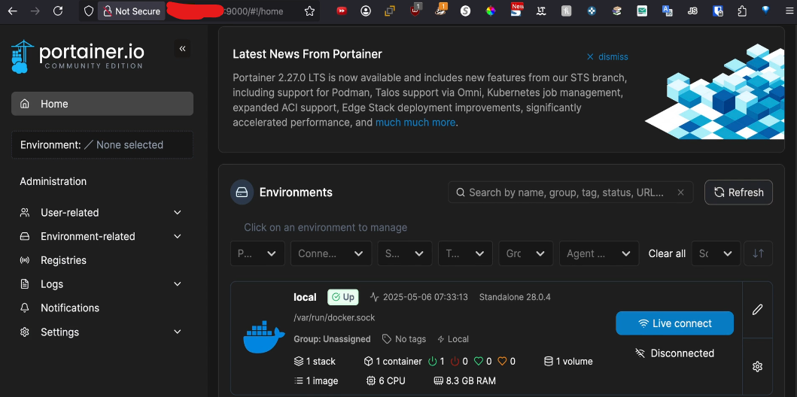

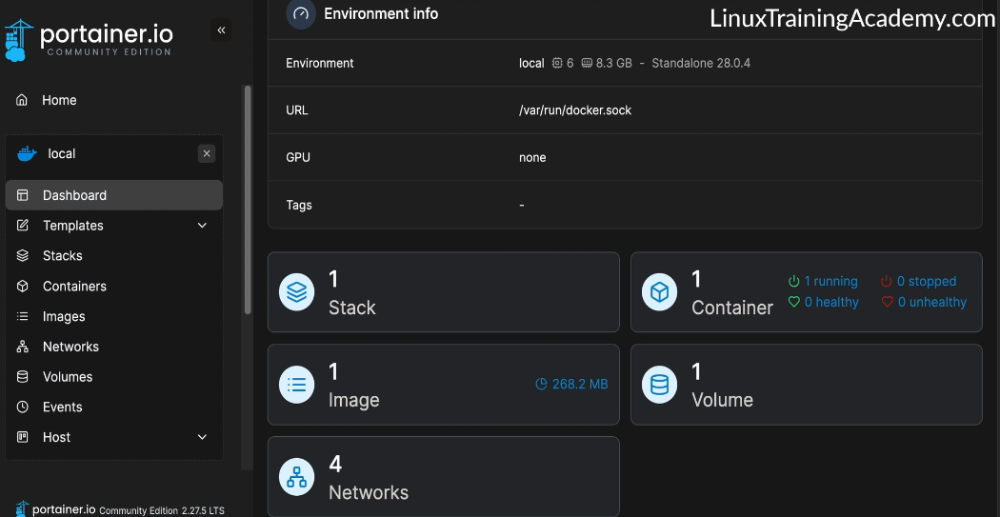

## 7. Secure Web Service Access with TDSProxy and Tailscale

### Deploying a File Browser for File Management

- Use File Browser when a browser-based file manager is more comfortable than the command line interface (CLI).
  - It can create directories, upload files, download files, and edit configuration files through a graphical user interface (GUI).
  - The course still supports command-line workflows, so File Browser is optional.
  - The example mount gives File Browser access to the whole server filesystem, so treat the service as sensitive.
- Deploy File Browser from Portainer as a Docker Compose stack.
  - Open Portainer from a device connected to the same Tailscale network.
  - Select the `local` Docker environment.
  - Go to `Stacks`, choose `Add stack`, and name the stack `filebrowser`.
  - Paste or upload the lesson's `compose.yaml`.
  - Click `Deploy the stack` after Portainer accepts the YAML.
- Understand the File Browser Compose configuration before deployment.
  - The `filebrowser/filebrowser:v2.32.0` image runs the File Browser container.
  - `container_name: filebrowser` gives the container a predictable name.
  - The `8080:80` port mapping exposes container port `80` on host port `8080`.
  - The `/:/srv` bind mount exposes the host root filesystem inside File Browser.
  - The `data:/data` named volume stores File Browser's database and internal settings.
  - `FB_DATABASE: /data/database.db` tells File Browser where to store its database.
  - `restart: unless-stopped` restarts the container after a reboot or crash unless you stop it manually.
- Use Portainer to confirm and open the deployed stack.
  - The stack detail page shows the container state, image, stack membership, and published ports.
  - If published-port links use the wrong host, set the environment's public IP address to the Docker host's Tailscale IP.
  - Run `tailscale ip -4` on the Docker host when you need that IPv4 address.
  - Open File Browser at `http://<tailscale-ip>:8080`.
- Secure the initial File Browser account before browsing files.
  - The default username is `admin`.
  - The default password is `admin`.
  - Change the password from `Settings` after the first login.
- Use File Browser for common server file tasks.
  - `My Files` opens the server filesystem exposed at `/srv`.
  - The view toggle changes how files and folders are displayed.
  - The `/opt/docker/portainer/compose.yaml` file can be opened and edited from the browser when the host root is mounted.
  - Save intentional edits with the save icon, or discard changes before leaving the editor.
- Deploy the same stack from the command line when you prefer terminal-based operations.
  - Create `/opt/docker/filebrowser`.
  - Add the Compose file as `/opt/docker/filebrowser/compose.yaml`.
  - Run Docker Compose from that directory.
- Keep the project status in mind.
  - Portainer can deploy Compose stacks from the browser, while `docker compose up -d` can deploy the same stack from the terminal.
  - The source notes mark File Browser as archived on GitHub.

```bash
mkdir -p /opt/docker/filebrowser
cd /opt/docker/filebrowser
nano compose.yaml
docker compose up -d
```

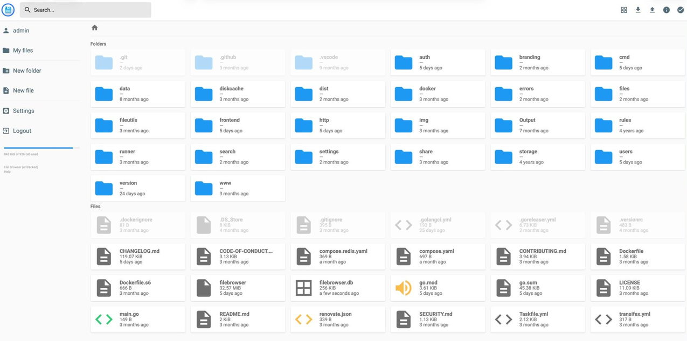

File Browser Resources:

- [Filebrowser GitHub Repository](https://github.com/filebrowser/filebrowser)
- [Filebrowser Docker Hub](https://hub.docker.com/r/filebrowser/filebrowser)

Compose: [`filebrowser/compose.yaml`](./lab/self-hosted-course/docker-stacks/filebrowser/compose.yaml):

```yaml
services:
  filebrowser:
    image: filebrowser/filebrowser:v2.32.0
    container_name: filebrowser
    ports:
      - "8080:80"
    volumes:
      - /:/srv
      - data:/data
    environment:
      FB_DATABASE: /data/database.db
    restart: unless-stopped

volumes:
  data:
```

### Introduction to Configuring TDSProxy for Tailscale-Based HTTPS Access

- Replace raw IP-and-port URLs with service names inside your Tailscale network.
  - Earlier lessons accessed services with addresses such as `http://<tailscale-ip>:8080`.
  - That works, but it requires remembering both the Docker host's Tailscale IP address and each service's published port.
  - Friendly service names are easier to remember and safer to share in notes.
- Use TSDProxy (Tailscale Docker Proxy) to connect Docker services to Tailscale names.
  - TSDProxy watches Docker containers and registers enabled services with Tailscale.
  - It accepts requests for a named service and forwards them to the correct container and port.
  - Later sections add the Docker labels and Compose configuration that tell TSDProxy which services to expose.
- Use Tailscale HTTPS so browser access is encrypted.
  - Tailscale can issue Transport Layer Security (TLS) certificates for names under your tailnet's DNS name.
  - TSDProxy uses that capability to provide HTTPS access for proxied services.
  - The result is a cleaner URL such as `https://portainer.<tailnet-name>.ts.net`.
- Rename the tailnet before building service URLs.
  - Tailscale creates a default tailnet DNS name such as `tailabc123.ts.net`.
  - The default name works, but it is not especially memorable.
  - Tailscale can generate easier "fun" tailnet names made from words separated by hyphens.
  - The chosen tailnet name becomes part of each service's fully qualified domain name.
- Use this setup to hide implementation details from daily access.
  - Users connect to service names instead of host IP addresses and port numbers.
  - TSDProxy handles the routing from each name to the correct Docker container.
  - HTTPS keeps traffic protected while services remain available only through the Tailscale network unless you explicitly configure public exposure.

### Tailscale Account Configuration: Renaming your Tailnet and Enabling HTTPS

- Configure the tailnet before deploying TSDProxy.
  - Open the Tailscale admin console in a browser.
  - Log in to the account that owns or administers the tailnet.
  - Go to the `DNS` settings page.
- Rename the tailnet DNS name if the default name is hard to remember.
  - Tailscale assigns a default name such as `tailabc123.ts.net`.
  - A tailnet owner, admin, or network admin can choose a randomly generated memorable name.
  - Use `Rename Tailnet`, acknowledge the warning, and reroll options until one is acceptable.
  - The selected name becomes part of service URLs such as `https://portainer.<tailnet-name>.ts.net`.
- Understand the rename warning before confirming.
  - Changing the active tailnet DNS name can affect existing links that depend on MagicDNS, HTTPS certificates, or device sharing.
  - Pick the name before creating many service URLs, bookmarks, or shared references.
    - Example suggested names: `aegean-major`, `brown-antares`, etc.
  - After choosing a name, confirm with `Rename Tailnet`.
- Enable Tailscale HTTPS certificates.
  - Stay on the `DNS` settings page and find the HTTPS certificate setting.
  - Click `Enable HTTPS`, then confirm if prompted.
  - TSDProxy needs this enabled so it can obtain certificates for proxied service names.
  - If HTTPS certificates are disabled, TSDProxy may fail or show certificate-related errors.

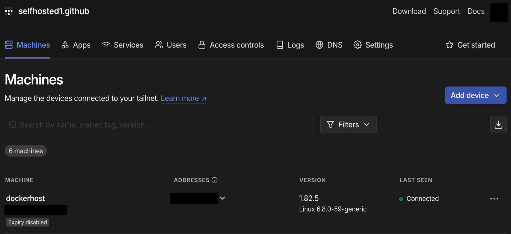

### Deploying TDSProxy

- Deploy TSDProxy after the Tailscale tailnet name and HTTPS certificate settings are ready.
  - The service can be deployed from Portainer or from the command line.
  - The course demonstrates the Portainer stack workflow.
  - Open Portainer from a device connected to the same Tailscale network.
  - Select the `local` environment, go to `Stacks`, and choose `Add stack`.
- Create a Portainer stack for TSDProxy.
  - Name the stack `tsdproxy`.
  - Paste or upload the lesson's `compose.yaml`.
  - Deploy the stack after Portainer validates the YAML.
  - If the deploy button is disabled, fix the YAML error that Portainer reports.
- Understand the service and image choices in the Compose file.
  - The course pins `almeidapaulopt/tsdproxy:1` for the version taught in the lesson.
  - `container_name: tsdproxy` gives the container a predictable Docker name.
  - `8081:8080` publishes TSDProxy's internal web interface port `8080` on host port `8081`.
  - Host ports must be unique, but different containers can reuse the same internal container port.
- Understand the volume mounts before running the stack.
  - `/var/run/docker.sock:/var/run/docker.sock` lets TSDProxy inspect Docker containers and labels.
  - `data:/data` stores TSDProxy-managed data such as certificates and state in a Docker named volume.
  - `/opt/docker/tsdproxy/config:/config` keeps editable configuration files in a known host directory.
  - Use bind mounts for files you expect to edit directly, and named volumes for application-managed data.
- Use labels to let TSDProxy discover services.
  - Docker labels attach metadata to containers.
  - `tsdproxy.enable: true` tells TSDProxy to proxy the container through a Tailscale name.
  - `tsdproxy.ephemeral: false` keeps the Tailscale machine persistent instead of short-lived.
  - Later service stacks use additional labels to define each proxied service name and port.
- Authenticate TSDProxy with Tailscale after deployment.
  - Open the TSDProxy dashboard at `http://<tailscale-ip>:8081`.
  - Click the `authenticating` entry to start the Tailscale login flow.
  - Log in to Tailscale and approve the new device or service connection.
  - Confirm that TSDProxy appears in the Tailscale machines list.
- Disable key expiry for long-running self-hosted services when appropriate.
  - Tailscale machines normally require periodic re-authentication.
  - Expired keys can break access until the service is re-authenticated.
  - Use the machine's menu in the Tailscale dashboard and choose `Disable Key Expiry` when you want persistent service access.
- Test access through the Tailscale service name.
  - The named URL follows the pattern `https://proxy.<tailnet-name>.ts.net`.
  - The first request can take a little time while TSDProxy joins Tailscale, provisions certificates, and starts proxying.
  - Wait and reload if the first attempt fails.
  - A successful HTTPS load confirms that the certificate and proxy path are working.

TDSProxy links:

- [TSDProxy GitHub Repository](https://github.com/almeidapaulopt/tsdproxy)
- [TSDProxy Docker Hub Repository](https://hub.docker.com/r/almeidapaulopt/tsdproxy/)

TSDProxy compose file: [`tsdproxy/compose.yaml`](./lab/self-hosted-course/docker-stacks/tsdproxy/compose.yaml):

```yaml
services:
  tsdproxy:
    image: almeidapaulopt/tsdproxy:1
    container_name: tsdproxy
    ports:
      - "8081:8080"
    volumes:
      - /var/run/docker.sock:/var/run/docker.sock
      - data:/data
      - /opt/docker/tsdproxy/config:/config
    labels:
      tsdproxy.enable: true
      tsdproxy.ephemeral: false
    restart: unless-stopped

volumes:
  data:
```

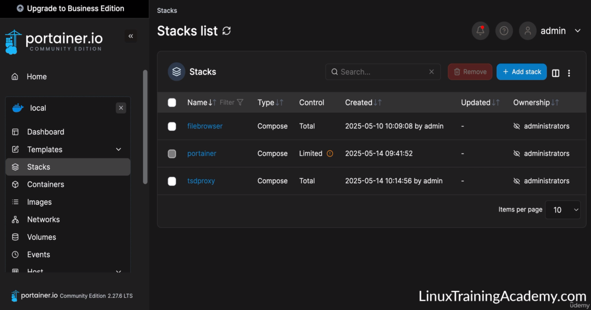

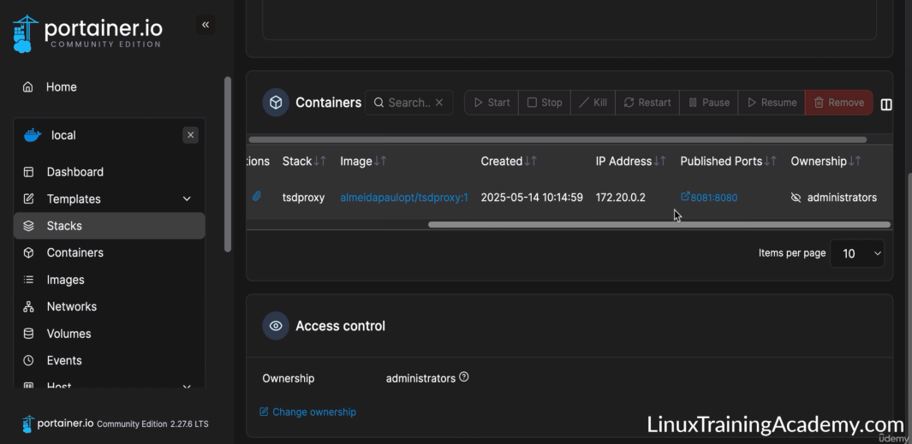

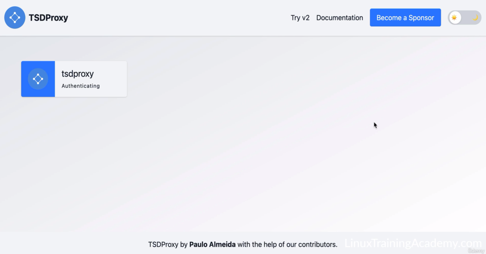

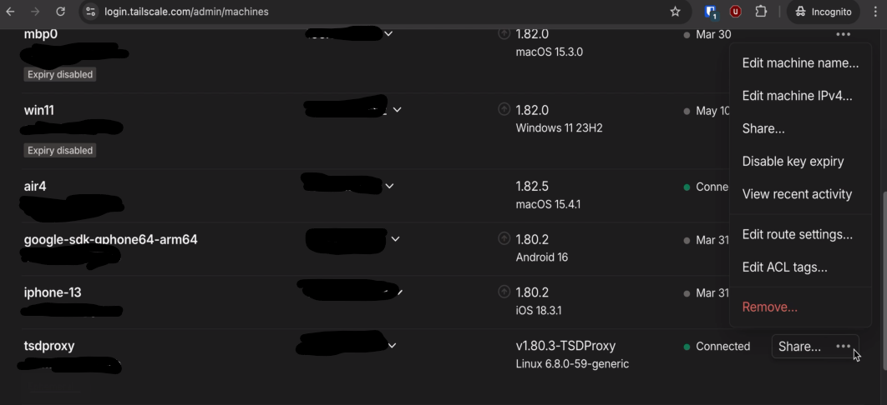

### Configuring File Browser for Use with TDSProxy

- Edit the existing File Browser stack in Portainer.
  - Open Portainer and go to `Stacks`.
  - Select the `filebrowser` stack.
  - Open the stack editor.
- Add TSDProxy labels under the File Browser service.
  - The `labels` block must be nested under `services.filebrowser`.
  - Its exact position inside the service does not matter, but placing it near `environment` and `restart` keeps the file easy to scan.
  - `tsdproxy.enable: true` tells TSDProxy to publish File Browser through a Tailscale name.
  - `tsdproxy.ephemeral: false` keeps the Tailscale machine persistent.
- Redeploy the stack after editing.
  - Click `Update the Stack`.
  - Confirm the update if Portainer asks.
  - Wait for Portainer to report that the stack deployed successfully.
- Authenticate File Browser as a Tailscale service.
  - Return to the TSDProxy dashboard and refresh it.
  - Open the new File Browser entry.
  - Log in to Tailscale and approve the device or service connection.
  - Confirm that File Browser appears in the Tailscale machines list.
- Disable key expiry for long-running File Browser access when appropriate.
  - Open the File Browser machine menu in the Tailscale dashboard.
  - Choose `Disable Key Expiry`.
  - This avoids later access failures caused by expired Tailscale keys.
- Access File Browser by its Tailscale service name.
  - The first request may take extra time while TSDProxy joins Tailscale, provisions certificates, and starts the proxy.
  - Wait briefly and reload if the first attempt fails.
  - After the first successful load, use the service name instead of the Docker host IP address and port.
- Repeat the same TSDProxy pattern for other self-hosted services.
  - Add the TSDProxy labels to the service's Compose definition.
  - Redeploy or update the stack.
  - Refresh the TSDProxy dashboard.
  - Authenticate the new Tailscale machine or service if prompted.
  - Disable key expiry when the service should remain available long term.
  - Use the generated Tailscale HTTPS name instead of the Docker host IP address and port.
  - Add explicit labels such as `tsdproxy.name` or port labels when a service name or port is ambiguous.

```yaml
services:
  filebrowser:
    labels:
      tsdproxy.enable: true
      tsdproxy.ephemeral: false
```

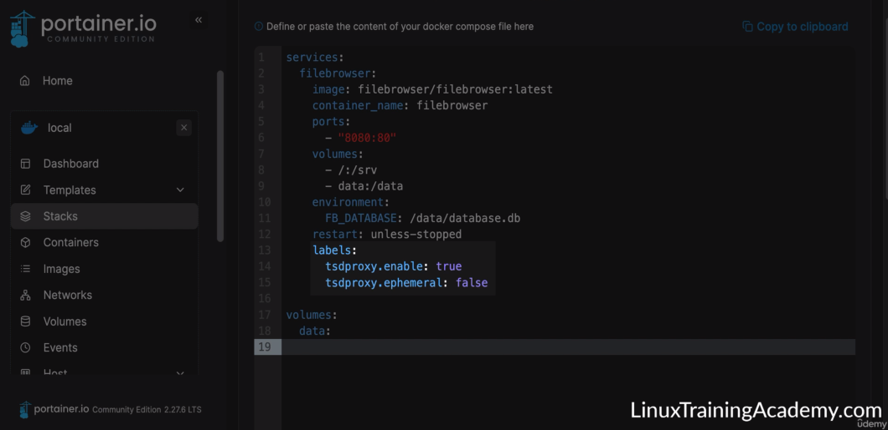

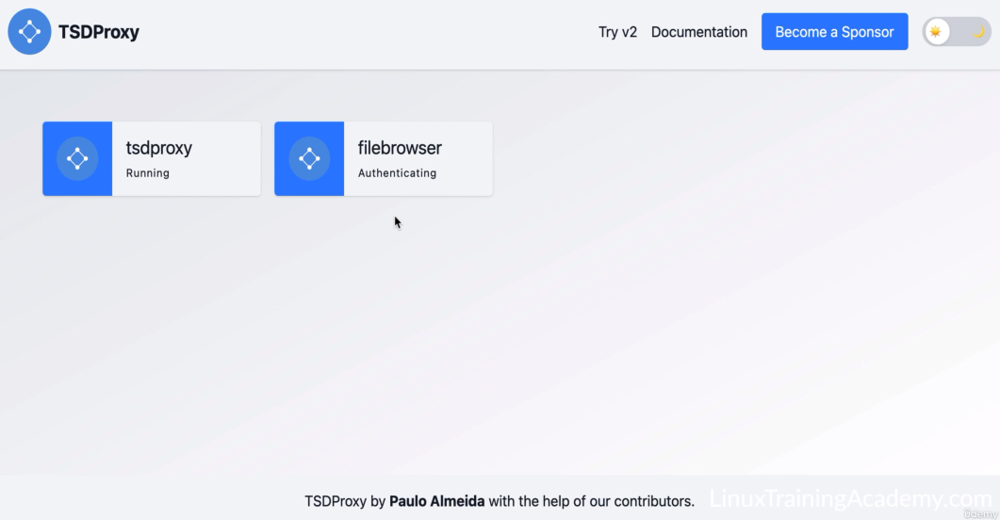

### Configuring Portainer for User with TDSProxy

- Configure Portainer with the same TSDProxy pattern used for File Browser.
  - Open Portainer and go to `Stacks`.
  - Select the `portainer` stack.
  - Open the stack editor.
  - Add the TSDProxy labels under `services.portainer`.
- Keep the labels attached to the Portainer service.
  - The `labels` block must be nested inside the `portainer` service definition.
  - `tsdproxy.enable: true` tells TSDProxy to publish Portainer through a Tailscale name.
  - `tsdproxy.ephemeral: false` keeps the Tailscale machine persistent.
  - Add an explicit `tsdproxy.name` or port label only if automatic naming or port detection is not suitable.
- Redeploy Portainer after editing the Compose file.
  - Click `Update the Stack`.
  - Confirm the update if Portainer asks.
  - Wait for Portainer to report that the stack deployed successfully.
  - Expect a brief interruption because Portainer is redeploying the service you are currently using.
- Authenticate the new Portainer Tailscale service.
  - Refresh the TSDProxy dashboard.
  - Open the Portainer entry when it appears.
  - Log in to Tailscale and approve the new service connection.
  - Confirm that Portainer appears in the Tailscale machines list.
- Disable key expiry for stable Portainer access when appropriate.
  - Open the Portainer machine menu in the Tailscale dashboard.
  - Choose `Disable Key Expiry`.
  - This prevents future access failures caused by expired Tailscale keys.
- Use the Tailscale HTTPS name for daily Portainer access.
  - The expected service URL is `https://portainer.<tailnet-name>.ts.net`.
  - The first request can take extra time while TSDProxy joins Tailscale, provisions certificates, and starts the proxy.
  - After the service works by name, prefer the HTTPS Tailscale URL over direct `IP:port` access.

```yaml
services:
  portainer:
    labels:
      tsdproxy.enable: true
      tsdproxy.ephemeral: false
```

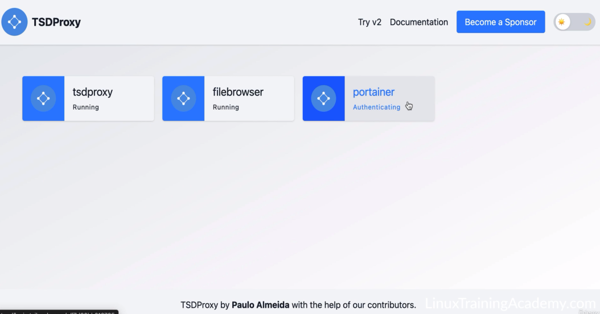

### Finding Open Ports on your Docker Host

- Check host port availability before publishing another service.
  - Each user-facing service needs a unique host port.
  - Existing examples use host ports such as `9000` for Portainer, `8080` for File Browser, and `8081` for TSDProxy.
  - More services make it harder to remember which host ports are already taken.
  - Valid TCP (Transmission Control Protocol) and UDP (User Datagram Protocol) port numbers must be `65535` or lower.
- Use `ss` for the manual command-line method.
  - `ss` means socket statistics.
  - `-n` shows numeric addresses and ports instead of resolving names.
  - `-t` includes TCP sockets.
  - `-u` includes UDP sockets.
  - `-l` limits output to listening sockets.
  - The `Local Address:Port` column shows the host port in use after the final colon.
- Extract just the listening port numbers when the full `ss` table is too noisy.
  - The pipeline below reads listening TCP and UDP sockets.
  - `awk` prints the local address and port column.
  - The Perl-compatible regular expression extracts the final numeric port.
  - `sort -n -u` sorts the list numerically and removes duplicates.
- Choose a host port that is unused and easy to reason about.
  - Matching host and container ports is convenient when the host port is free.
  - If `8080` is already used, choose a nearby available port such as `8081` or `8082`.
  - Do not create invalid ports by appending digits, such as turning `8080` into `80800`.
- We can use Open Port Finder if we prefer a browser-based helper; I think it's overkill for most users.
  - Deploy it as a Portainer stack or with Docker Compose.
  - The course image is `jasonc/open-port-finder:latest`.
  - The container name is `ports`, which gives TSDProxy a short service name to register.
  - `network_mode: host` lets the container inspect the host network directly.
  - `tsdproxy.container_port: "56789"` tells TSDProxy which app port to proxy because host networking makes automatic detection harder.
- Publish Open Port Finder through TSDProxy.
  - Deploy the stack from Portainer's `Stacks` view.
  - Open the TSDProxy dashboard and authenticate the `ports` service with Tailscale.
  - Disable key expiry for the `ports` service if it should remain available long term.
  - Access it with a name such as `https://ports.<tailnet-name>.ts.net`.
  - Enter a desired port and use the app's result in the next service's Compose file.

```bash
# Show listening TCP and UDP sockets with numeric addresses and ports.
ss -ntul

# Print only the local port numbers being used, then sort and deduplicate them.
ss -ntul | awk '{print $5}' | grep -oE '[0-9]+$' | sort -n -u
```

[`open-port-finder/compose.yaml`](./lab/self-hosted-course/docker-stacks/open-port-finder/compose.yaml):

```yaml
services:
  open-port-finder:
    image: jasonc/open-port-finder:latest
    container_name: ports
    network_mode: host
    labels:
      tsdproxy.enable: true
      tsdproxy.ephemeral: false
      tsdproxy.container_port: "56789"
    restart: unless-stopped
```

## 8. Building a Centralized Dashboard

### Introduction to Setting Up HomePage as Self-Hosted Dashboard

- Use Homepage as a central launchpad for self-hosted services.
  - It collects service links in one customizable dashboard.
  - It reduces the need to remember many separate URLs.
  - It makes occasional services easier to rediscover when you do not use them every day.
- Add a dashboard when the number of services starts to grow.
  - A few service URLs are easy to remember.
  - Many service URLs become cumbersome to track manually.
  - Homepage gives you one place to scan, open, and organize those services.
- Use Homepage to make shared access simpler.
  - Family members or other trusted users can start from the dashboard.
  - They do not need to know every individual service name or address.
  - You can present only the services they should use.
- Keep the deployment details for the next lesson.
  - The course deploys Homepage as another self-hosted Docker service.
  - Homepage is configured with YAML files for settings, services, bookmarks, and widgets.
  - The dashboard can later point to services exposed through TSDProxy names.

### Deploying HomePage with Portainer

- Deploy Homepage as another Portainer stack.
  - Open Portainer through its TSDProxy URL.
  - Select the `local` environment.
  - Go to `Stacks` and choose `Add Stack`.
  - Name the stack `homepage`.
  - Paste or upload the lesson's `compose.yaml`.
- Understand the Homepage image name.
  - `ghcr.io/gethomepage/homepage:latest` comes from GitHub Container Registry (GHCR).
  - The full image format is registry, namespace, image, and tag.
  - Docker Hub image names can omit the registry because Docker defaults to `docker.io`.
  - Docker can still pull and run images from other registries when the registry is included.
- Understand the container settings.
  - `container_name: homepage` gives the service a predictable Docker name.
  - `3000:3000` maps host port `3000` to the container's internal port `3000`.
  - `/var/run/docker.sock:/var/run/docker.sock` lets Homepage read Docker container status.
  - `/opt/docker/homepage/config:/app/config` stores editable Homepage configuration files on the host.
  - `HOMEPAGE_ALLOWED_HOSTS: "*"` allows access by any reachable IP address or hostname in this course setup.
- Connect Homepage to TSDProxy.
  - `tsdproxy.enable: true` publishes Homepage through a Tailscale HTTPS name.
  - `tsdproxy.ephemeral: false` keeps the Tailscale machine persistent.
  - `restart: unless-stopped` restarts Homepage after a reboot or crash unless you stop it manually.
- Finish the Tailscale service setup after deployment.
  - Click `Deploy the Stack`.
  - Open the TSDProxy dashboard.
  - Select the `homepage` entry and authenticate it with Tailscale.
  - Disable key expiry for the Homepage machine if it should remain available long term.
  - Access Homepage at `https://homepage.<tailnet-name>.ts.net`.
  - Reload after a short wait if the first request fails while TSDProxy provisions the service.


Links:

- [Homepage GitHub Repository](https://github.com/gethomepage/homepage)
- [Homepage Official Page](https://gethomepage.github.io/homepage/)

Deployment compose file: [`homepage/compose.yaml`](./lab/self-hosted-course/docker-stacks/homepage/compose.yaml):

- The linked Compose file defines the Homepage container, its config bind mount, Docker socket access, TSDProxy labels, and restart policy.

```yaml
services:
  homepage:
    image: ghcr.io/gethomepage/homepage:latest
    container_name: homepage
    ports:
      - 3000:3000
    volumes:
      - /var/run/docker.sock:/var/run/docker.sock
      - /opt/docker/homepage/config:/app/config
    environment:
      HOMEPAGE_ALLOWED_HOSTS: "*"
    labels:
      tsdproxy.enable: true
      tsdproxy.ephemeral: false
    restart: unless-stopped
```

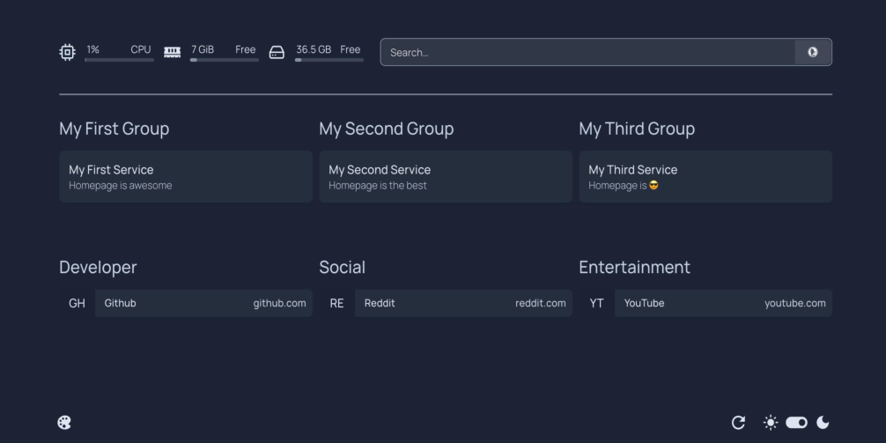

### HomePage Overview and Features

- Start with Homepage's default dashboard layout.
  - The default page includes sample groups, links, services, icons, widgets, and theme controls.
  - Almost every visible part can be customized later.
  - The default layout is useful as a reference before replacing the sample content.
- Use information widgets at the top of the dashboard.
  - The resources widget can show central processing unit (CPU), random access memory (RAM), and disk usage.
  - Homepage can be expanded with other statistics such as temperature or uptime.
  - The search widget is configured for DuckDuckGo in the course files.
  - The datetime widget can show the current time in a compact format.
- Organize self-hosted applications in the services section.
  - The default dashboard shows placeholder groups such as `First Group`, `Second Group`, and `Third Group`.
  - Real service groups should replace the sample data.
  - Service entries can link to TSDProxy URLs and can optionally show Docker container status or integrations.
- Use bookmarks for related non-service links.
  - The course bookmark examples include Tailscale, Homepage documentation, icon resources, and Linux Training Academy.
  - Bookmarks are useful for admin consoles, documentation, and reference sites.
  - They keep supporting links near the services they help maintain.
- Use the footer controls for quick dashboard adjustments.
  - Color palette controls change the dashboard appearance.
  - The refresh/reload control forces Homepage to reread its configuration.
  - The theme toggle switches between dark mode and light mode.

### Customizing HomePage

- Customize Homepage by editing YAML files in `/opt/docker/homepage/config`.
  - Edit the files directly on the Docker host or through File Browser.
  - In File Browser, browse to `/opt/docker/homepage/config`.
  - The main files are `settings.yaml`, `widgets.yaml`, `services.yaml`, and `bookmarks.yaml`.
  - Homepage usually detects saved changes, but the dashboard refresh button can force it to reread configuration.
- Match each configuration file to the dashboard area it controls.
  - `settings.yaml` controls global appearance and page behavior.
  - `widgets.yaml` controls the top information widgets.
  - `services.yaml` controls service groups, links, status checks, Docker status, and integrations.
  - `bookmarks.yaml` controls static reference links near the bottom of the dashboard.
  - Homepage documentation lists additional settings and supported widgets.
- Use `settings.yaml` for global appearance.
  - `title` changes the browser tab and dashboard title.
  - `background.image` sets the dashboard background image.
  - `background.brightness`, `opacity`, `blur`, and `saturate` adjust how visually strong the image appears.
  - `theme` and `color` can lock the dashboard to a preferred appearance.
  - `hideVersion: true` removes the Homepage version text from the footer.
- Use `widgets.yaml` for the top information area.
  - The resources widget can show central processing unit (CPU), memory, and disk usage.
  - The search widget can use DuckDuckGo or another supported provider.
  - The datetime widget adds a compact time display.
  - Additional widgets such as weather or stocks can be added from the Homepage documentation.
- Use `services.yaml` for live service entries.
  - Replace the default sample groups with a real group such as `Infrastructure`.
  - Add links to services such as Portainer, File Browser, TSDProxy, Open Port Finder, and IT-Tools.
  - Use your own tailnet name in every `YOUR-TAILNET-NAME.ts.net` placeholder.
  - Add icons from Dashboard Icons, Material Design Icons, Simple Icons, or selfh.st icons.
  - Add `siteMonitor` to show service response status.
  - Add `container` when Homepage should show Docker container status through the mounted Docker socket.
  - Add supported service widgets when you want live data, such as Portainer container counts.
- Create a Portainer widget only after generating the required Portainer details.
  - Find the Portainer environment number from the Portainer URL after opening the local environment.
  - Create a Portainer access token from the admin account settings.
  - Use the environment number as `env` and the token as `key`.
  - Treat the token as a secret and avoid committing a real value to public notes.
- Use `bookmarks.yaml` for static reference links.
  - Bookmarks are simple shortcuts, while services can include status checks and integrations.
  - Add admin consoles, documentation, icon sources, and course resources that support your self-hosting workflow.

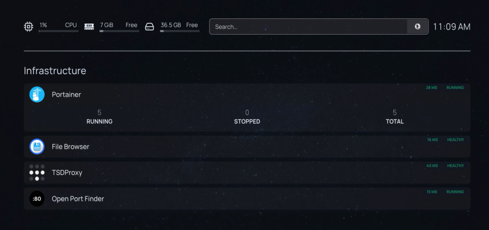

Links:

- [Homepage GitHub Repository](https://github.com/gethomepage/homepage)
- [Homepage Official Page](https://gethomepage.dev/)

Configuration files: [Homepage Configuration Files](./lab/self-hosted-course/configuration-files/homepage/).


[`settings.yaml`](./lab/self-hosted-course/configuration-files/homepage/settings.yaml):

- Defines global Homepage settings such as title, background image, theme, color palette, provider placeholders, and version visibility.
- Use this file to make the dashboard visually stable and less cluttered.

```yaml
---
# For configuration options and examples, please see:
# https://gethomepage.dev/configs/settings/

providers:
  openweathermap: openweathermapapikey
  weatherapi: weatherapiapikey

title: Launchpad
background:
  image: https://images.unsplash.com/photo-1628771791803-7ee290de9893?w=3840&h=2160&fit=crop&auto=format&q=80
  brightness: 50 # 0, 25, 50, 75, 125, 150, etc.
  opacity: 50 # 25, 50, 75
  #blur: sm # xs, sm, md, lg, xl, 2xl, 3xl
  #saturate: 50 # 0, 25, 50, 75

theme: dark
color: slate

hideVersion: true
```

[`widgets.yaml`](./lab/self-hosted-course/configuration-files/homepage/widgets.yaml):

- Defines top-level information widgets for system resources, search, and date/time.
- The course example shows CPU, memory, root disk usage, DuckDuckGo search, and short-format time.

```yaml
---
# For configuration options and examples, please see:
# https://gethomepage.dev/configs/info-widgets/

- resources:
    cpu: true
    memory: true
    disk: /

- search:
    provider: duckduckgo
    target: _blank

- datetime:
    format:
      timeStyle: short
```

[`services.yaml`](./lab/self-hosted-course/configuration-files/homepage/services.yaml):

- Defines the `Infrastructure` service group shown on the dashboard.
- Each service entry points to a TSDProxy HTTPS URL and can include an icon, site monitor, Docker container name, and optional widget.
- Replace `YOUR-TAILNET-NAME` and `ptr_YOUR_PORTAINER_API_KEY` with local values before using it.

```yaml
---
# For configuration options and examples, please see:
# https://gethomepage.dev/configs/services/

- Infrastructure:
    - Portainer:
        href: https://portainer.YOUR-TAILNET-NAME.ts.net
        icon: portainer
        siteMonitor: https://portainer.YOUR-TAILNET-NAME.ts.net
        container: portainer
        widget:
          type: portainer
          url: https://portainer.YOUR-TAILNET-NAME.ts.net
          env: 3
          key: ptr_YOUR_PORTAINER_API_KEY
    - File Browser:
        href: https://filebrowser.YOUR-TAILNET-NAME.ts.net
        icon: filebrowser
        siteMonitor: https://filebrowser.YOUR-TAILNET-NAME.ts.net
        container: filebrowser
    - TSDProxy:
        href: https://tsdproxy.YOUR-TAILNET-NAME.ts.net
        icon: tailscale-light
        siteMonitor: https://tsdproxy.YOUR-TAILNET-NAME.ts.net
        container: tsdproxy
    - Open Port Finder:
        href: https://ports.YOUR-TAILNET-NAME.ts.net
        icon: port-note
        siteMonitor: https://tsdproxy.YOUR-TAILNET-NAME.ts.net
        container: ports
    - IT-Tools:
        href: https://it-tools.YOUR-TAILNET-NAME.ts.net
        icon: it-tools
        siteMonitor: https://it-tools.YOUR-TAILNET-NAME.ts.net
        container: it-tools
```

[`bookmarks.yaml`](./lab/self-hosted-course/configuration-files/homepage/bookmarks.yaml):

- Defines static bookmark groups for network management, documentation, icon sources, and education links.
- Use this file for reference links that do not need live status or service widgets.

```yaml
---
# For configuration options and examples, please see:
# https://gethomepage.dev/configs/bookmarks

- Network Management:
    - Tailscale:
        - icon: tailscale-light
          href: https://tailscale.com/
          description: ""

- Documentation & Icons:
    - Homepage:
        - icon: homepage
          href: https://gethomepage.dev/
          description: ""
    - Dashboard Icons:
        - href: https://github.com/homarr-labs/dashboard-icons/
          icon: homarr
          description: ""
    - Material Design Icons:
        - href: https://pictogrammers.com/library/mdi/
          icon: mdi-material-design-#757575
          description: ""
    - Simple Icons:
        - href: https://simpleicons.org/
          icon: mdi-image-#CCCCCC
          description: ""
    - Selfh.st Icons:
        - href: https://selfh.st/icons/
          icon: sh-selfh-st
          description: ""

- Education:
    - Linux Training Academy:
        - icon: linux
          href: https://linuxtrainingacademy.com/
          description: ""

```

### Installing IT-Tools: Convert `docker run` to `docker compose`

- Deploy IT-Tools as a utility collection for common information technology (IT) tasks.
  - It includes tools for encoding, decoding, comparing text, and other admin-oriented workflows.
  - This lesson focuses on the `docker run` to Docker Compose converter.
  - The converter is useful when documentation provides only a `docker run` command but you want a reusable Compose stack.
- Deploy IT-Tools from Portainer.
  - Open Portainer through its TSDProxy URL.
  - Select the `local` environment.
  - Go to `Stacks` and choose `Add stack`.
  - Name the stack `it-tools`.
  - Paste or upload the lesson's Compose YAML.
- Understand the IT-Tools Compose file.
  - `corentinth/it-tools:latest` pulls the IT-Tools image from Docker Hub.
  - `container_name: it-tools` gives the container a predictable name.
  - `8082:80` maps host port `8082` to container port `80`.
  - `tsdproxy.enable: true` exposes IT-Tools through a Tailscale HTTPS name.
  - `tsdproxy.ephemeral: false` keeps the Tailscale machine persistent.
  - `restart: unless-stopped` restarts the service after a reboot or crash unless you stop it manually.
- Finish the TSDProxy setup after deployment.
  - Click `Deploy the stack`.
  - Open the TSDProxy dashboard.
  - Select the IT-Tools entry and authenticate it with Tailscale.
  - Disable key expiry for the IT-Tools machine if it should remain available long term.
  - Access IT-Tools at `https://it-tools.<tailnet-name>.ts.net`.
- Use the Docker conversion tool when deploying services from examples.
  - Search for `Docker` inside IT-Tools.
  - Open the `docker run` to Docker Compose converter.
  - Paste a `docker run` command into the converter.
  - Use the generated Compose YAML as a starting point for a Portainer stack or a terminal-based `docker compose` deployment.
- Add IT-Tools to Homepage for easier access.
  - Edit `/opt/docker/homepage/config/services.yaml`.
  - Add an `IT-Tools` service entry that points to your TSDProxy URL.
  - Replace the tailnet placeholder with your own tailnet name.
  - Refresh Homepage and confirm that the IT-Tools link appears.

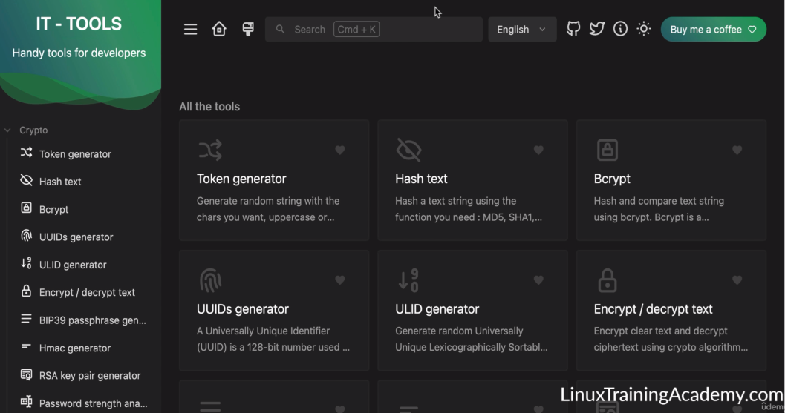

[`it-tools/compose.yaml`](./lab/self-hosted-course/docker-stacks/it-tools/compose.yaml):

- The linked Compose file defines the IT-Tools container, host port mapping, TSDProxy labels, and restart policy.

```yaml
services:
  it-tools:
    image: 'corentinth/it-tools:latest'
    container_name: it-tools
    ports:
      - '8082:80'
    labels:
      tsdproxy.enable: true
      tsdproxy.ephemeral: false
    restart: unless-stopped
```

## 9. Publishing Services on Your Own Domain

### Introduction to Accessing Self-Hosted Services Using your Own Domain with Caddy

- This lesson shows how to access self-hosted services through a domain you own.
  - It is useful if you already own a domain or plan to register one.
  - You can skip this path if you only want to use Tailscale names for private access.
- Earlier access methods were functional but less polished.
  - IP addresses and port numbers work, but they are hard to remember.
  - TSDProxy and Tailscale give services human-friendly names, but those names still depend on the Tailscale tailnet domain.
  - A custom domain gives you control over service names such as `files.example.com` or `portainer.example.com`.
- Caddy is the web server used for the custom-domain setup.
  - Caddy can act as a reverse proxy.
  - A reverse proxy receives browser traffic for a domain and forwards it to the correct service and port on your server.
  - In a Caddyfile, this is usually expressed with the `reverse_proxy` directive.
- Caddy can automatically obtain and renew Transport Layer Security (TLS) certificates.
  - TLS certificates make browser access use valid HTTPS.
  - Caddy uses Automated Certificate Management Environment (ACME) issuers such as Let's Encrypt.
  - A Certificate Authority (CA) only issues a certificate after Caddy proves control of the domain.
- The default HTTP-based ACME challenge does not fit a private tailnet-only server.
  - The CA normally validates a domain by requesting a token from a public URL on that domain.
  - If the service is only reachable inside your tailnet, the CA cannot reach that URL from the public internet.
- DNS challenges solve the validation problem without exposing the service publicly.
  - Instead of serving a token over HTTP, Caddy creates a special DNS record for the domain.
  - Cloudflare will be used as the DNS provider so Caddy can manage the required challenge records.
  - This lets Caddy issue valid HTTPS certificates while the services remain reachable only through your intended network path.


### Setting Up a Domain and DNS for Self-Hosted Services with Cloudflare

- Start by registering a domain if you do not already own one.
  - A domain registrar is the company that sells and manages domain registrations.
  - Common registrars include Cloudflare, Namecheap, GoDaddy, IONOS, and Porkbun.
  - Cloudflare is convenient for this course because Cloudflare will also provide Domain Name System (DNS) hosting, but buying the domain there is optional.
- Choose a top-level domain (TLD) that fits your name and budget.
  - Common TLDs include `.com`, `.net`, and `.org`.
  - Many other TLDs exist, such as `.xyz`, `.biz`, and `.top`.
  - Check the yearly renewal price, because a low first-year price can renew at a much higher rate.
- Add the domain to Cloudflare after registration.
  - Create or sign in to a Cloudflare account.
  - Add the domain to Cloudflare and choose the free plan when prompted.
  - Let Cloudflare scan and import existing DNS records, then review them before continuing.
- If the domain was registered outside Cloudflare, update the domain's authoritative nameservers.
  - Cloudflare provides the exact nameservers to use.
  - Log in to the registrar dashboard and replace the current nameservers with the Cloudflare-assigned nameservers.
  - Follow the registrar-specific instructions if the dashboard labels are different.
  - Cloudflare activation can take up to 24 hours, although it often completes sooner.
- Decide whether the whole domain should be used for private self-hosted services.
  - This works when the domain is dedicated to the services on your Docker host.
  - Example root service: `linuxtrainingacademy.com` opens the Homepage dashboard.
  - Example subdomain service: `portainer.linuxtrainingacademy.com` opens Portainer.
  - Create one DNS record for the root domain and point it to the Tailscale IP address of the Docker host.
  - Create one wildcard DNS record, such as `*.linuxtrainingacademy.com`, and point it to the same Tailscale IP address.
- Use a dedicated subdomain when the root domain already hosts public services.
  - This avoids sending your public website, blog, store, or business site to the private Docker host.
  - Example private namespace: `internal.linuxtrainingacademy.com`.
  - Example service address: `portainer.internal.linuxtrainingacademy.com`.
  - Create one DNS record for `internal.linuxtrainingacademy.com` and point it to the Docker host's Tailscale IP address.
  - Create one wildcard DNS record, such as `*.internal.linuxtrainingacademy.com`, and point it to the same Tailscale IP address.
- Wildcard DNS records reduce repeated setup work.
  - The asterisk (`*`) matches subdomains that do not already have a more specific DNS record.
  - New service names can resolve to the Docker host without adding a separate DNS record each time.
  - Caddy will later decide which service receives the request based on the hostname.

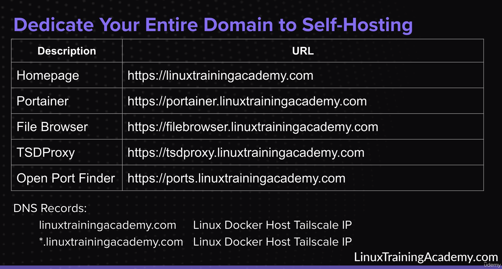

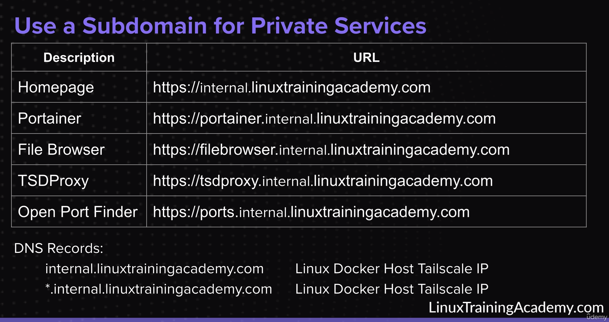


### Configuring Cloudflare DNS and Deploying Caddy as Reverse Proxy

- Configure Cloudflare DNS after choosing either a whole-domain or private-subdomain layout.
  - Get the Tailscale IP address of the Linux Docker host.
  - You can find it from the host command line or in the Tailscale dashboard.
  - In Cloudflare, open the domain and go to the DNS records page.
- Add the base DNS record for the private service namespace.
  - Use an `A` record.
  - For a dedicated private subdomain, set the name to something like `internal`.
  - Set the IPv4 address to the Docker host's Tailscale IP address.
  - Turn Cloudflare proxying off so the record is `DNS only`.
- Add the wildcard DNS record for future service names.
  - Use another `A` record.
  - For a private namespace, set the name to something like `*.internal`.
  - Point it to the same Tailscale IP address.
  - Keep proxy status off so Cloudflare only resolves the name and does not proxy the traffic.
- Test the DNS records from the Docker host.
  - The `host` command performs a DNS lookup and shows the IP address a name resolves to.
  - Test both the base namespace and wildcard names.
  - A made-up wildcard hostname should still resolve to the Docker host's Tailscale IP address.

```bash
# Show the Tailscale IP address assigned to this Docker host.
tailscale ip -4

# Confirm the base private namespace resolves to the Docker host.
# DNS changes often work quickly, but may take a few minutes to propagate.
host internal.example.com

# Confirm a real service hostname resolves through the wildcard record.
# DNS changes often work quickly, but may take a few minutes to propagate.
host portainer.internal.example.com

# Confirm an arbitrary hostname also matches the wildcard record.
# DNS changes often work quickly, but may take a few minutes to propagate.
host anything.internal.example.com
```

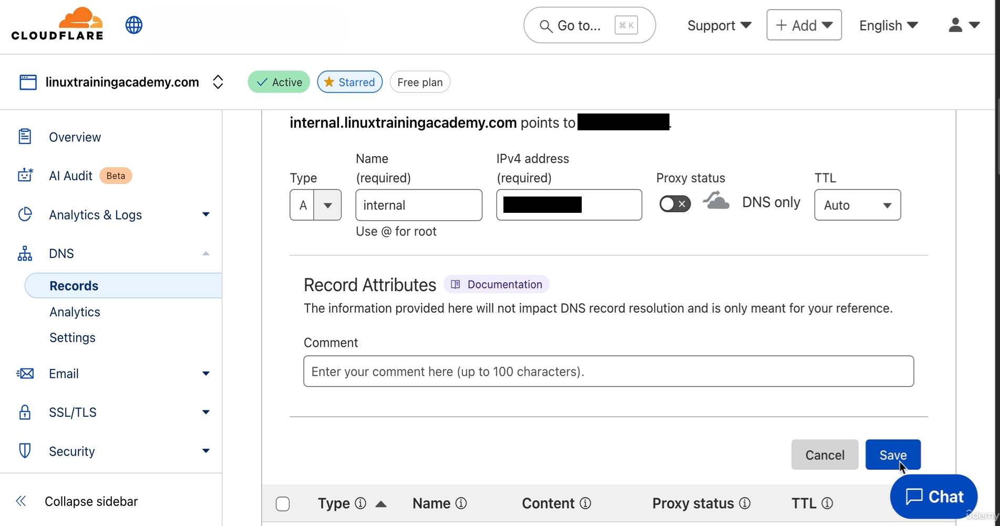

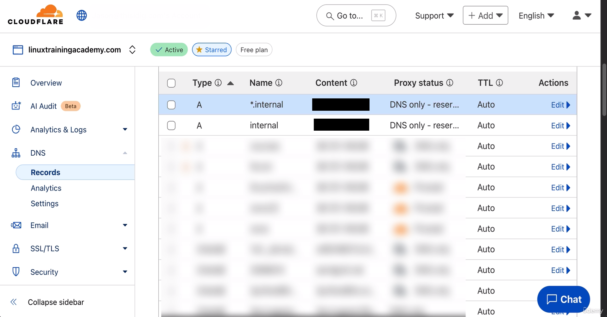

- Create a Cloudflare API token so Caddy can complete DNS challenges.
  - Open the Cloudflare profile menu and go to API Tokens.
  - Create a token from the `Edit zone DNS` template.
  - Leave the persmisions as: `Zone`, `DNS`, `Edit`.
  - Set Zone resources to `Include all zones`.
    - The token needs DNS edit access for the zones Caddy will manage.
  - Continue to summary and create the token.
  - Copy the token immediately because Cloudflare only shows it once; this will be our `CLOUDFLARE_API_TOKEN` to authenticate from Caddy to Cloudflare.
- Create the Caddy configuration file before deploying the stack (see below).
  - In File Browser, create `/opt/docker/caddy`.
  - Create a file named `Caddyfile` with a capital `C`.
  - Paste in the lesson Caddyfile and replace `YOUR_DOMAIN` with your real domain.
  - Create this file first, because Docker can create a missing bind-mounted file path as a directory.
  - Caddy routes each hostname to the matching service port; it's a reverse proxy.
    - `127.0.0.1` means localhost, or the same Linux Docker host.
    - `reverse_proxy http://127.0.0.1:3000` forwards matching browser requests to port `3000` on the host.
    - Add new services by copying the template, changing the hostname, and changing the host port.
- Deploy Caddy as a Portainer stack (see compose file below).
  - Open Portainer, select the local environment, and go to Stacks.
  - Add a stack named `caddy`.
  - Paste the lesson compose file and replace `YOUR_TOKEN_HERE` with the Cloudflare API token in `CLOUDFLARE_API_TOKEN`.
  - Deploy the stack and confirm the container starts.
  - Note: the example uses a public docker image from the instructor, but we could create our own following the Cloudflare documentation. The main difference in the image is that the instructor added the Cloudflare DNS module to the official Caddy image for Cloudflare integration.
- Confirm the final access path from a browser.
  - Visit the base private namespace, such as `internal.example.com`, to reach Homepage.
  - Visit service hostnames, such as `portainer.internal.example.com`, to reach individual services.
  - Access should work only from devices connected to the tailnet: `internal.example.com` and `*.internal.example.com` resolve to the Docker host's Tailscale IP address, so only devices connected to your tailnet can actually reach that IP.
  - The non-`internal` will be accessible from anywhere, as explained in the next section!
- As a result, we can access our VPS services using our domains of choice.

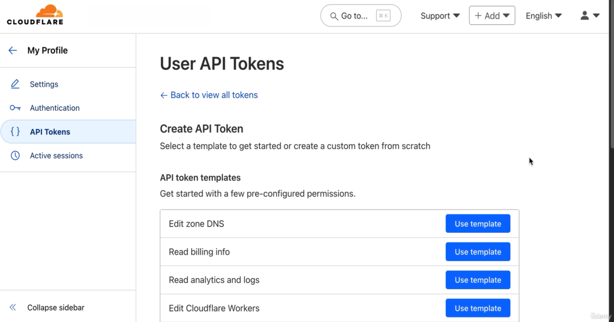

Caddy configuration file: [`caddy/Caddyfile`](./lab/self-hosted-course/configuration-files/caddy/Caddyfile):

- Defines Cloudflare as the DNS provider for Caddy's ACME certificate challenges.
- Maps each private hostname to the local port used by the matching service.
- Includes a copyable template for future services.

```caddyfile
{
  # Use Cloudflare DNS challenges for Caddy-managed TLS certificates.
  dns cloudflare {env.CLOUDFLARE_API_TOKEN}
}

internal.YOUR_DOMAIN {
  # Send the private namespace root to Homepage.
  reverse_proxy http://127.0.0.1:3000
}

portainer.internal.YOUR_DOMAIN {
  # Send Portainer traffic to its host port.
  reverse_proxy http://127.0.0.1:9000
}

filebrowser.internal.YOUR_DOMAIN {
  reverse_proxy http://127.0.0.1:8080
}

tsdproxy.internal.YOUR_DOMAIN {
  reverse_proxy http://127.0.0.1:8081
}

ports.internal.YOUR_DOMAIN {
  reverse_proxy http://127.0.0.1:56789
}

it-tools.internal.YOUR_DOMAIN {
  reverse_proxy http://127.0.0.1:8082
}

# Template for adding additional services:
# SERVICE_NAME.internal.YOUR_DOMAIN {
#   reverse_proxy http://127.0.0.1:HOST_PORT
# }
```

Caddy deployment file: [`caddy/compose.yaml`](./lab/self-hosted-course/docker-stacks/caddy/compose.yaml):

- Runs one `caddy` service from a Caddy image that includes the Cloudflare DNS module.
- Uses host networking so Caddy can listen on ports `80` and `443` and reach services on host ports.
- Passes the Cloudflare API token through an environment variable.
- Mounts the host Caddyfile into the container and stores Caddy data/config in named volumes.

```yaml
services:
  caddy:
    # This image includes the Cloudflare DNS module required for DNS challenges.
    image: jasonc/caddy-cloudflare:2
    container_name: caddy
    # Let Caddy bind to host ports 80 and 443 and reach host-local services.
    network_mode: host
    environment:
      # Replace this placeholder with the Cloudflare API token you created.
      CLOUDFLARE_API_TOKEN: YOUR_TOKEN_HERE
    volumes:
      # Create this file on the host before deploying the stack.
      - /opt/docker/caddy/Caddyfile:/etc/caddy/Caddyfile
      # Store certificates and renewal data.
      - data:/data
      # Store Caddy's internal active configuration.
      - config:/config
    restart: unless-stopped

volumes:
  data:
  config:
```


### Making Your Self-Hosted Services Public with Cloudflare Tunnels

- Cloudflare Tunnels are for services you intentionally want to expose to the public internet.
  - Previous lessons kept services private by routing them through Tailscale or tailnet-only names.
  - Public services might include a blog, portfolio, documentation site, or public project page.
  - Administrative services such as Portainer should usually remain private.
- This lesson uses Ghost as the public-service example.
  - Ghost is a blogging platform.
  - The public hostname should match the `url` setting in the Ghost compose file.
  - A dedicated hostname such as `blog.example.com` is cleaner than mixing a public app into an internal namespace.
- Deploy Ghost from Portainer first.
  - Open Portainer and select the local Docker environment.
  - Go to Stacks, add a stack named `ghost`, and paste the lesson compose file.
  - Change the `url` environment variable to the public address you plan to use.
  - Deploy the stack and confirm it starts.
- The Ghost stack contains the app and its database.
  - The `ghost` service runs the Ghost application from the official `ghost:5` image.
  - The `db` service runs MySQL from the official `mysql:8` image.
  - Docker Compose creates a private network where the app can reach the database by the service name `db`.
  - The `ghost` volume stores content such as images, themes, and logs.
  - The `db` volume stores MySQL database files.
- Cloudflare Tunnel publishes the local service without opening inbound firewall ports.
  - The `cloudflared` connector runs on the Docker host.
  - It creates an outbound encrypted connection from the host to Cloudflare.
  - Cloudflare routes public requests for the hostname through that tunnel to the local service.
  - You need Cloudflare DNS for the domain and a running `cloudflared` connector on the host.
- Create the tunnel in the Cloudflare Zero Trust dashboard.
  - Open Cloudflare: `Zero Trust`, then go to Networks and Tunnels.
  - Add a tunnel and choose `cloudflared`.
  - Give it a name such as `self-hosted-tunnel`.
  - Select `Docker` as the environment and copy the generated Docker command: `docker run ... --token <token>`
  - Save the tunnel token from the copied command after `--token`.
  - Do not include surrounding quotation marks if they were copied with the token.
- Deploy `cloudflared` from Portainer.
  - Add a stack named `cloudflared`.
  - Paste the lesson compose file (see below).
  - Replace `REPLACE_WITH_YOUR_TOKEN` with the tunnel token.
  - Deploy the stack.
  - Check the Cloudflare web UI for a connected connector status; there should be a successful connector.
- Add a public hostname route for Ghost.
  - In the tunnel setup (`Cloudflare web UI > Zero Trust > Network > Tunnels > <our-tunnel>`), add a public hostname; to get there, click on next on the previous view, where the connector was shown.
  - Use `blog` as the subdomain and select your domain.
  - Leave the path blank unless you intentionally want path-based routing.
  - Set the service type to `HTTP`.
  - Set the service URL to `127.0.0.1:2368` because `cloudflared` runs on the Docker host and Ghost is exposed on host port `2368`.
  - Complete the setup and visit `https://blog.example.com`.
- Finish the Ghost setup in the browser.
  - The public site is available at the hostname you configured.
  - The Ghost administration page is available at `/ghost`.
  - Anyone on the internet can reach this hostname after the tunnel route is active.
- Be selective about what you publish.
  - Public tunnel routes expose services to the world.
  - Do not publish tools that control your server or Docker environment unless you have a strong reason and proper access controls.
  - **Keep Portainer and similar administrative dashboards behind Tailscale or another private access method.**
- Repeat the public-hostname process for each additional service you want to expose.
  - Open the existing tunnel in Cloudflare and add another public hostname.
  - Choose the subdomain for the service.
  - Set the service type and local URL, such as `HTTP` and `127.0.0.1:8082` for IT-Tools.
  - Save the route and test the public hostname.

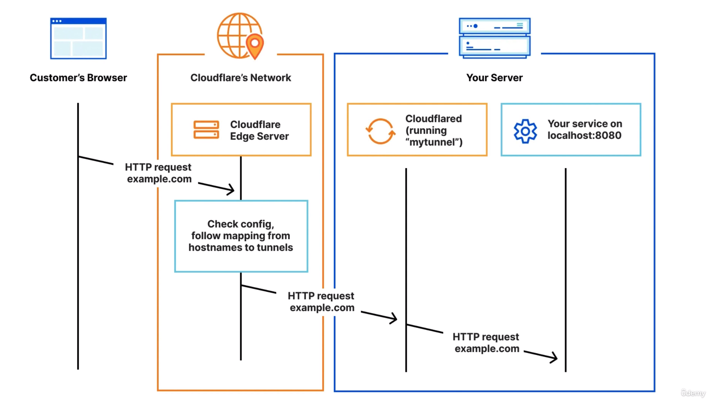

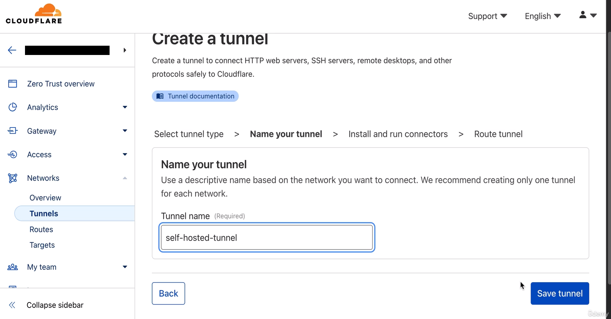

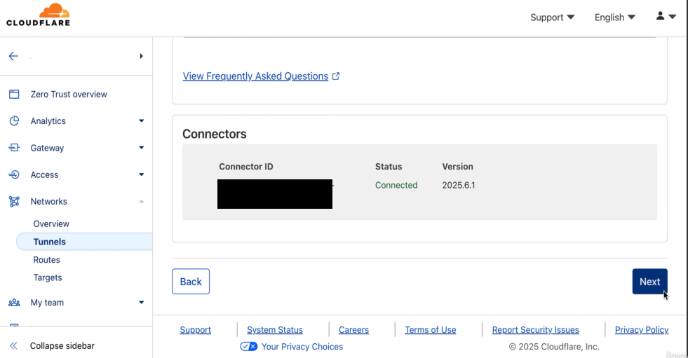

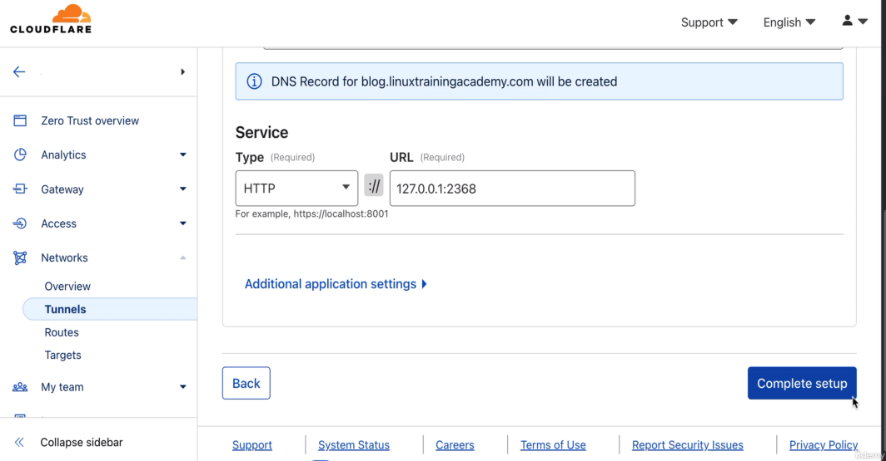

Ghost deployment file: [`ghost/compose.yaml`](./lab/self-hosted-course/docker-stacks/ghost/compose.yaml):

- Runs Ghost and MySQL as one Compose application.
- Publishes Ghost on host port `2368`.
- Uses matching database credentials in the Ghost and MySQL service settings.
- Stores Ghost content and MySQL data in named volumes.

```yaml
services:
  ghost:
    # Official Ghost image, version 5.
    image: ghost:5
    container_name: ghost
    restart: unless-stopped
    ports:
      # Expose Ghost on the Docker host so cloudflared can reach it.
      - 2368:2368
    environment:
      database__client: mysql
      # Compose lets the app reach the database by service name.
      database__connection__host: db
      database__connection__user: root
      database__connection__password: password123
      database__connection__database: ghost
      # Change this to the public hostname you will publish through Cloudflare.
      url: https://blog.YOUR_DOMAIN
    volumes:
      # Store Ghost themes, images, and application content.
      - ghost:/var/lib/ghost/content

  db:
    # MySQL version used by this lesson's Ghost deployment.
    image: mysql:8
    container_name: ghost-db
    restart: unless-stopped
    environment:
      # Keep this in sync with database__connection__password above.
      MYSQL_ROOT_PASSWORD: password123
    volumes:
      # Store MySQL data files.
      - db:/var/lib/mysql

volumes:
  ghost:
  db:
```

Cloudflare Tunnel deployment file: [`cloudflared/compose.yaml`](./lab/self-hosted-course/docker-stacks/cloudflared/compose.yaml):

- Runs the Cloudflare Tunnel connector from the official `cloudflare/cloudflared` image.
- Uses host networking so the connector can reach services exposed on the Docker host.
- Starts a remotely managed tunnel with the token from Cloudflare.
- Restarts automatically unless you stop it.

```yaml
services:
  cloudflared:
    image: cloudflare/cloudflared:latest
    container_name: cloudflared
    # Let cloudflared connect to host-local service ports such as 127.0.0.1:2368.
    network_mode: host
    restart: unless-stopped
    # Run the remotely managed tunnel configured in Cloudflare.
    command: tunnel --no-autoupdate run
    environment:
      # Replace this with the token from the Cloudflare tunnel setup screen.
      TUNNEL_TOKEN: REPLACE_WITH_YOUR_TOKEN
```

## 10. Discovering & Deploying Additional Self-Hosted Services and Applications

### Intro to Finding, Evaluating, and Deploying Self-Hosted Services and Solutions

- This lesson teaches a repeatable process for choosing and deploying self-hosted services.
  - Find alternatives to expensive, third-party, or closed services you already use.
  - Evaluate those alternatives against your own requirements.
  - Deploy the selected service using the Docker and Portainer skills developed earlier in the course.
- Self-hosting gives you more control over important services.
  - You can reduce reliance on companies that may change pricing, remove features, or shut down products.
  - You can choose open-source or self-hosted tools that better fit your privacy, cost, and flexibility goals.
- Self-hosted services can replace common hosted products.
  - File storage and sharing tools such as Dropbox or Google Drive can be replaced by options like Nextcloud or Seafile.
  - Team messaging tools such as Slack can be replaced by options like Mattermost or Rocket.Chat.
- The main goal is confidence, not memorizing one specific app.
  - Tool lists change over time.
  - Websites, projects, names, and installation steps may look different later.
  - The lasting skill is learning how to research, judge, and deploy services on your own.

Links:

- [Best Self-Hosted Software & Open Source Web Apps](https://www.linuxtrainingacademy.com/best-self-hosted-software-open-source-web-apps/)
- [awesome-selfhosted](https://github.com/jasonc/awesome-selfhosted)
- [Self-Hosted Apps and Alternatives](https://selfh.st/apps/)
- [Awesome Self Hosted](https://selfhosted.libhunt.com/)
- [A curated list of self-hosted software & services](https://selfhostedworld.com/)
- [Open Source Alternatives to Popular Software](https://openalternative.co/)

### Finding Self-Hosted Solutions: Directories, Search Engines, and Communities

- Start with self-hosted directories and curated lists.
  - They collect many projects in one place and make browsing easier than searching the whole web first.
  - Awesome Self Hosted is a common starting point for discovering popular open-source and self-hosted services.
  - Other directories may overlap, but each one can surface tools the others miss.
- Search directories by product name when you want to replace a specific tool.
  - Use your browser's in-page search with `Ctrl+F` on Windows or Linux.
  - Use `Command+F` on macOS.
  - Searching for `Trello` can reveal direct alternatives such as Focalboard, Planka, and Wekan.
- Search by category when product-name searches are too narrow.
  - Some good alternatives may not mention the commercial tool they replace.
  - Trello-like tools are often grouped under task management, to-do lists, or Kanban boards.
  - Category browsing can reveal more options, such as Kanboard, Nullboard, Restyaboard, Tracks, AppFlowy, Tasks, or Plane.
- Check more than one directory.
  - Self-hosted directories often have different tags, descriptions, and project coverage.
  - Useful places to search include Selfh.st, selfhosted.libhunt.com, selfhostedworld.com, and OpenAlternative.
  - Use tags, alternatives, and keyword search to move from a broad need to a short list of candidates.
- Use regular search engines when directories are not enough.
  - Search engines can find project pages, documentation, blog posts, forum threads, and comparison articles.
  - Combine the name of an existing product with discovery terms such as `self-hosted`, `open source`, `alternative`, `clone`, or `replacement`.
  - If you do not have a specific product in mind, search for the category or function instead.
- Search community discussions for real-world feedback.
  - Communities often mention tools that do not appear in curated directories.
  - Reddit communities such as `/r/selfhosted`, `/r/homelab`, and `/r/HomeServer` can contain practical recommendations and warnings.
  - Search existing posts before creating a new one.
  - Replies can be especially useful because people compare tools from actual use.
- Use artificial intelligence (AI) assistants as discovery helpers.
  - Ask for a list of tools that match a product, category, or feature set.
  - Treat the result as a starting point, not as final proof that a project is active or suitable.
  - Verify project status, documentation, licensing, and deployment requirements before choosing a tool.

### How to Evaluate Self-Hosted Applications

- Evaluate functionality first.
  - The application must solve the problem you actually have.
  - Compare its features against your must-have requirements before spending time deploying it.
  - For a Trello replacement, a Kanban board with columns and movable cards may be a required feature.
- Prefer applications that are easy to run with Docker.
  - A good candidate has an official Docker image or a well-maintained community image.
  - Clear Compose examples make deployment easier to repeat and troubleshoot.
  - Look for documented environment variables, volumes, ports, and network requirements.
- Check whether the project is actively maintained.
  - Find the project's source code by searching for the application name plus `GitHub` or `source code`.
  - Review recent commits, releases, and changes.
  - A project with recent activity is usually a safer choice than one that has been inactive for years.
- Use repository activity as a health signal.
  - Contributors show how many people have added code to the project.
  - Forks show that other developers have copied the project to study, modify, or contribute to it.
  - Stars show that users have bookmarked or endorsed the project, but they should not be the only signal you trust.
- Review issues and support channels.
  - Open issues are normal on active projects.
  - Closed issues can show that maintainers fix bugs, answer questions, and accept improvements.
  - Discussion forums, chat rooms, or community links make it easier to get help later.
- Be cautious with projects that show weak maintenance signals.
  - One contributor, very few stars, no forks, and no recent commits can indicate higher risk.
  - A small project can still be useful, but you should expect more responsibility for troubleshooting and maintenance.
- Treat documentation quality as part of the evaluation.
  - Good documentation helps you install, configure, update, and troubleshoot the service.
  - Useful docs explain installation steps, common settings, dependencies, architecture, and recovery tips.
  - Poor or missing docs can make a service harder to maintain, update, or scale.


### Deploying Self-Hosted Applications Using Docker, Docker Compose, or Portainer

- Start from the application's official documentation.
  - Look for installation instructions in the project website, repository, or linked documentation site.
  - Search specifically for Docker or Docker Compose instructions.
  - Many projects provide a Compose file that can be used as a starting point.
- Check the source repository when the docs are incomplete.
  - Look for files named `compose.yaml`, `docker-compose.yml`, or `docker-compose.yaml`.
  - Look for a `Dockerfile` if no Compose file is provided.
  - A `Dockerfile` can indicate that the project supports containerized deployment.
- Check Docker Hub when you find an image but no Compose file.
  - Search for the application name on Docker Hub.
  - Read the image page for required environment variables, volume paths, exposed ports, and usage examples.
  - Official images may use a short image name such as `ghost`, while other images usually include a user or organization name.
- Convert `docker run` examples when needed.
  - Some projects provide only a `docker run` command.
  - Convert that command into a Compose file with IT-Tools or an artificial intelligence (AI) assistant.
  - Review the generated Compose file before deploying it.
- Search the web for Compose examples if the official sources do not provide one.
  - Combine the application name with terms such as `docker compose`, `docker compose file`, `compose.yaml`, or `docker-compose.yml`.
  - Community examples can help, but they may be outdated or tailored to a different setup.
  - Portainer Community Templates can also provide useful starting examples.
- Customize any Compose file before deploying it.
  - Change host ports so they do not conflict with ports already in use on your Docker host.
  - Translate bind mount paths into the directory layout used in this course, such as `/opt/docker/<app-name>/`.
  - Set required environment variables before starting the service.
  - Review volumes so application data is stored persistently.
- Understand the main Compose settings before using them.
  - `services` defines the containers that belong to the application.
  - `image` tells Docker which container image to run.
  - `ports` maps a port on the Docker host to a port inside the container.
  - `environment` passes configuration values into the container.
  - `volumes` preserve data or mount host files and directories into the container.
- Decide how the service should be accessed after deployment.
  - For private tailnet access, add the required TSDProxy labels to the Compose file and let TSDProxy publish it through Tailscale.
  - For private custom-domain access, add a matching Caddy hostname and `reverse_proxy` target for the service's host port.
  - For public internet access, add a Cloudflare Tunnel public hostname that points to the service's local URL.
- Deploy through Portainer when you want the browser-based workflow.
  - Create a new stack.
  - Paste the final Compose YAML.
  - Deploy the stack and check that the containers start successfully.
  - Open the service through the access method you configured.

```text
# Useful search patterns for finding deployment examples.
<app-name> docker compose
<app-name> docker compose file
<app-name> compose.yaml
<app-name> docker-compose.yml
<app-name> Docker Hub
```

```yaml
# Minimal Compose shape to adapt for a simple web application.
services:
  app:
    image: example/app:latest
    container_name: example-app
    restart: unless-stopped
    ports:
      # Map an available host port to the port the app listens on in the container.
      - 8080:80
    environment:
      # Replace example settings with values required by the image documentation.
      APP_SETTING: value
    volumes:
      # Store persistent app data under the course's /opt/docker layout.
      - /opt/docker/example-app/config:/config
```
