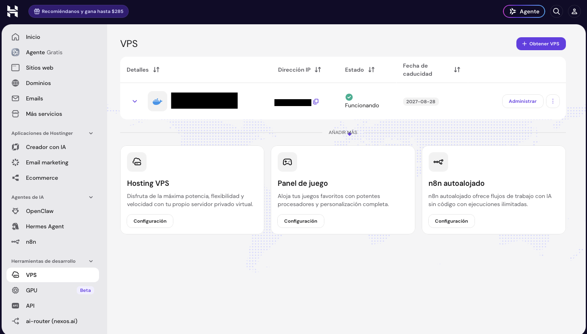
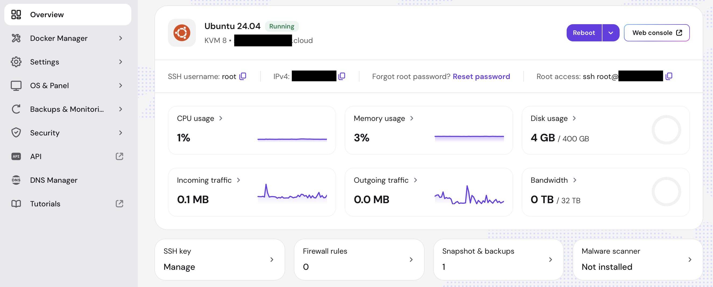
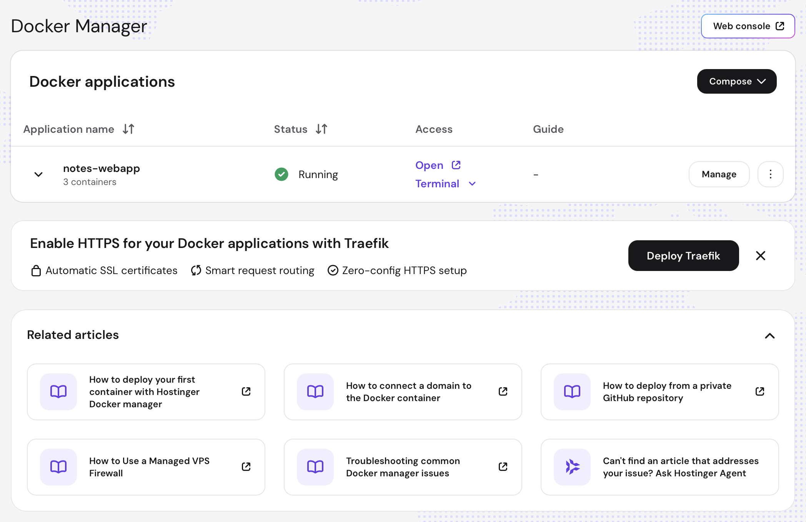

# Hostinger VPS Web Application Deployment Guide

This guide explains Hostinger VPS hosting by deploying the repository's
[`notes_webapp`](../notes_webapp/) Django application as a complete Docker
Compose stack: Nginx, Gunicorn/Django, and PostgreSQL.

The commands were reviewed against the current Hostinger documentation and
tested with Hostinger CLI 3.32.0 on 2026-09-05.

> [!IMPORTANT]
> The exemplary deployment at the end of this guide currently uses plain HTTP
> because no application domain was supplied. It is suitable for learning and
> health checks, but not for real credentials or private notes. Complete the
> domain and HTTPS section before treating it as a production service.

Table of contents:

- [Hostinger VPS Web Application Deployment Guide](#hostinger-vps-web-application-deployment-guide)
  - [Official references](#official-references)
  - [1. Hostinger's resource model and brief overview](#1-hostingers-resource-model-and-brief-overview)
    - [Hostinger overview](#hostinger-overview)
    - [Hostinger hPanel overview: VPS and Docker management](#hostinger-hpanel-overview-vps-and-docker-management)
      - [Docker Manager](#docker-manager)
      - [Firewall](#firewall)
  - [2. Target architecture](#2-target-architecture)
    - [Dev and Prod Environments](#dev-and-prod-environments)
  - [3. Prerequisites and account setup](#3-prerequisites-and-account-setup)
    - [Install the Hostinger CLI](#install-the-hostinger-cli)
    - [Log in to Hostinger](#log-in-to-hostinger)
    - [Prepare an SSH key](#prepare-an-ssh-key)
  - [4. Prepare the application](#4-prepare-the-application)
  - [5. Select and initialize the VPS](#5-select-and-initialize-the-vps)
    - [Creating a new VPS via CLI](#creating-a-new-vps-via-cli)
  - [6. Secure the server baseline](#6-secure-the-server-baseline)
  - [7. Configure and deploy the Compose stack](#7-configure-and-deploy-the-compose-stack)
    - [Re-Deployment](#re-deployment)
  - [8. Add a domain and HTTPS](#8-add-a-domain-and-https)
  - [9. Development and delivery workflow](#9-development-and-delivery-workflow)
    - [Automated CICD](#automated-cicd)
  - [10. Operate the deployment](#10-operate-the-deployment)
    - [Shut Down Apps and Clean Up](#shut-down-apps-and-clean-up)
  - [11. Security, persistence, backups, and cost](#11-security-persistence-backups-and-cost)
  - [12. Troubleshooting](#12-troubleshooting)
    - [The VPS remains in the initial state](#the-vps-remains-in-the-initial-state)
    - [SSH does not connect](#ssh-does-not-connect)
    - [The web container is unhealthy with HTTP 400](#the-web-container-is-unhealthy-with-http-400)
    - [Nginx is not created](#nginx-is-not-created)
    - [A port is already allocated](#a-port-is-already-allocated)
    - [The database or migrations fail](#the-database-or-migrations-fail)
    - [The site works by IP but not by domain](#the-site-works-by-ip-but-not-by-domain)
  - [13. Exemplary notes\_webapp deployment](#13-exemplary-notes_webapp-deployment)
    - [Deployment record](#deployment-record)
    - [Changes made to notes\_webapp](#changes-made-to-notes_webapp)
    - [What the first deployment taught us](#what-the-first-deployment-taught-us)

## Official references

- [Hostinger API CLI guide](https://www.hostinger.com/support/11679133-how-to-use-hostinger-api-cli/)
- [Hostinger API and CLI documentation](https://docs.hostinger.com/api-reference/cli)
- [Hostinger API reference](https://developers.hostinger.com/)
- [Docker VPS template](https://www.hostinger.com/support/8306612-how-to-use-the-docker-vps-template-at-hostinger/)
- [Connect to a VPS with SSH](https://www.hostinger.com/support/5723772-how-to-connect-to-your-vps-via-ssh-at-hostinger/)
- [Use SSH keys](https://www.hostinger.com/support/4792364-how-to-use-ssh-keys-at-hostinger-vps/)
- [Configure a VPS firewall](https://www.hostinger.com/support/4805502-how-to-set-up-a-firewall-at-vps/)
- [Point a domain to a VPS](https://www.hostinger.com/support/1583227-how-to-point-a-domain-to-your-vps-at-hostinger/)
- [Install SSL with Certbot](https://www.hostinger.com/support/6865487-how-to-install-ssl-on-vps-using-certbot-at-hostinger/)
- [VPS backups and snapshots](https://www.hostinger.com/support/1583232-how-to-back-up-or-restore-a-vps-at-hostinger/)
- [Deploy with GitHub Actions](https://www.hostinger.com/support/deploy-to-hostinger-vps-using-github-actions/)
- [Hostinger Docker Manager](https://www.hostinger.com/support/12040789-hostinger-docker-manager-for-vps-simplify-your-container-deployments/)
- [Connect Compose projects with Traefik](https://www.hostinger.com/support/connecting-multiple-docker-compose-projects-using-traefik-in-hostinger-docker-manager/)
- [Install Portainer CE with Docker](https://docs.portainer.io/start/install-ce/server/docker/linux)

The two introductory videos previously collected for this chapter remain useful
as visual orientation, but the commands in this guide follow the official
references above:

- [Hostinger VPS Tutorial 2026: Step-by-Step Guide for Beginners](https://www.youtube.com/watch?v=oDzkmotLgks)
- [Hostinger VPS Tutorial for Beginners -- Full Setup Guide](https://www.youtube.com/watch?v=JIi4ROX4zHc)

## 1. Hostinger's resource model and brief overview

Hostinger VPS is Infrastructure as a Service. Hostinger provides and manages the
virtual machine and its surrounding platform, while we administer the operating
system, firewall, Docker, containers, application, database, TLS, updates, and
recovery procedures.

| Resource | Purpose in this example |
| --- | --- |
| Hostinger account | Billing and access boundary |
| VPS plan | CPU, memory, disk, traffic, and recurring cost |
| Virtual machine | The Ubuntu server that runs the complete stack |
| Data center | Physical region in which the VPS is created |
| OS template | Ubuntu 24.04 with Docker and Compose preinstalled |
| Firewall | Restricts incoming traffic to SSH, HTTP, and HTTPS |
| Backups/snapshot | Server-level recovery mechanisms |
| Docker Compose project | Nginx, Django, and PostgreSQL containers |

The Hostinger CLI runs on the local computer and calls the Hostinger API. It can
inspect and initialize a VPS, manage power state, DNS, firewalls, and other
Hostinger resources. It does **not** execute `docker compose` inside the VPS;
use SSH for operating-system and application commands.

The hPanel VPS page shows the machine, plan, address, state, and management
entry point:



Hostinger also offers Docker Manager in hPanel. This guide deliberately uses
SSH and the repository's Compose file so the complete deployment is visible,
reproducible, and portable to another VPS provider.

### Hostinger overview

The left vertical panel when we log in to Hostinger has the following services:

- Web hosting and application deployment (PaaS, Platform as a Service): WordPress, Web Apps (Github-connected deployments), pure HTML/PHP-based webs, etc.
- **VPS (Virtual Private Server) plans for more control over the infrastructure: Infrastructure as a Service (IaaS)**
- Domain registration and management services; we can transfer our domain to Hostinger
- Email hosting and management services
- AI web builder
- Email marketing services
- E-commerce solutions
- AI agents: Hermes, OpelClaw, n8n
- **API: REST API + CLI + VS Code Extension**
- **GPU rental services**
- AI-routing services: they offer several models under the same API (Anthropic, OpenAI, DeepSeek, Mistral, Kimi, Minimax, GLM, etc.)

### Hostinger hPanel overview: VPS and Docker management

This section focuses on the VPS hosting service: [https://hpanel.hostinger.com/vps](https://hpanel.hostinger.com/vps).


We can select the deployed VPS and manage it by clicking on `Administrar / Manage`; then, we get these options:

```text
Overview
    VPS OS is displayed, with details
        Performance: CPU, memory, disk, traffic, and recurring cost
        Data: IP, DNS, etc
        Plan information: plan type, CPU, RAM, Disk, Bandwidth (data transfer allowed in + out per month)
    We can open web-based SSH console
    We can reboot the system
    We see the SSH keys, etc.
Docker Manager
    Applications: (see below)
    Credentials
    Catalog: images
Settings
    Main settings: reset firewall, change hostname, manage SSH keys, DNS resolvers, etc
    IP address
    Emergency mode
    SSH keys: we add our computer public key here
OS & Panel
    OS
        We can reinstall any flavor of the operating system + version here
        For example: Ubuntu 26.04
    Licenses
        We can buy licenses here; for example, cPanel (31€/month) or other software licenses.
Backups & Monitoring
    Snapshots & Backups
        The VM image is backed up weekly by default.
        Daily backups can be bought: 23 €/month
    Server Usage: Performance info every 30 mins (CPU, RAM, inbound/outboud traffic, etc)
    Latest Actions: log of latest events, e.g., deploy, etc.
Security: we can install and configure
    Malware scanner
    Firewall
        Note that if we activate UFW (Uncomplicated Firewall), it will manage the firewall rules for the VPS, i.e., we already have a firewall!
        (See below)
API: Links to REST API, CLI, VS Code Extension
    API tokens to be used programmatically to access Hostinger's API are created here.
DNS Manager: We can add domains
Tutorials: Links to tutorials
```




#### Docker Manager

Docker Manager is Hostinger's hPanel interface for viewing and operating Docker
projects on the VPS. It detects this example's `notes-webapp` Compose project
and its three containers, and provides access to status, logs, configuration,
and a web console. This convenience does not turn the deployment into a managed
PaaS: Docker and every deployed container still run inside our VPS.



The **Deploy Traefik** suggestion is optional. Traefik is a reverse proxy: it
accepts incoming HTTP and HTTPS requests and routes each hostname to the correct
container. Its Docker integration reads labels from Compose services, and its
ACME integration can request and renew Let's Encrypt certificates
automatically. It is especially useful when several independent Compose
projects must share the VPS's public ports 80 and 443.

Traefik overlaps with the role of the Nginx container in this example. The
current path is:

```text
Internet -> Nginx -> Django/Gunicorn
```

Deploying Traefik would normally change it to one of these:

```text
Internet -> Traefik -> Django/Gunicorn
Internet -> Traefik -> Nginx -> Django/Gunicorn
```

The first variant replaces Nginx as the reverse proxy. The second retains Nginx
for application-specific proxy behavior, but adds another proxy layer and is
usually unnecessary for this small app. Traefik must become the only service
publishing ports 80 and 443; deploying it while the current Nginx container
still publishes port 80 causes a port conflict. The application also needs the
Traefik labels and shared Docker network described in Hostinger's
[multi-project Traefik guide](https://www.hostinger.com/support/connecting-multiple-docker-compose-projects-using-traefik-in-hostinger-docker-manager/).

Traefik is not required for HTTPS. We can keep Nginx, obtain a Let's Encrypt
certificate with Certbot, mount the certificate and ACME challenge directories
into the Nginx container, publish port 443, and automate renewal plus an Nginx
reload. This is the most direct option for learning Nginx and operating a single
application. Traefik becomes more attractive as the number of applications and
domains grows.

[Portainer Community Edition](https://docs.portainer.io/start/install-ce/server/docker/linux)
is another optional addition. It provides a richer web UI for managing Docker
containers, images, networks, volumes, and Compose stacks, and can manage more
than one Docker environment. Portainer is **not** a reverse proxy and does not
replace Nginx or Traefik for application routing and HTTPS. For this single VPS,
it largely duplicates Hostinger Docker Manager, so it is useful as a learning
tool or when its additional Docker-management features are specifically needed,
but it is not necessary for `notes_webapp`.

Portainer commonly receives access to `/var/run/docker.sock`; control of that
socket is effectively root-level control of the VPS. Its administration UI must
therefore use strong credentials, trusted HTTPS, and restricted network access.
Its persistent `portainer_data` volume must also be backed up. Do not expose the
optional Edge Agent port 8000 unless that feature is actually being used.

Only Docker Manager's hPanel integration is supplied by Hostinger here.
Traefik, Portainer, Nginx, Certbot, their configurations, certificates,
credentials, updates, monitoring, persistent data, backups, and recovery are
self-managed workloads on the VPS. Hostinger can simplify initial deployment
through its catalog, but it does not operate those containers as fully managed
services by default.

#### Firewall

This deployment can use two complementary firewall layers:

```text
Internet
  -> Hostinger managed VPS firewall
  -> Ubuntu UFW firewall
  -> Docker-published port
  -> Nginx
```

The **Hostinger managed VPS firewall** is a network-level service configured in
**hPanel -> VPS -> Security -> Firewall**. It is listed as an included VPS
feature, so it does not require a separate paid add-on or a package installation
inside Ubuntu. It filters incoming packets before they reach the virtual
machine, uses reusable firewall groups, and supports IPv4 and IPv6.

**UFW** is the operating-system firewall installed and configured inside the
Ubuntu VPS. The exemplary deployment already enabled it with a default-deny
incoming policy and allow rules for SSH, HTTP, and HTTPS. Both layers can remain
active: a new connection succeeds only when both firewalls permit it.

For `notes_webapp`, create a Hostinger firewall group with these inbound rules:

| Protocol | Port | Source | Purpose |
| --- | ---: | --- | --- |
| TCP | `22` | A trusted public IP when stable; otherwise `Anywhere` | SSH administration |
| TCP | `80` | `Anywhere` | HTTP and Let's Encrypt validation |
| TCP | `443` | `Anywhere` | HTTPS |

Keep all other incoming traffic dropped. In particular, do not expose the
Gunicorn port `8000` or PostgreSQL port `5432`; their Compose bindings remain on
`127.0.0.1` for local diagnostics only.

> [!WARNING]
> Add and verify the SSH, HTTP, and HTTPS allow rules **before** activating the
> Hostinger firewall group. Hostinger's default policy drops all unmatched
> traffic, and applying an empty ruleset blocks every new connection, including
> SSH. If SSH is restricted to one source address, confirm that it is the
> current public IP and account for dynamic-address changes.

Using both layers is worthwhile. The Hostinger firewall reduces unwanted
traffic before it consumes VPS resources and provides protection independent of
the server configuration. UFW provides finer host-level control. The provider
firewall is also useful with Docker because published container ports can
bypass some UFW forwarding expectations.

The Hostinger firewall does not replace HTTPS, application authentication,
security updates, secret management, or DDoS protection. It is managed through
Hostinger, but selecting the rules, applying the firewall group, testing access,
and keeping it synchronized with UFW remain our responsibility. See Hostinger's
[managed VPS firewall guide](https://www.hostinger.com/support/8172641-how-to-use-a-managed-vps-firewall-at-hostinger/).

## 2. Target architecture

The deployment created for this guide currently has **one environment only**.
It is the production-shaped, or `prod`, environment and runs as the Compose
project `notes-webapp`. A separate `dev` Compose project has not been deployed.
The current instance still requires a domain and HTTPS before it should be used
as a real production service.

This single environment runs the three services declared by
[`docker-compose.yaml`](../notes_webapp/docker-compose.yaml):

```text
Internet
  -> VPS firewall: TCP 80 (and later 443)
  -> Nginx container: public port 80
       -> web container: Gunicorn + Django on the private Compose network
            -> db container: PostgreSQL 16 on the private Compose network
                 -> named volume: postgres_data
```

Two loopback bindings make diagnosis possible over SSH without publishing the
services to the internet:

```text
VPS 127.0.0.1:8000 -> web:8000
VPS 127.0.0.1:5432 -> db:5432
VPS 0.0.0.0:80     -> nginx:80
```

Nginx is the only public application entry point. It forwards the host, client
address, and protocol headers to Django. The web container waits for
PostgreSQL, applies migrations, collects static files, starts Gunicorn, and
reports health through `/health/`. Nginx reports its health through
`/nginx-health`.

### Dev and Prod Environments

Unlike Railway, Hostinger does not automatically create isolated application
environments. There is no technical requirement to purchase two VPSs: `dev`
and `prod` can run as two independent Docker Compose projects on this KVM 8
server. Each project must use a different Compose project name, `.env` file,
host ports, Docker network, PostgreSQL volume, application secrets, and database
credentials. Separate checkout directories make the fixed Compose
`env_file: .env` reference unambiguous:

```text
/home/deploy/notes_webapp     -> main branch -> COMPOSE_PROJECT_NAME=notes-webapp (current prod)
/home/deploy/notes_webapp-dev -> dev branch  -> COMPOSE_PROJECT_NAME=notes-dev
```

A simple same-VPS port layout is:

| Service | `prod` binding | `dev` binding |
| --- | --- | --- |
| Nginx | `0.0.0.0:80` | `127.0.0.1:8081` |
| Gunicorn | `127.0.0.1:8000` | `127.0.0.1:8001` |
| PostgreSQL | `127.0.0.1:5432` | `127.0.0.1:5433` |
| PostgreSQL volume | `notes-webapp_postgres_data` | `notes-dev_postgres_data` |

Start and inspect each project from its own directory:

```bash
cd /home/deploy/notes_webapp
docker compose --profile proxy up --build --detach
docker compose --profile proxy ps

cd /home/deploy/notes_webapp-dev
docker compose --profile proxy up --build --detach
docker compose --profile proxy ps
```

With this layout, production is public while development remains reachable only
from the VPS. Open an SSH tunnel when local browser access to development is
needed:

```bash
ssh -L 8081:127.0.0.1:8081 deploy@<vps-ip>
```

Then open <http://localhost:8081>. This avoids adding a public development port
to either firewall. If both environments need normal public HTTPS URLs, use one
front-door Nginx or Traefik instance on ports 80 and 443 and route different
hostnames, such as `notes.example.com` and `dev-notes.example.com`, to their
respective private services. Two separate Compose Nginx containers cannot both
publish the same host ports.

Running both environments on one KVM 8 is reasonable for this small learning
application and avoids another VPS charge. The isolation is only at the
container level: both environments still share the VPS kernel, CPU, memory,
disk, public IP, firewall, Docker daemon, and Hostinger backup/restore boundary.
A server outage, disk exhaustion, root or Docker compromise, VPS restoration,
or maintenance operation can therefore affect both environments.

Use separate VPSs when production needs a stronger security and failure
boundary, independent maintenance or restoration, or guaranteed resource
separation. That is a production recommendation, not a deployment requirement.

## 3. Prerequisites and account setup

Requirements:

- a Hostinger account with an active, uninitialized or running VPS;
- Hostinger CLI 3.32.0 or newer;
- an SSH client and an SSH key pair;
- Git;
- a domain for the final HTTPS setup;
- the public `mxagar/notes_webapp` repository.

### Install the Hostinger CLI

On macOS or Linux with Homebrew:

```bash
brew install hostinger/tap/hostinger
```

Upgrade and verify the installation:

```bash
brew upgrade hostinger
command -v hostinger
hostinger version
```

For Windows or a system without Homebrew, download the appropriate archive
from the [official CLI releases](https://github.com/hostinger/api-cli/releases)
and place the `hostinger` executable on `PATH`.

### Log in to Hostinger

For interactive use, run any command:

```bash
hostinger vps virtual-machines list
```

If the CLI has no credentials, it opens the default browser. Sign in and
authorize the CLI; it then caches and refreshes the interactive credentials.

For CI/CD or scripts, create an API token in **hPanel -> API** and provide it as
the `HOSTINGER_API_TOKEN` environment variable or as `api_token` in
`~/.hostinger.yaml`. Never commit the token. A configured token takes
precedence over browser authentication, so check both locations when an old
token unexpectedly causes authorization errors.

Confirm access without changing resources:

```bash
hostinger vps virtual-machines list --format tree
```

### Prepare an SSH key

An SSH key pair contains two files:

- the **private key**, which remains only on the computer used to connect;
- the **public key**, whose filename ends in `.pub` and is uploaded to the VPS.

Hostinger CLI authentication and SSH authentication are separate. Signing in
to the CLI lets it call the Hostinger API; it does not automatically authorize
an SSH connection to the VPS.

The following instructions use a dedicated Ed25519 key named
`id_hostinger_ed25519`. They are suitable for macOS and Linux. First, inspect
the SSH directory:

```bash
ls -la ~/.ssh
```

If `id_hostinger_ed25519` already exists, reuse it only if it is the intended key. Otherwise, choose a different filename. Do not overwrite an existing private key, because every server that trusts its matching public key would be affected.

Create the key pair locally:

```bash
mkdir -p ~/.ssh
chmod 700 ~/.ssh
ssh-keygen -t ed25519 -a 100 \
  -f ~/.ssh/id_hostinger_ed25519 \
  -C "mikel@hostinger"
```

`ssh-keygen` asks for a passphrase twice. A passphrase is recommended because
it protects the private key if the local file is copied or stolen. Leaving it
empty is more convenient for unattended automation but provides less
protection. This command creates:

```text
~/.ssh/id_hostinger_ed25519      # private key: never upload or share
~/.ssh/id_hostinger_ed25519.pub  # public key: upload this file
```

Set conventional permissions and record the public-key fingerprint:

```bash
chmod 600 ~/.ssh/id_hostinger_ed25519
chmod 644 ~/.ssh/id_hostinger_ed25519.pub
ssh-keygen -lf ~/.ssh/id_hostinger_ed25519.pub
```

To copy the public key on macOS, run:

```bash
pbcopy < ~/.ssh/id_hostinger_ed25519.pub
```

On Linux, or to inspect it before copying, run:

```bash
cat ~/.ssh/id_hostinger_ed25519.pub
```

Copy the complete single line, beginning with `ssh-ed25519`. Never copy the
contents of `id_hostinger_ed25519` without the `.pub` suffix.

There are two ways to upload the public key to Hostinger:

1. **During setup of a new VPS:** in the hPanel VPS onboarding flow, choose
   **Add SSH key**, give it a recognizable name such as
   `mikel-hostinger`, and paste the complete public-key line. The CLI
   alternative is the `--public-key` option shown in the next section; use it
   only while initializing a VPS whose state is `initial`.
2. **For an existing VPS:** open **hPanel -> VPS -> Manage -> Settings -> SSH
   keys**, select **Add SSH key**, enter a name, paste the public key, and save
   it. Hostinger documents both the onboarding and post-setup methods in its
   [SSH-key guide](https://www.hostinger.com/support/4792364-how-to-use-ssh-keys-at-hostinger-vps/).

Find the VPS IP address and SSH username in **hPanel -> VPS -> Manage ->
Overview**. For the Ubuntu Docker template, the initial administrative user is
normally `root`; use the exact username displayed in hPanel. Test the key with:

```bash
ssh -i ~/.ssh/id_hostinger_ed25519 \
  -o IdentitiesOnly=yes \
  root@<vps-ip>
```

On the first connection, SSH displays the server's host-key fingerprint. Do
not accept it blindly. Open Hostinger's **Web console** and run this on the VPS:

```bash
ssh-keygen -lf /etc/ssh/ssh_host_ed25519_key.pub
```

Compare that SHA256 fingerprint with the one shown by the local SSH prompt,
then accept it if they match. This verifies that the client is reaching the
expected server. Hostinger's
[connection guide](https://www.hostinger.com/support/5723772-how-to-connect-to-your-vps-via-ssh-at-hostinger/)
also explains where to find the connection details and how to use the Web
console.

The Hostinger-managed key authorizes the initial SSH account. Section 6 creates
the less-privileged `deploy` user and copies the authorized key to that user's
account. After that step, connect with:

```bash
ssh -i ~/.ssh/id_hostinger_ed25519 \
  -o IdentitiesOnly=yes \
  deploy@<vps-ip>
```

For convenience, add an alias to the local `~/.ssh/config` after the `deploy`
user works:

```sshconfig
Host hostinger
    HostName <vps-ip>
    User deploy
    IdentityFile ~/.ssh/id_hostinger_ed25519
    IdentitiesOnly yes
```

Then `ssh hostinger` is sufficient. Do not disable password or root login
until key-based access has succeeded in a second terminal and the Web console
has been tested as a recovery path. If authentication fails, collect verbose
SSH diagnostics:

```bash
ssh -vvv -i ~/.ssh/id_hostinger_ed25519 \
  -o IdentitiesOnly=yes \
  root@<vps-ip>
```

Check the username, IP address, uploaded public key, and whether TCP port 22 is
permitted by the VPS firewall. If the private key is ever exposed, create and
test a replacement before deleting the old public key from hPanel and the VPS.

## 4. Prepare the application

The example application already contains the required pieces:

- a production [`Dockerfile`](../notes_webapp/Dockerfile) that installs locked
  dependencies and runs as a non-root application user;
- Gunicorn bound to `0.0.0.0:8000` inside the web container;
- PostgreSQL 16 with a persistent named volume and a database health check;
- a database-aware Django `GET /health/` endpoint;
- an entrypoint that applies migrations and runs Django's `collectstatic`
  management command before starting Gunicorn;
- WhiteNoise, a Python package that serves collected static application assets;
- proxy-aware Django settings for Nginx's `X-Forwarded-Proto` header;
- an Nginx reverse-proxy configuration and Compose `proxy` profile.

`collectstatic` is part of Django, not a separate package. It gathers CSS,
JavaScript, and other static assets in `STATIC_ROOT`. WhiteNoise is a
third-party package that serves those collected files. Neither mechanism is for
user-uploaded media.

Check the application locally before deploying it:

```bash
cd notes_webapp
uv sync --locked --group dev
uv run nox
docker compose --profile proxy config
```

The `proxy` profile matters: plain `docker compose up` starts only `db` and
`web`; `docker compose --profile proxy up` also starts Nginx.

## 5. Select and initialize the VPS

Buying a Hostinger VPS plan may already leave the VPS fully initialized and
running, especially when the operating-system or Docker-template onboarding was
completed in hPanel. In that case, the data center and template were selected
during onboarding: there is nothing else to create, and running `setup` or
`purchase` is unnecessary.

Always inspect the account before taking a provisioning action:

```bash
hostinger vps virtual-machines list --format tree
hostinger vps virtual-machines get <vm-id> --format tree
```

Interpret the result as follows:

- **`running`:** the VPS already exists and is powered on. Reuse its ID and IP
  address. Do not select another data center or template, and do not run
  `setup` or `purchase`.
- **`stopped`:** the VPS is already provisioned but powered off. Start that
  machine with `hostinger vps virtual-machines start <vm-id> --format tree`;
  do not create a replacement.
- **`initial`:** the VPS has been purchased, but its first operating-system
  installation has not been completed. Do not purchase another plan. Complete
  its setup using the subsection below.
- **No VPS is listed:** first confirm that the expected plan is in the same
  Hostinger account. Only purchase through the CLI if no VPS or unused
  purchased plan exists and an additional paid VPS is genuinely required.

The `get` output shows the current template, state, and IPv4 address. A running
machine created from the Ubuntu Docker template can proceed directly to the SSH
and tool checks at the end of this section.

### Creating a new VPS via CLI

There are two different CLI cases that are easy to confuse:

1. `setup` initializes a VPS that has **already been purchased** and is in the
   `initial` state. It does not purchase another plan.
2. `purchase` buys and initializes an **additional paid VPS**. If no payment
   method is supplied, the CLI can charge the account's default payment method.

For an existing `initial` VPS, discover valid data centers and templates rather
than copying numeric IDs from this guide:

```bash
hostinger vps data-centers list --format tree
hostinger vps templates list --format tree
```

Choose the nearest suitable data center and the current Ubuntu Docker template.
Then initialize the already purchased VPS and attach the **public** SSH key:

```bash
hostinger vps virtual-machines setup <vm-id> \
  --data-center-id <data-center-id> \
  --template-id <ubuntu-docker-template-id> \
  --public-key '{"name":"hostinger-notes-webapp","key":"ssh-ed25519 AAAA..."}' \
  --enable-backups=true \
  --format tree
```

Never run `setup` against a `running` VPS. It is specifically for a newly
purchased resource in the `initial` state; reinstalling or recreating a
configured server can destroy its existing contents.

If `virtual-machines list` returned no machine and a new paid VPS is really
needed, inspect the current catalog first:

```bash
hostinger billing catalog list --category VPS --format tree
```

Then purchase and initialize it in one operation. Replace every placeholder,
including the public-key text, before running the command:

```bash
hostinger vps virtual-machines purchase \
  --item-id <vps-catalog-item-id> \
  --setup '{"template_id":<ubuntu-docker-template-id>,"data_center_id":<data-center-id>,"enable_backups":true,"public_key":{"name":"hostinger-notes-webapp","key":"ssh-ed25519 AAAA..."}}' \
  --format tree
```

> [!WARNING]
> `purchase` creates a billable VPS and may charge the default payment method.
> Do not use it merely because an existing machine is `stopped` or `initial`.

Both setup and purchase are asynchronous. For an existing `<vm-id>`, wait for
the action to succeed and the machine to become unlocked and `running`:

```bash
hostinger vps actions list <vm-id> --format tree
hostinger vps virtual-machines get <vm-id> --format tree
```

For `purchase`, first retrieve the new VM ID from the command result or list the
machines again, then use that ID in the two commands above.

Once the selected VPS is `running`, retrieve `<vps-ip>` from its `get` result.
Whether the VPS was already running or was just initialized, connect and verify
the installed tools in the same way:

```bash
ssh -i ~/.ssh/id_hostinger_ed25519 -o IdentitiesOnly=yes root@<vps-ip>
docker --version
docker compose version
git --version
```

## 6. Secure the server baseline

Create an unprivileged deployment account during the initial root SSH session:

```bash
# Get all users: make sure we don't already have a deploy user
getent passwd

# Set up a new user
# useradd creates deploy without a usable password; the password is locked.
# The account authenticates through an authorized SSH public key instead.
useradd --create-home --shell /bin/bash deploy
usermod --append --groups docker deploy
install --directory --mode 700 --owner deploy --group deploy /home/deploy/.ssh
cp /root/.ssh/authorized_keys /home/deploy/.ssh/authorized_keys
chown deploy:deploy /home/deploy/.ssh/authorized_keys
chmod 600 /home/deploy/.ssh/authorized_keys
```

Open SSH before enabling UFW so the current and future sessions remain usable:

```bash
# If root, we need sudo
ufw allow OpenSSH
ufw allow 80/tcp
ufw allow 443/tcp
ufw --force enable
ufw status verbose
```

Keep the root session open while testing the new account in another terminal:

```bash
ssh -i ~/.ssh/id_hostinger_ed25519 -o IdentitiesOnly=yes deploy@<vps-ip>
docker version
```

The `docker` group grants root-equivalent control over the Docker daemon. Use
the account only for deployment and protect its key.

> [!WARNING]
> Docker-published ports can bypass some UFW forwarding expectations. Firewall
> rules are not a substitute for safe Compose bindings. This deployment binds
> Gunicorn and PostgreSQL to `127.0.0.1` and publishes only Nginx.

Hostinger also supports a managed VPS firewall. Ensure its rules match the host
firewall, and always preserve SSH access before applying a firewall group.

## 7. Configure and deploy the Compose stack

Connect as `deploy`, clone the intended branch, and enter the repository:

```bash
ssh -i ~/.ssh/id_hostinger_ed25519 -o IdentitiesOnly=yes deploy@<vps-ip>
git clone --branch main https://github.com/mxagar/notes_webapp.git
cd notes_webapp
```

Create the untracked environment file, restrict its permissions, and generate
two different secrets:

```bash
cp .env.example .env
chmod 600 .env
openssl rand -base64 48  # DJANGO_SECRET_KEY
openssl rand -base64 32  # POSTGRES_PASSWORD
```

Edit `.env` without committing it. Replace every placeholder:

```dotenv
COMPOSE_PROJECT_NAME=notes-webapp

DJANGO_DEBUG=false
DJANGO_SECRET_KEY=<unique-random-django-secret>
DJANGO_ALLOWED_HOSTS=127.0.0.1,localhost,<vps-ip>,<vps-hostname>
DJANGO_CSRF_TRUSTED_ORIGINS=http://<vps-ip>,http://<vps-hostname>
DJANGO_SECURE_SSL_REDIRECT=false
DJANGO_SECURE_HSTS_SECONDS=0
DJANGO_SECURE_HSTS_INCLUDE_SUBDOMAINS=false
DJANGO_SECURE_HSTS_PRELOAD=false

POSTGRES_DB=notes
POSTGRES_USER=notes
POSTGRES_PASSWORD=<unique-random-database-password>
POSTGRES_PORT=127.0.0.1:5432
DATABASE_URL=postgresql://notes:<unique-random-database-password>@db:5432/notes

PORT=8000
GUNICORN_WORKERS=4
WEB_PORT=127.0.0.1:8000
NGINX_PORT=80
```

`127.0.0.1` must appear in `DJANGO_ALLOWED_HOSTS` because the image's health
check requests `http://127.0.0.1:8000/health/`. The public IP and hostname are
needed because Nginx preserves the browser's `Host` header.

Validate the service list, build, and start the complete stack:

```bash
docker compose --profile proxy config --services
docker compose --profile proxy up --build --detach
docker compose --profile proxy ps
```

The service list must contain `db`, `web`, and `nginx`. Wait until all three
containers report `healthy`, then verify both layers:

```bash
curl --fail http://127.0.0.1/nginx-health
curl --fail http://127.0.0.1/health/
```

From the local computer, verify the public path:

```bash
curl --fail http://<vps-ip>/nginx-health
curl --fail http://<vps-ip>/health/
curl --head http://<vps-ip>/
```

The expected results are `ok`, `{"status": "ok"}`, and an HTTP 302 redirect
from `/` to `/accounts/login/` for an anonymous visitor.

### Re-Deployment

The repository checkout, its untracked `.env`, and Docker's named volumes live
on the VPS disk. A normal container restart, VPS reboot, or Hostinger stop/start
does not remove them. The Compose file uses `restart: unless-stopped` for the
database, web application, and Nginx, so Docker starts those containers again
after a reboot unless they were explicitly stopped. If the stack was removed
with `docker compose down`, start it again with `up`.

The server's `/home/deploy/notes_webapp/.env` is deliberately ignored by Git.
Consequently, `git pull` does not download, replace, or update it. Maintain that
file directly on the server, keep it owned by `deploy` with mode `600`, and
store a secure off-server backup because Git is not its backup mechanism:

```bash
cd /home/deploy/notes_webapp
ls -l .env
git status --short
```

To deploy an application update from `main`, first ensure there are no
unexpected edits to tracked files, then pull and reconcile the Compose stack:

```bash
cd /home/deploy/notes_webapp
git status --short
git pull --ff-only origin main

docker compose --profile proxy up \
  --build \
  --detach \
  --remove-orphans

docker compose --profile proxy ps
curl --fail http://127.0.0.1/health/
```

`up --build` rebuilds the application image and replaces containers when
necessary without deleting the PostgreSQL volume. When the web container
starts, its entrypoint applies pending migrations and runs `collectstatic`.

If only `.env` changes, `docker compose restart` is insufficient because a
simple restart does not recreate the containers with the new environment.
Validate the resolved configuration and recreate them explicitly:

```bash
cd /home/deploy/notes_webapp
nano .env
chmod 600 .env

docker compose --profile proxy config --quiet
docker compose --profile proxy up --detach --force-recreate
docker compose --profile proxy ps
curl --fail http://127.0.0.1/health/
```

Changing `POSTGRES_PASSWORD` in `.env` does not change the password inside an
already initialized PostgreSQL database. The official PostgreSQL image applies
its initialization variables only when the database directory is empty. Change
database credentials deliberately inside PostgreSQL and update
`DATABASE_URL` consistently; otherwise the web application will lose database
access. Changing `DJANGO_SECRET_KEY` also invalidates existing signed sessions
and tokens.

The `postgres_data` named volume preserves the database when containers are
recreated or `docker compose down` is used normally. These operations have
different persistence consequences:

| Operation | Source and `.env` | PostgreSQL volume | Automatic recovery |
|---|---:|---:|---|
| Restart a container | Preserved | Preserved | Container restarts |
| Reboot or stop/start the VPS | Preserved | Preserved | `unless-stopped` restarts the stack |
| `docker compose down` | Preserved | Preserved | Run `up` again |
| `docker compose down --volumes` | Preserved | **Deleted** | Database must be restored |
| Reinstall, recreate, or delete the VPS | **May be deleted** | **May be deleted** | Restore from an external backup |

Do not use `docker compose down --volumes`, `docker volume rm`, or
`docker system prune --volumes` unless deleting stored data is intentional.
Also keep `COMPOSE_PROJECT_NAME=notes-webapp` stable: changing it makes Compose
select a differently named volume, which can make the database appear empty
even though the old volume may still exist.

Container and VPS persistence is not a database-backup strategy. Retain
restorable PostgreSQL backups outside the VPS in addition to Hostinger's
machine-level backups.

## 8. Add a domain and HTTPS

A publicly trusted certificate is issued for a domain, not the raw VPS IP.
Create an `A` record for the chosen domain or subdomain pointing to `<vps-ip>`.
If using the root domain and `www`, Hostinger's guide uses two `A` records. DNS
propagation can take up to 24 hours.

Verify DNS before requesting a certificate:

```bash
dig +short <domain>
curl --head http://<domain>/
```

Then update the server's `.env`:

```dotenv
DJANGO_ALLOWED_HOSTS=127.0.0.1,localhost,<domain>
DJANGO_CSRF_TRUSTED_ORIGINS=https://<domain>
DJANGO_SECURE_SSL_REDIRECT=true
DJANGO_SECURE_HSTS_SECONDS=0
```

The repository's Nginx runs **inside a container**, so Hostinger's host-level
`certbot --nginx` example cannot directly edit its mounted configuration. Add
certificate and ACME-challenge volumes to the Compose project, obtain the
certificate with Certbot's webroot flow, configure Nginx to listen on 443, and
add automated renewal. An alternative is to place a TLS-capable reverse proxy
such as Nginx Proxy Manager or Traefik in front of this Compose project.

After HTTPS and certificate renewal work, change `DJANGO_SECURE_HSTS_SECONDS`
from `0` to a short trial value and increase it gradually. Do not enable HSTS,
`includeSubDomains`, or preload before every affected hostname has reliable
HTTPS; a bad HSTS policy can make a site unreachable in browsers.

Verify the final route and redirect:

```bash
curl --fail https://<domain>/health/
curl --head http://<domain>/
```

The first request must return HTTP 200. The second must redirect to HTTPS.

## 9. Development and delivery workflow

This initial deployment uses a transparent manual workflow:

```text
push tested code to GitHub main
  -> SSH to the VPS
  -> fetch and fast-forward the checkout
  -> rebuild/recreate the Compose services
  -> wait for health checks
  -> verify the public endpoint
```

Run the following on the VPS:

```bash
cd /home/deploy/notes_webapp
git fetch origin main
git status --short --branch
git merge --ff-only origin/main
docker compose --profile proxy up --build --detach
docker compose --profile proxy ps
curl --fail http://127.0.0.1/health/
```

`git merge --ff-only` refuses to overwrite unexpected server-side commits. Do
not edit tracked source directly on the server; make and test changes in the
source repository.

### Automated CICD

CI and CD are related but separate stages:

- **Continuous integration (CI)** checks each proposed revision with tests,
  linting, and other quality gates.
- **Continuous delivery or deployment (CD)** releases a revision that passed
  CI to the target environment and verifies its health.

The simplest provider-native option for this application is GitHub Actions with
Hostinger's current [`hostinger/deploy-on-vps@v2`](https://github.com/marketplace/actions/deploy-on-hostinger-vps)
action. It sends the Compose project to the selected VPS through Hostinger's
API, so the GitHub runner does not need an SSH private key. The application
already has a `quality` job in `.github/workflows/ci.yml`; the deployment job
can depend on it and run only for successful pushes to `main`.

This approach changes who controls the deployment. The manual workflow above
uses the Git checkout and `.env` under `/home/deploy/notes_webapp`. The
Hostinger action instead manages a Docker Manager project and supplies its
environment through the API. Do not let both mechanisms independently manage
different Compose projects on the same ports. Keep the project name
`notes-webapp`, back up PostgreSQL first, and treat GitHub's production
environment as the new source of deployment secrets before switching.

In the GitHub repository, create an environment named `production` under
**Settings -> Environments**. Add:

- secret `HOSTINGER_API_KEY`: an API key created under **hPanel -> API**;
- secret `HOSTINGER_ENV`: the complete production `KEY=value` configuration,
  including all values currently stored in `.env` and
  `COMPOSE_PROFILES=proxy` so Nginx is started;
- variable `HOSTINGER_VM_ID`: the numeric ID of the target VPS;
- variable `HOSTINGER_HEALTH_URL`: for example,
  `https://notes.example.com/health/`, or the temporary HTTP IP URL.

The API key can manage Hostinger resources, while `HOSTINGER_ENV` contains the
application and database secrets. Never place either value directly in the
workflow. GitHub environment protection rules can require approval before the
production job runs.

Add the following `deploy` job after the existing `quality` job in
`notes_webapp/.github/workflows/ci.yml`:

```yaml
  deploy:
    name: Deploy to Hostinger production
    needs: quality
    if: github.event_name == 'push' && github.ref == 'refs/heads/main'
    runs-on: ubuntu-latest
    environment: production
    concurrency:
      group: hostinger-notes-production
      cancel-in-progress: false
    permissions:
      contents: read
    steps:
      - uses: actions/checkout@v5

      - name: Deploy Compose project
        uses: hostinger/deploy-on-vps@v2
        with:
          api-key: ${{ secrets.HOSTINGER_API_KEY }}
          virtual-machine: ${{ vars.HOSTINGER_VM_ID }}
          project-name: notes-webapp
          docker-compose-path: docker-compose.yaml
          environment-variables: ${{ secrets.HOSTINGER_ENV }}

      - name: Verify public health endpoint
        run: >-
          curl --fail --show-error
          --retry 12 --retry-delay 5 --retry-all-errors
          "${{ vars.HOSTINGER_HEALTH_URL }}"
```

The `needs: quality` dependency prevents deployment when CI fails. The `if`
condition excludes pull-request runs, `concurrency` prevents two production
deployments from changing the VPS simultaneously, and the final request makes
an unhealthy release fail visibly. For the first automated deployment, push a
harmless tested commit to `main`, watch the Docker Manager project, confirm the
named PostgreSQL volume, and verify the public endpoint. A simple rollback is
to revert the faulty commit on `main`; mature workflows should retain versioned
images and provide an explicit rollback job.

Other useful automation patterns are:

| Approach | When it fits | Main trade-off |
|---|---|---|
| GitHub Actions over SSH | Preserve the current server checkout and `.env`; remotely run the documented `git pull` and Compose commands | Requires a dedicated CI SSH key and careful host-key verification |
| Build images in CI and push to GHCR | Prefer immutable, tagged releases and quick rollbacks | Compose must pull images instead of building locally; registry credentials and retention must be managed |
| Hostinger API or CLI from another CI system | GitLab CI, Jenkins, or another runner already controls delivery | More custom scripting than the official GitHub action |
| Ansible or another configuration-management tool | Manage multiple VPSs, users, firewall rules, packages, and deployments consistently | More setup and state management than this single-server example |
| Self-hosted GitHub runner or pull-based updater | Avoid inbound SSH and keep deployment execution on the VPS | The runner becomes privileged infrastructure that must be patched and secured; image updaters such as Watchtower do not run application CI |

An image-registry workflow is the stronger long-term design: CI builds and
tests one image, assigns an immutable version tag, and both deployment and
rollback select a known image. The provider-native action is simpler for this
learning deployment because it works with the existing Compose file and
Hostinger Docker Manager.

For a conventional two-environment setup, use `dev -> dev VPS` and
`main -> prod VPS`. Each should have separate credentials, domains, Django
secrets, database passwords, volumes, and backups. Mapping `main` to both can be
useful for a learning exercise, but it is not a promotion workflow.

## 10. Operate the deployment

Run these commands from `/home/deploy/notes_webapp` on the VPS.

Inspect state and resource use:

```bash
docker compose --profile proxy ps
docker compose top
docker stats --no-stream
docker system df
```

Read bounded logs:

```bash
docker compose logs --no-color --tail 200 nginx web db
docker compose logs --no-color --since 30m web
```

Run a Django management command:

```bash
docker compose exec web /app/.venv/bin/python src/manage.py check --deploy
```

The HTTP-only learning deployment reports Django warnings `security.W004` and
`security.W008` because HSTS and automatic HTTPS redirects are deliberately
disabled. Resolve them by completing the domain and HTTPS setup; do not silence
them or enable HSTS before TLS and certificate renewal work reliably.

Restart without rebuilding, or rebuild after updating the checkout:

```bash
docker compose restart web
docker compose --profile proxy up --build --detach
docker compose --profile proxy ps
```

Stop the stack without deleting PostgreSQL data:

```bash
docker compose --profile proxy down
```

Do **not** add `--volumes` unless deletion of the PostgreSQL data is explicitly
intended and a restorable backup has been verified.

Inspect Hostinger-level state from the local computer:

```bash
hostinger vps virtual-machines get <vm-id> --format tree
hostinger vps actions list <vm-id> --format tree
```

### Shut Down Apps and Clean Up

To stop serving the site publicly while leaving Django and PostgreSQL running,
stop only Nginx. To stop and remove all three containers and their network, use
`down` without `--volumes`; the PostgreSQL volume and `.env` remain intact:

```bash
# To stop serving the app: stop nginx
cd /home/deploy/notes_webapp
docker compose --profile proxy stop nginx
# Or stop the complete stack:
docker compose --profile proxy down
```

Confirm that nothing is listening publicly on HTTP or HTTPS:

```bash
sudo ss -ltnp | grep -E ':(80|443)[[:space:]]' || echo "Ports 80 and 443 are closed"
```

For defense in depth, remove the corresponding allow rule from both UFW and
Hostinger's managed firewall. For example, `sudo ufw delete allow 80/tcp`
closes HTTP at the host firewall; do not remove the SSH rule for port 22. Stop
the container first because Docker-published ports can bypass some UFW rules.
Do not add `--volumes` to `down` unless deleting the database is intentional.

## 11. Security, persistence, backups, and cost

- Keep `DJANGO_DEBUG=false` on every public deployment.
- Store `.env` only on the server with mode `600`; use different secrets for
  every environment.
- Publish only Nginx. Keep Gunicorn and PostgreSQL bound to `127.0.0.1` or
  remove their host mappings completely.
- Allow only required inbound ports. Restrict SSH by source address when
  practical, and keep a tested recovery path in hPanel.
- Apply Ubuntu and container-image security updates regularly, then rebuild and
  re-verify the stack.
- PostgreSQL data persists in `postgres_data`. The volume survives container
  recreation and `docker compose down`, but not deliberate volume deletion,
  disk loss, or every operator error.
- Hostinger enables weekly VPS backups by default. Its documentation describes
  backups stored separately from the server and a manual snapshot that expires
  after one day. Test restoration and keep a separate, database-aware
  PostgreSQL backup for important data.
- Restoring a VPS backup overwrites server state and locks the VPS during the
  operation. Treat it as a destructive recovery action.
- A VPS is billed as an allocated server whether its containers are busy, idle,
  or stopped. Stopping Compose does not cancel the VPS plan.
- Do not put real personal or confidential notes into the HTTP learning
  deployment.

## 12. Troubleshooting

### The VPS remains in the initial state

An `initial` VPS has been purchased but not configured. Select current data
center and template IDs, run `virtual-machines setup`, then monitor:

```bash
hostinger vps actions list <vm-id> --format tree
hostinger vps virtual-machines get <vm-id> --format tree
```

Wait until setup succeeds, the machine is `running`, and actions are unlocked.

### SSH does not connect

Check the machine, address, selected private key, and registered public key:

```bash
hostinger vps virtual-machines get <vm-id> --format tree
ssh-keygen -lf ~/.ssh/id_hostinger_ed25519.pub
ssh -vvv -i ~/.ssh/id_hostinger_ed25519 \
  -o IdentitiesOnly=yes \
  root@<vps-ip>
```

Hostinger exposes firewall and SSH reset options and a browser terminal in
hPanel if a server configuration causes a lockout.

### The web container is unhealthy with HTTP 400

```bash
docker compose --profile proxy ps
docker compose logs --no-color --tail 100 web
```

The image probes `http://127.0.0.1:8000/health/`. Django returns HTTP 400 when
`127.0.0.1` is absent from `DJANGO_ALLOWED_HOSTS`. Add `127.0.0.1` and
`localhost`, then recreate the affected services:

```bash
docker compose --profile proxy up --detach --force-recreate web nginx
```

### Nginx is not created

Nginx belongs to the optional `proxy` profile:

```bash
docker compose --profile proxy up --detach
docker compose --profile proxy ps
```

It also waits for `web` to become healthy, so diagnose `web` first when Nginx
remains pending.

### A port is already allocated

```bash
sudo ss --tcp --listening --numeric --process
docker ps --format 'table {{.Names}}\t{{.Ports}}'
```

Only one service can bind public port 80. Stop the conflict or use one
front-door reverse proxy to route applications by hostname. Do not expose
Gunicorn or PostgreSQL publicly.

### The database or migrations fail

```bash
docker compose --profile proxy ps
docker compose logs --no-color --tail 200 db web
docker compose exec db pg_isready -U notes -d notes
```

Ensure `POSTGRES_PASSWORD` is present and consistent. Changing it in `.env`
does not change the password stored in an existing PostgreSQL volume. Do not
delete the volume as a shortcut when it contains data.

### The site works by IP but not by domain

```bash
dig +short <domain>
curl --resolve <domain>:80:<vps-ip> --head http://<domain>/
docker compose logs --no-color --tail 100 web nginx
```

Add the bare hostname to `DJANGO_ALLOWED_HOSTS` and the complete
`https://<domain>` origin to `DJANGO_CSRF_TRUSTED_ORIGINS`, then recreate `web`
and `nginx`.

## 13. Exemplary notes_webapp deployment

This section records the deployment performed while validating the guide.
Transient account identifiers, addresses, and generated secrets are redacted.

### Deployment record

The deployment was completed on 2026-09-05:

| Item | Value |
| --- | --- |
| Provider | Hostinger VPS |
| Plan | KVM 8: 8 vCPU, 32 GB RAM, 400 GB disk |
| Data center | Paris |
| VPS | `srvxxx.hstgr.cloud` (`xxx`) |
| OS template | Ubuntu 24.04 with Docker |
| Source | `mxagar/notes_webapp`, branch `main` |
| Deployed commit | `28097b61c9d47def264e55f7a9954cac4dc49523` |
| Checkout | `/home/deploy/notes_webapp` |
| Runtime | Docker 29.7.2; Docker Compose v5.5.0 |
| Public service | Nginx on TCP 80 |
| Loopback-only services | Gunicorn on 8000; PostgreSQL on 5432 |
| Persistent data | Compose volume `notes-webapp_postgres_data` |
| Host firewall | UFW: SSH, TCP 80, and TCP 443 allowed |
| Hostinger backups | Weekly backups enabled during VPS setup |
| TLS state | Not configured; no application domain was supplied |

All three containers reached `healthy`. The public Nginx health endpoint
returned `ok`, Django's database-aware endpoint returned `{"status": "ok"}`
with HTTP 200, and `/` returned the expected HTTP 302 redirect to
`/accounts/login/`.

### Changes made to notes_webapp

No tracked application change was required. The existing Compose file,
Dockerfile, Nginx configuration, migrations, static-file setup, and health
checks were sufficient.

The only application-specific server file is the untracked
`/home/deploy/notes_webapp/.env`. It contains generated per-deployment secrets,
has mode `600`, and must remain outside Git.

### What the first deployment taught us

The first build, database startup, migrations, static-file collection, and
Gunicorn startup succeeded. The web container nevertheless became `unhealthy`:
its health check uses `127.0.0.1`, while the initial production
`DJANGO_ALLOWED_HOSTS` contained only the public VPS address and hostname.
Django therefore returned HTTP 400.

Adding `127.0.0.1` and `localhost` to the server's environment file and
recreating `web` and `nginx` made the health check pass. Compose then started
Nginx because its `depends_on` condition requires a healthy web service.

The deployment also demonstrates the important difference from Railway: the
Hostinger CLI prepared the virtual machine, but the application deployment
itself occurred over SSH with Docker Compose. On a VPS, the operator owns server
security, TLS termination, upgrades, monitoring, database backup, and recovery.
