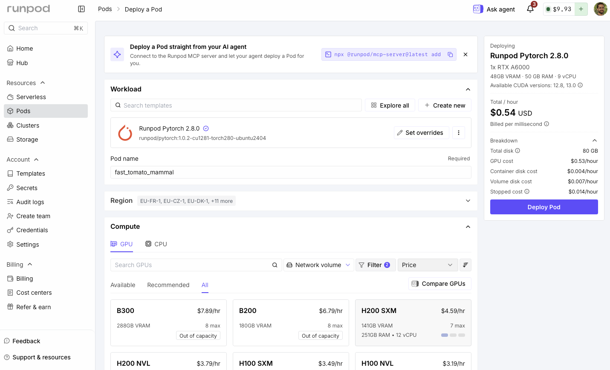
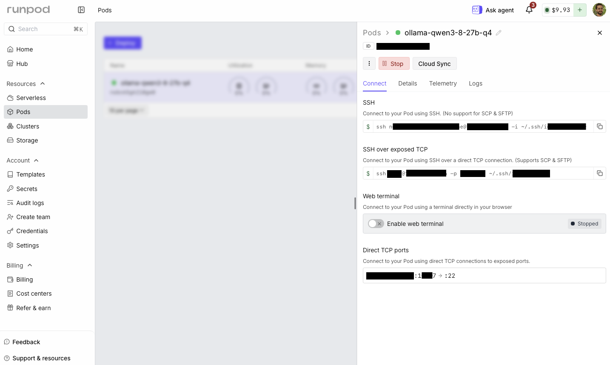

# RunPod GPU Deployment Guide

> **Companion notebook:** [`lab/runpod.ipynb`](./lab/runpod.ipynb) contains a guarded, end-to-end workflow for deploying **Qwen3.8-27B Q4_K_M** with Ollama on a RunPod Pod. It uses `runpodctl` to inspect the account, discover capacity, create and diagnose the Pod, review billing, and delete it safely. Ollama remains behind an authenticated SSH tunnel.

The notebook is designed to be runnable, but this repository does not claim a completed paid deployment. GPU availability, image tags, prices, and API behavior can change. Review the configuration and current RunPod console before enabling Pod creation.

This guide was reviewed against the current RunPod and Ollama documentation on 2026-09-04.

## Official references

- [RunPod Pods overview](https://docs.runpod.io/pods/overview)
- [RunPod Ollama tutorial](https://docs.runpod.io/tutorials/pods/run-ollama)
- [RunPod CLI overview](https://docs.runpod.io/runpodctl/overview)
- [`runpodctl pod` reference](https://docs.runpod.io/runpodctl/reference/runpodctl-pod)
- [`runpodctl billing` reference](https://docs.runpod.io/runpodctl/reference/runpodctl-billing)
- [`runpodctl user` reference](https://docs.runpod.io/runpodctl/reference/runpodctl-user)
- [RunPod REST API overview](https://docs.runpod.io/api-reference/overview)
- [Create a Pod](https://docs.runpod.io/api-reference/pods/POST/pods)
- [Connect to a Pod with SSH](https://docs.runpod.io/pods/configuration/use-ssh)
- [Expose ports](https://docs.runpod.io/pods/configuration/expose-ports)
- [Storage options](https://docs.runpod.io/pods/storage/types)
- [Pod pricing](https://docs.runpod.io/pods/pricing)
- [RunPod GPU types](https://docs.runpod.io/references/gpu-types)
- [Ollama Docker documentation](https://docs.ollama.com/docker)
- [Ollama API documentation](https://docs.ollama.com/api/introduction)
- [Official Qwen3.8 Ollama tags](https://ollama.com/library/qwen3.8/tags)

## Table of contents

- [RunPod GPU Deployment Guide](#runpod-gpu-deployment-guide)
  - [Official references](#official-references)
  - [Table of contents](#table-of-contents)
  - [1. Why use a Pod](#1-why-use-a-pod)
  - [2. Model and hardware choice](#2-model-and-hardware-choice)
    - [Recommended GPU](#recommended-gpu)
    - [Why use the RunPod PyTorch image?](#why-use-the-runpod-pytorch-image)
  - [3. Account, API key, and SSH setup](#3-account-api-key-and-ssh-setup)
  - [Essential `runpodctl` commands](#essential-runpodctl-commands)
    - [Authenticate and inspect the account](#authenticate-and-inspect-the-account)
    - [Manage SSH keys](#manage-ssh-keys)
    - [Discover GPUs and official templates](#discover-gpus-and-official-templates)
    - [Create the guarded Qwen Pod](#create-the-guarded-qwen-pod)
    - [Inspect and diagnose Pods](#inspect-and-diagnose-pods)
    - [Stop, start, and terminate](#stop-start-and-terminate)
    - [Review balance and charges](#review-balance-and-charges)
  - [4. Security design](#4-security-design)
  - [5. Storage and billing](#5-storage-and-billing)
  - [6. Console deployment](#6-console-deployment)
  - [7. Automated notebook workflow](#7-automated-notebook-workflow)
  - [8. Calling Ollama](#8-calling-ollama)
  - [9. Cleanup](#9-cleanup)
  - [10. Troubleshooting](#10-troubleshooting)
    - [No GPU is available](#no-gpu-is-available)
    - [No public IP or SSH port appears](#no-public-ip-or-ssh-port-appears)
    - [SSH asks for a password](#ssh-asks-for-a-password)
    - [SSH host-key mismatch](#ssh-host-key-mismatch)
    - [Ollama does not start](#ollama-does-not-start)
    - [Model pull fills the disk](#model-pull-fills-the-disk)
    - [Out of memory](#out-of-memory)
    - [HTTP 524 or requests stop after 100 seconds](#http-524-or-requests-stop-after-100-seconds)

## 1. Why use a Pod

RunPod offers persistent **Pods** and autoscaled **Serverless** workers. A Pod is the simpler match for this experiment because downloading an 18 GB model, opening an interactive SSH tunnel, inspecting logs, and comparing GPU performance are stateful operations.

Use Serverless later when the workload has a production container, a request handler, predictable startup behavior, and enough traffic variability to justify autoscaling. An Ollama tag cannot be placed directly into a generic Serverless endpoint without a compatible worker container and request handler.

The companion notebook therefore uses an on-demand GPU Pod managed primarily with the official `runpodctl` CLI. The REST API remains useful for integrations, but it is not required by this notebook.

## 2. Model and hardware choice

The model is the official Ollama artifact:

```text
qwen3.8:27b-q4_K_M
```

At the time of review, Ollama lists it as an approximately 18 GB, 27B-parameter, Q4_K_M model. Q4_K_M is a four-bit GGUF quantization intended to preserve more quality than smaller quantizations while substantially reducing memory compared with BF16.

### Recommended GPU

The notebook tries these GPU types in order:

1. `NVIDIA GeForce RTX 5090` — 32 GB VRAM
2. `NVIDIA A40` — 48 GB VRAM
3. `NVIDIA L40S` — 48 GB VRAM

The notebook uses a **32,768-token context**. One 32 GB RTX 5090 is the economical target for the 18 GB quantization while leaving substantially more room than a 24 GB card for the KV cache, CUDA state, multimodal components, and Ollama overhead. Artifact size is not the complete runtime memory requirement.

This fit remains workload-dependent. If Ollama reports an out-of-memory error at 32K, use a 48 GB A40/L40S or reduce `OLLAMA_CONTEXT_LENGTH` to 16384. Do not assume the model's advertised 256K context will fit merely because the weights fit.

The notebook defaults to one GPU because a single 5090 is simpler than splitting this quantization across two cards. If it is unavailable, change `RUNPOD_GPU_TYPE` to `NVIDIA A40` or `NVIDIA L40S`. Override `RUNPOD_GPU_COUNT` or `OLLAMA_CONTEXT_LENGTH` only when required.

### Why use the RunPod PyTorch image?

The notebook uses the pinned image `runpod/pytorch:1.0.3-cu1281-torch291-ubuntu2404` for the surrounding Pod environment, not because Ollama requires PyTorch. This tag exists in RunPod's registry and is also the image used in the current [`runpodctl pod create` documentation](https://docs.runpod.io/runpodctl/reference/runpodctl-pod). This guide is deliberately **SSH-first**: RunPod's official PyTorch templates have an SSH server and the required connection setup preconfigured, so the notebook can install Ollama, inspect the GPU and logs, and reach the API through an authenticated SSH tunnel. RunPod also uses its PyTorch template in the [official Ollama-on-a-Pod tutorial](https://docs.runpod.io/tutorials/pods/run-ollama).

The official `ollama/ollama:latest` image is a valid and more direct choice when the only requirement is to start Ollama. Its documented container workflow starts the Ollama service and exposes port `11434`, but it does not provide RunPod's preconfigured full SSH environment. Using it with this notebook would therefore require a custom image or startup command that installs and starts `sshd`, handles the authorized public key, and starts Ollama. See the [RunPod SSH requirements for custom images](https://docs.runpod.io/pods/configuration/use-ssh) and the [official Ollama container instructions](https://hub.docker.com/r/ollama/ollama).

That distinction matters for security. Ollama has no built-in API authentication, so exposing `11434/http` through a public proxy is not equivalent to protecting it with the RunPod API key. The current design exposes only `22/tcp`, binds Ollama to Pod-local `127.0.0.1:11434`, and carries requests through SSH key authentication:

```text
Local client -> authenticated SSH tunnel -> Pod 127.0.0.1:11434 -> Ollama
```

Do not substitute `runpod/pytorch:latest`: RunPod does not currently publish that tag, so Pod creation fails with an image-not-found error. Keeping a reviewed versioned tag also prevents an upstream image update from silently changing the deployment. `RUNPOD_IMAGE` remains configurable through `.env` when you intentionally test a newer tag from the official [`runpod/pytorch` registry](https://hub.docker.com/r/runpod/pytorch/tags).

## 3. Account, API key, and SSH setup

Create a RunPod account, add credit, and generate a dedicated API key in account settings. Prefer a newly generated key with the minimum permissions that still allow the Pod operations you need; avoid reusing a legacy or unrelated automation key.

Install the official CLI on macOS:

```bash
brew install runpod/runpodctl/runpodctl
```

Then use the interactive diagnostic command. It configures both API and SSH access without placing the API key in this repository:

```bash
runpodctl doctor  # An API key is required for this command, created in the RunPod console
runpodctl version
runpodctl user
```

RunPod stores CLI credentials under `~/.runpod/config.toml`. Treat that file like a password, restrict its permissions, never commit it, and revoke the key immediately if it is exposed:

```bash
chmod 600 ~/.runpod/config.toml
```

Create a dedicated SSH key pair and upload only its public half:

```bash
ssh-keygen -t ed25519 -f ~/.ssh/id_runpod_ed25519 -C "runpod"
chmod 600 ~/.ssh/id_runpod_ed25519
runpodctl ssh add-key --key-file ~/.ssh/id_runpod_ed25519.pub
runpodctl ssh list-keys
```

This creates two different files:

- `~/.ssh/id_runpod_ed25519` is the **private key**. It stays on your computer and is used by `ssh -i`.
- `~/.ssh/id_runpod_ed25519.pub` is the **public key**. This is the file uploaded to RunPod.

The notebook's local `.env` contains both paths explicitly. It does not need the API key because `runpodctl` handles API authentication:

```dotenv
# Private key used locally by SSH. Never upload or commit this file.
RUNPOD_SSH_KEY_PATH=~/.ssh/id_runpod_ed25519

# Public key uploaded with `runpodctl ssh add-key`.
RUNPOD_SSH_PUBLIC_KEY_PATH=~/.ssh/id_runpod_ed25519.pub

# Optional overrides
# RUNPOD_CLOUD_TYPE=COMMUNITY
# RUNPOD_GPU_TYPE=NVIDIA GeForce RTX 5090
# RUNPOD_GPU_COUNT=1
# RUNPOD_IMAGE=runpod/pytorch:1.0.3-cu1281-torch291-ubuntu2404
# RUNPOD_POD_ID=
# OLLAMA_MODEL=qwen3.8:27b-q4_K_M
# OLLAMA_CONTEXT_LENGTH=32768
```

`RUNPOD_SSH_KEY_PATH` intentionally does **not** end in `.pub`: the SSH client needs the private key for authentication. `RUNPOD_SSH_PUBLIC_KEY_PATH` does end in `.pub` and is safe to upload. If the public-key variable is omitted, the notebook derives it by appending `.pub` to the private-key path.

The `.env` file and private key must not be committed. The notebook reads the public key and also passes it to the official RunPod image as `PUBLIC_KEY`, ensuring that the corresponding private key can authenticate to port 22. Never put the private key itself in a Pod environment variable.

## Essential `runpodctl` commands

`runpodctl` emits JSON by default, which makes it suitable for notebooks and automation. Current CLI versions support only `json` and `yaml` output; `table` is not a valid format. Add `--output=yaml` (or `-o yaml`) when YAML is easier to read.

### Authenticate and inspect the account

```bash
runpodctl doctor
runpodctl user
```

`doctor` is the recommended first-time setup and diagnostic command. `user` shows the current credit balance, current spend per hour, and account spend limit. Do not paste the API key into notebook cells, terminal screenshots, shell scripts, or Git history.

### Manage SSH keys

```bash
# Upload the public key, never the private key:
runpodctl ssh add-key --key-file ~/.ssh/id_runpod_ed25519.pub
runpodctl ssh list-keys
runpodctl ssh info POD_ID
```

The `info` command returns the current SSH command for a Pod. Keep the private key local and protected with mode `600`.

### Discover GPUs and official templates

```bash
runpodctl gpu list
runpodctl template search pytorch --type official
```

GPU inventory changes continuously. Confirm that the requested GPU is available immediately before provisioning.

### Create the guarded Qwen Pod

The notebook constructs the equivalent command using a JSON-encoded public-key environment variable:

```bash
runpodctl pod create \
  --name ollama-qwen3-8-27b-q4 \
  --image runpod/pytorch:1.0.3-cu1281-torch291-ubuntu2404 \
  --gpu-id "NVIDIA GeForce RTX 5090" \
  --gpu-count 1 \
  --cloud-type COMMUNITY \
  --public-ip \
  --ssh \
  --ports 22/tcp \
  --container-disk-in-gb 50 \
  --volume-in-gb 40 \
  --volume-mount-path /workspace \
  --env '{"PUBLIC_KEY":"ssh-ed25519 AAAA..."}'
```

In `runpodctl` 2.12.0, `pod create` does not provide a `--terminate-after` flag. Do not add it: the command will fail with `unknown flag`. This workflow consequently has no CLI-configured automatic deletion backstop. Keep the RunPod console open during the experiment, delete the Pod explicitly when finished, and confirm its absence with `runpodctl pod list --all`. Account spending limits and billing alerts are useful secondary safeguards, but they do not replace deletion.





### Inspect and diagnose Pods

```bash
runpodctl pod list --all
runpodctl pod get POD_ID
runpodctl ssh info POD_ID
runpodctl doctor
```

`pod get` includes resource and connection details. Once connected by SSH, use `nvidia-smi`, `ollama ps`, `df -h /workspace`, and `/workspace/ollama-serve.log` for workload-level debugging.

In `runpodctl` 2.12.0, `pod get` reports the mapped SSH address under the nested `ssh.ip` and `ssh.port` fields. Older examples may refer to top-level `publicIp` and `portMappings`; the companion notebook accepts both response shapes.

### Stop, start, and terminate

```bash
runpodctl pod stop POD_ID
runpodctl pod start POD_ID
runpodctl pod delete POD_ID
runpodctl pod list --all
```

Stopping and deleting are not equivalent:

- `stop` releases GPU compute but retains the Pod and its volume disk, so storage billing can continue.
- `delete` permanently terminates the Pod and deletes its attached volume disk.
- A separate network volume survives Pod deletion and must be deleted independently.

After deletion, list all Pods and verify that the ID is gone.

### Review balance and charges

```bash
runpodctl user
runpodctl billing pods --bucket-size hour --grouping podId
runpodctl billing pods --bucket-size hour --grouping podId --pod-id POD_ID
runpodctl billing network-volume --bucket-size day
```

The RunPod console's **Billing** page provides the visual Billing Explorer, balance, transactions, and auto-pay controls. Use both the CLI and console: the CLI is convenient during an experiment, while the console is the final place to confirm that no Pod or volume remains.

## 4. Security design

There are two separate authentication boundaries:

- **RunPod control plane:** `runpodctl` uses the RunPod API key to create, inspect, stop, and delete resources.
- **Ollama data plane:** Ollama's HTTP API has no authentication. A valid RunPod API key does not protect a publicly exposed Ollama port.

RunPod's HTTP proxy is HTTPS, but the official port documentation states that proxy URLs are publicly accessible. A Pod ID is not an authentication mechanism.

The notebook therefore does **not** expose `11434/http`. Its network path is:

```text
Local OpenAI/Ollama client
  -> 127.0.0.1:<random local port>
  -> encrypted SSH tunnel with key authentication
  -> Pod 127.0.0.1:11434
  -> Ollama
  -> Qwen3.8-27B
```

Only `22/tcp` is exposed. Ollama binds to `127.0.0.1` inside the Pod, and the local tunnel also binds to `127.0.0.1`.

Someone cannot call Ollama merely by knowing the Pod ID, public IP, or mapped SSH port. They would additionally need the SSH private key or another way into the Pod or host. The underlying RunPod host still belongs to a third party, so do not process sensitive data on Community Cloud without accepting that trust boundary. Prefer Secure Cloud and encrypted volume storage for sensitive workloads.

Do not change `OLLAMA_HOST` to `0.0.0.0` or expose `11434/http` unless an authentication and authorization layer is added. HTTPS encryption alone does not control who may call the endpoint.

## 5. Storage and billing

RunPod separates GPU compute from storage. The relevant Pod storage types are:

| Storage | Lifetime | Use here |
|---|---|---|
| Container disk | Temporary; cleared when the Pod stops or resets | OS, the RunPod image, and the Ollama binary |
| Volume disk at `/workspace` | Persists while the Pod exists; deleted with the Pod | Ollama model blobs and logs |
| Network volume | Exists independently and is billed separately | Optional shared/persistent model cache |

The notebook allocates a 50 GB container disk and a 40 GB volume disk. The model is stored beneath `/workspace/ollama-models`, not in the temporary container layer.

Stopping a Pod stops GPU compute charges but can retain and bill volume storage. Deleting the Pod deletes its attached volume disk. A separately created network volume survives Pod deletion and must be deleted separately when no longer needed.

Always verify the current hourly GPU and storage prices in the console before creating the Pod. Also run `runpodctl user` before and after the experiment and query `runpodctl billing pods --pod-id POD_ID` for attributable history.

## 6. Console deployment

For a manual deployment matching the notebook:

1. Open **Pods → Deploy** in the RunPod console.
2. Select an on-demand RTX 5090, A40, or L40S.
3. Select the official RunPod PyTorch template.
4. Allocate about 50 GB of container disk and at least 40 GB of volume disk.
5. Expose TCP port `22`; do not expose HTTP port `11434`.
6. Add the SSH public key in account settings or as `PUBLIC_KEY`.
7. Deploy the Pod and wait for its public IP and mapped SSH port.
8. Connect with the SSH command shown by RunPod.
9. Install Ollama using the official installer, start it on `127.0.0.1:11434`, and store models in `/workspace/ollama-models`.
10. Open a local SSH tunnel and pull `qwen3.8:27b-q4_K_M` through the local endpoint.

RunPod's own Ollama tutorial exposes port 11434 through the public HTTP proxy. That is convenient for a demonstration, but it is not suitable for an unauthenticated private model API. This guide intentionally uses SSH instead.

## 7. Automated notebook workflow

Open [`lab/runpod.ipynb`](./lab/runpod.ipynb), select the shared lab kernel, and run cells in order.

Install the environment from the lab directory:

```bash
cd 02_Example_Deployments/lab
uv sync --locked
uv run python -m ipykernel install --user \
  --name gpu-deployments \
  --display-name gpu-deployments
```

The notebook shells out to the official `runpodctl` binary and parses its default JSON output. It uses the CLI for account checks, GPU discovery, creation, inspection, billing, and deletion. No RunPod Python SDK is required.

Paid operations are guarded:

- `CREATE_POD = False` prevents accidental creation.
- `DELETE_POD = False` prevents accidental deletion.
- `RUNPOD_POD_ID` lets the notebook resume an existing Pod without creating another one.

Before setting `CREATE_POD = True`, inspect the configured image, cloud type, GPU, GPU count, storage, and current account balance. Your installed CLI does not configure automatic Pod deletion, so plan to run the cleanup cell and verify deletion as soon as the experiment ends.

The default `RUNPOD_IMAGE` is pinned because `runpod/pytorch:latest` is not published. Before intentionally changing the tag, confirm that the exact value exists in the official [`runpod/pytorch` registry](https://hub.docker.com/r/runpod/pytorch/tags).

## 8. Calling Ollama

After the SSH tunnel is open, the local Ollama URL resembles:

```text
http://127.0.0.1:54321
```

Ollama provides both its native API and an OpenAI-compatible API. The OpenAI client configuration is:

```python
from openai import OpenAI

client = OpenAI(
    base_url=f"{OLLAMA_URL}/v1/",
    api_key="ollama",  # SDK placeholder; Ollama does not authenticate it
)
```

Omit `max_tokens` to avoid an application-level output cap. Generation still ends at an end-of-sequence token or the model/runtime context limit.

For approximate end-to-end throughput:

```python
tok_s = response.usage.completion_tokens / elapsed_seconds
```

For generation-only throughput, use Ollama's native timing fields:

```python
tok_s = result["eval_count"] / (result["eval_duration"] / 1e9)
```

Ollama durations are in nanoseconds. Use a warm second request when comparing GPUs so initial model loading does not dominate the result.

## 9. Cleanup

The final notebook cell first closes the local SSH tunnel. With `DELETE_POD = True`, it runs `runpodctl pod delete POD_ID`, then lists Pods again for verification. Confirm in the RunPod console that the Pod is gone and check whether any separately created network volumes remain.

If a later notebook cell fails after Pod creation, return immediately to the cleanup cell or delete the Pod in the console. Do not rely on closing the browser or notebook kernel to stop billing.

## 10. Troubleshooting

### No GPU is available

- Check current stock in the console.
- Change `RUNPOD_GPU_TYPE` to another GPU with at least 32 GB VRAM.
- Try `SECURE` or `COMMUNITY` according to availability and your trust requirements.
- Do not silently switch to a GPU with less than 32 GB for this 32K Q4 configuration.

### No public IP or SSH port appears

- Confirm `supportPublicIp` is true and `22/tcp` is exposed.
- Wait for the Pod image to finish downloading and initializing.
- Inspect the Pod logs in the console.
- Confirm the selected machine supports a public IP.

### SSH asks for a password

- Ensure `RUNPOD_SSH_KEY_PATH` points to the private key corresponding to the injected `.pub` file.
- Ensure the private key permissions are restrictive: `chmod 600 KEY_PATH`.
- Verify the full public-key line begins with a key type such as `ssh-ed25519`.
- Compare the current IP and port mapping with the RunPod Connect panel.

### SSH host-key mismatch

Public IPs and mapped ports can be reassigned. Verify the new mapping in the authenticated RunPod console before removing an old known-host entry:

```bash
ssh-keygen -R '[POD_IP]:MAPPED_PORT'
```

Never disable host-key checking merely to suppress the warning.

### Ollama does not start

Connect over SSH and inspect:

```bash
cat /workspace/ollama-serve.log
nvidia-smi
curl http://127.0.0.1:11434/api/tags
```

### Model pull fills the disk

- Confirm `OLLAMA_MODELS=/workspace/ollama-models` is present in the Ollama server environment.
- Check `df -h /workspace` and `du -sh /workspace/ollama-models`.
- Increase the volume disk in the console if necessary. RunPod volumes can be increased but not reduced.

### Out of memory

- Reduce `OLLAMA_CONTEXT_LENGTH`, for example from 32768 to 16384.
- Move from the 32 GB target to a 48 GB GPU.
- Confirm no other process is consuming VRAM with `nvidia-smi`.
- Do not use the advertised 256K context as a default merely because the weights fit.

### HTTP 524 or requests stop after 100 seconds

That is a RunPod HTTP-proxy timeout. This notebook does not use that proxy; it uses an SSH tunnel. If you exposed `11434/http` manually, remove it and follow the private-tunnel workflow, or place a properly authenticated asynchronous service in front of Ollama.
