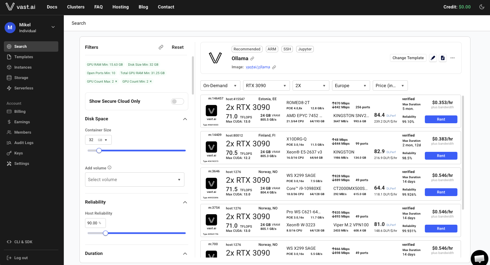
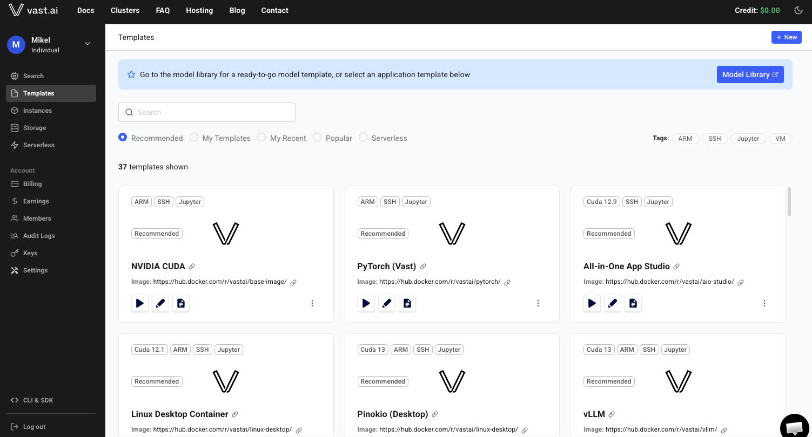
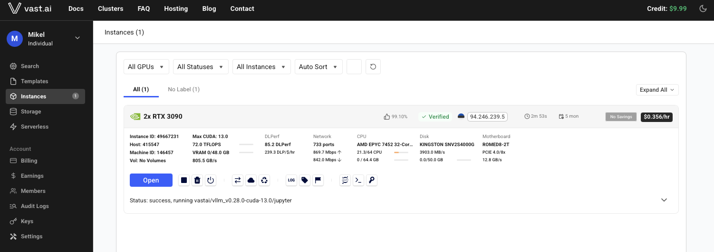
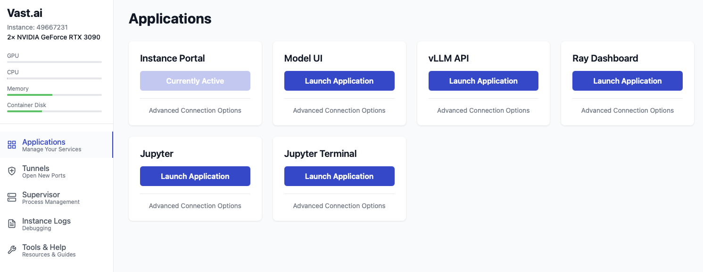

# Vast.ai: A Guide

Sources:

- [Vast.ai Quickstart Guide (2025 Update) -- Run AI Models on Cloud GPUs](https://www.youtube.com/watch?v=GxCLo1vYrbY)
- [Serving Online Inference with vLLM API on Vast.ai](https://www.youtube.com/watch?v=NsFbRM1X26M&list=PLOh22sMx68s5jJSywN5OgKUXQeQnxVfGy&index=10)
- [Setting up DeepSeek R1 on Vast.ai](https://www.youtube.com/watch?v=542xENIxKFU&list=PLOh22sMx68s5jJSywN5OgKUXQeQnxVfGy&index=11)
- [Vast.ai Serverless Documentation](https://docs.vast.ai/documentation/serverless/getting-started-with-serverless)
- [Vast.ai Get Started Guide](https://docs.vast.ai/guides/get-started)

Additional links:

- [Vast.ai Tutorials Playlist](https://www.youtube.com/playlist?list=PLOh22sMx68s5jJSywN5OgKUXQeQnxVfGy)
- List of GPUs and their prices: [`https://gputable.dev`](https://gputable.dev).

Table of Contents:

- [Vast.ai: A Guide](#vastai-a-guide)
  - [1. Introduction](#1-introduction)
  - [2. Account Setup and Billing](#2-account-setup-and-billing)
  - [3. Core Concepts: Templates, Instances, and Offers](#3-core-concepts-templates-instances-and-offers)
  - [4. Quickstart: Renting an On-Demand GPU Instance](#4-quickstart-renting-an-on-demand-gpu-instance)
    - [Trusting the Vast.ai Certificate (Jupyter / Instance Portal HTTPS)](#trusting-the-vastai-certificate-jupyter--instance-portal-https)
    - [Managing SSH Keys](#managing-ssh-keys)
      - [Connecting from a Non-Interactive Client (e.g., a Railway-Hosted App)](#connecting-from-a-non-interactive-client-eg-a-railway-hosted-app)
    - [Launching an LLM: Ollama vs. vLLM](#launching-an-llm-ollama-vs-vllm)
      - [Which one should you pick?](#which-one-should-you-pick)
    - [Calling an Instance from Python with the OpenAI SDK](#calling-an-instance-from-python-with-the-openai-sdk)
  - [5. The `vastai` CLI](#5-the-vastai-cli)
  - [6. Example: Serving an LLM with the vLLM API](#6-example-serving-an-llm-with-the-vllm-api)
    - [Deploying a single-GPU model](#deploying-a-single-gpu-model)
    - [Deploying a large, quantized model across multiple GPUs](#deploying-a-large-quantized-model-across-multiple-gpus)
  - [7. Example: Deploying DeepSeek R1 with Ollama and Open WebUI](#7-example-deploying-deepseek-r1-with-ollama-and-open-webui)
  - [8. Vast.ai Serverless](#8-vastai-serverless)
  - [9. Example: Deploying Qwen3.8-27B on Vast.ai Serverless](#9-example-deploying-qwen38-27b-on-vastai-serverless)
    - [Prerequisites](#prerequisites)
    - [Create the endpoint](#create-the-endpoint)
    - [Create the workergroup](#create-the-workergroup)
    - [Query the endpoint](#query-the-endpoint)
  - [10. Managing Costs and Cleanup](#10-managing-costs-and-cleanup)

## 1. Introduction

- Vast.ai is a GPU marketplace: individuals and data centers list spare GPU capacity, and renters bid on or directly rent that capacity by the hour.
  - This peer-to-peer supply keeps prices well below traditional cloud providers for the same GPU class.
  - A live price comparison across GPU models and providers is available at [`gputable.dev`](https://gputable.dev).
- Workloads are launched from **templates**: preconfigured Docker images with the software stack (Jupyter, SSH, a web UI, an inference server) already wired up.
- Two ways to run workloads:
  - **On-demand instances**: you rent one or more specific GPU machines and manage them yourself (start, stop, destroy).
  - **Serverless endpoints**: you define scaling rules and Vast.ai automatically provisions and tears down GPU workers behind an API (see [Section 8](#8-vastai-serverless)).
- Official documentation is organized by use case (image generation, video generation, text generation, embeddings, 3D rendering, audio, development) and is worth browsing before picking a template, since most common workloads already have a maintained, tested template.





## 2. Account Setup and Billing

- Create an account from the main search interface's login modal, verify the account through the confirmation email, then open the **Billing** section.
- Add funds with a credit card, Coinbase, or Crypto.com.
- Enable **automatic top-up** so that instances are not interrupted when the account balance runs low.
  - First, we need to add payment method (e.g., credit card), then add credit for the first time, and finally enable auto top-up.
- Storage is billed independently of compute:
  - Disk space attached to an instance accrues cost continuously, whether the instance is running or stopped.
  - Only a fully **destroyed** instance stops all charges (see [Section 10](#10-managing-costs-and-cleanup)).
  - GPU compute charges stop when an instance is stopped, but restart as soon as it is started again.

## 3. Core Concepts: Templates, Instances, and Offers

- **Templates** bundle a Docker image with default ports, environment variables, and startup commands. Common categories:
  - General computing: CUDA / PyTorch images with Jupyter and SSH pre-installed.
  - Text generation: oobabooga/textgen, LLM-serving frameworks such as vLLM.
  - Desktop environments: a full Linux desktop container, or Pinocchio.
  - Image generation: ComfyUI.
  - Video generation: Open-Sora, ComfyUI with the LTX-Video module.
  - Audio: Whisper for transcription.
- **Offers** are the individual machines listed by hosts. The search interface filters offers by:
  - GPU type, GPU count, and total compute (FLOPS).
  - VRAM, bandwidth, and CPU specs.
  - Rental type: on-demand, interruptible (spot-like, can be preempted), or reserved (discounted, longer commitment).
  - Maximum rental duration (useful when you need a machine guaranteed available for weeks or months).
  - Trust level: offers hosted in a verified data center are labeled distinctly from community-hosted machines.
- **Instances** are the running rentals created from an offer + template pair. Each instance gets its own **instance portal**, which lists every service exposed by the template (Jupyter, SSH, the app's web UI, its API port) together with live logs.

## 4. Quickstart: Renting an On-Demand GPU Instance

There is a CLI which can be installed as follows:

```bash
# System installation
curl -fsSL https://vast.ai/install.sh | bash

# Python installation
pip install --upgrade vastai

# Set your API key (from the dashboard) for CLI authentication
# https://cloud.vast.ai: Keys > API Keys > Create New Key
vastai set api-key <YOUR_API_KEY>
```

To create an instance:

1. Open the Vast.ai console [https://cloud.vast.ai](https://cloud.vast.ai) and pick a **template** relevant to the workload (for example ComfyUI for image generation, or PyTorch for general development, or vLLM for serving LLMs).
2. Size the **disk**: hover over the price button to see storage cost per GB, GPU cost per hour, and the combined total before renting.
3. Filter and pick an **offer** (a specific GPU machine) that matches the template's requirements, then click **Rent**.
   - The first time you open Jupyter or the instance portal, the browser may prompt to trust or download a certificate -- see [Trusting the Vast.ai Certificate](#trusting-the-vastai-certificate-jupyter--instance-portal-https) below for what it is and whether you need to install it.
4. Watch the instance load on the **Instances** page:
   - IP address and port mappings are available from the instance's detail button.
   - The **Open** button launches the instance portal, showing every running service (for example Jupyter, a terminal, the app UI) and their logs.
   - In the instance web UI we can see other additional options:
     - Instance ID
     - IP and Port information
     - Hardware specs
     - Run stats
     - We can add SSH keys manually here, if not added globally in the account settings.
     - Launch Jupyter with its icon
     - etc.
5. Connect to the instance through whichever service the template exposes:
   - Jupyter gives notebooks, a terminal, and a file browser (drag-and-drop upload).
   - SSH access and key management (add/remove keys) are available per instance — see [Managing SSH Keys](#managing-ssh-keys) below.
6. Other per-instance actions available from the console:
   - Tag the instance for organization.
   - Recreate the instance to change its template without re-selecting an offer.
   - Sync data in/out through Dropbox, Google Drive, S3, or Backblaze.
   - Reboot, stop, or destroy the instance.
7. Check the **Billing** page at any time to see the running cost per hour and per day for each instance.





### Trusting the Vast.ai Certificate (Jupyter / Instance Portal HTTPS)

- Jupyter and the instance portal are served over HTTPS by a Caddy proxy running on the instance, using a **self-signed** certificate generated at boot — not one issued by a public certificate authority. That mismatch is exactly what triggers the browser's security warning the first time you open either service.
- Two ways to deal with it:
  - **Per-visit workaround**: click through the browser's warning (Chrome/Edge: "Advanced" -> "Proceed"). Fine for occasional, personal access.
  - **Permanent fix**: install Vast.ai's own root certificate once, so every instance you ever rent is trusted automatically:
    - Download it directly from `https://console.vast.ai/static/jvastai_root.cer`.
    - **Windows**: double-click the file -> *Install Certificate* -> *Local Machine* -> *Place all certificates in the following store* -> *Trusted Root Certification Authorities* -> finish, then reboot.
    - **macOS**: double-click the file to add it to Keychain Access, open the new entry, expand **Trust**, and set "When using this certificate" to **Always Trust**. Takes effect immediately, no reboot.
    - **Chrome (Windows/Linux)**: Settings -> Privacy and security -> Security -> *Manage certificates* -> **Authorities** tab -> Import -> select `jvastai_root.cer` -> place it in *Trusted Root Certification Authorities*.
- This certificate only covers the HTTPS front-end Vast.ai puts in front of Jupyter/the instance portal. It has nothing to do with SSH, and nothing to do with a plain HTTP API port an image binds directly (for example a vLLM server started without `ENABLE_HTTPS`, as in [Section 6](#6-example-serving-an-llm-with-the-vllm-api)).
- For scripts and CLI tools hitting an HTTPS instance-portal endpoint without installing the certificate, skip verification instead: `curl -k ...`, or `verify=False` in Python (shown in [Calling an Instance from Python](#calling-an-instance-from-python-with-the-openai-sdk) below).

### Managing SSH Keys

- SSH access is authenticated with a public/private **keypair**, not a password. The key is not tied to any particular "machine" — it is tied to whichever private key file the SSH client happens to load when it connects, wherever that client runs.

1. Generate a keypair (any computer works — it does not have to be the box that will later connect):

```bash
ssh-keygen -t ed25519 -C "mxagar@gmail.com" -f ~/.ssh/id_vastai_ed25519
```

2. Register the **public** half (`id_vastai_ed25519.pub`) with Vast.ai:
   - Account-wide, at [cloud.vast.ai/manage-keys](https://cloud.vast.ai/manage-keys/) — this only applies to instances created *after* the key is added; existing instances keep whatever key they were launched with.
   - Or per existing instance, via the CLI:

```bash
vastai attach ssh <INSTANCE_ID> ~/.ssh/id_vastai_ed25519.pub
```

3. Connect with the matching **private** key. Clicking the instance's connect button in the console shows two ready-made connection strings, reaching the same instance through different network paths — add `-i ~/.ssh/id_vastai_ed25519` to either to use this key instead of the default:

```bash
# Direct SSH Connect: straight to the host machine's own public IP,
# only offered when that host has an open, forwardable port. Faster,
# no intermediary -- preferred whenever it is available.
ssh -i ~/.ssh/id_vastai_ed25519 -p <PORT> root@<IP> -L 8080:localhost:8080

# Proxy SSH Connect: relayed through one of Vast.ai's own SSH proxy
# servers (ssh4.vast.ai or similar). Works for every instance, including hosts
# behind NAT/CGNAT that can't be reached directly, at the cost of some
# extra latency and slower file transfers (scp/rsync).
ssh -i ~/.ssh/id_vastai_ed25519 -p <PORT> root@<IP/DNS> -L 8080:localhost:8080
```

  - If only the Proxy string is shown (Direct greyed out), that particular host machine cannot accept inbound connections directly, so Proxy is the only option.
  - Both accept the same flags, e.g. the `-L 8080:localhost:8080` local port-forward above makes a service listening on port 8080 on the instance (Jupyter, a web UI, ...) reachable at `localhost:8080` on your own machine.
- VM-type instances (as opposed to container/Docker instances) cannot have their key swapped live — recreate the VM to apply a new key.

#### Connecting from a Non-Interactive Client (e.g., a Railway-Hosted App)

- The keypair does not need to be generated "on" the machine that will use it. Generate it anywhere, register the **public** half with Vast.ai exactly as above, and only the **private** half needs to end up wherever the SSH client actually runs — e.g., inside a Railway service's container at runtime.

1. Generate the keypair locally (once) and register the public key with Vast.ai as above.
2. Store the **private** key's contents as a Railway variable (Project -> Service -> Variables), for example `VASTAI_SSH_PRIVATE_KEY`. Store the full PEM text itself, not a file path — a Railway container does not share your local filesystem.
3. On boot, write the variable to a file inside the container and lock down its permissions before use, since SSH refuses group- or world-readable private keys:

```bash
mkdir -p ~/.ssh
printf '%s\n' "$VASTAI_SSH_PRIVATE_KEY" > ~/.ssh/id_vastai_ed25519
chmod 600 ~/.ssh/id_vastai_ed25519
ssh -i ~/.ssh/id_vastai_ed25519 -p "$VASTAI_PORT" root@"$VASTAI_HOST" "<command>"
```

- If the Railway app only needs to call the model's HTTP API (chat completions, embeddings, etc.) rather than run shell commands on the instance, skip SSH entirely: point the OpenAI SDK or `requests` at the instance's public IP and mapped port, or at a Serverless endpoint ([Section 9](#9-example-deploying-qwen38-27b-on-vastai-serverless)). No keypair is involved for pure API calls — SSH keys only matter for actual shell or file access to the instance.

### Launching an LLM: Ollama vs. vLLM

- Both Ollama and vLLM ship as ready-made templates in the console, so either can be launched with the same Quickstart flow above, entirely without the CLI.
- **Ollama** (template: "Ollama" or "Ollama + Open WebUI"):
  1. Pick the template and size the disk for the models you plan to pull (each model downloads on demand once the instance is running, not at rent time).
  2. Rent an offer with enough VRAM for the models you intend to run.
  3. Open the instance portal and launch Open WebUI (or connect over SSH and use the `ollama` CLI directly).
  4. Pull a model by tag, either from Open WebUI's model manager or a terminal, for example `ollama pull llama3.1:8b`.
  5. Chat immediately through Open WebUI, or call Ollama's own OpenAI-compatible API.
  - Full walkthrough: [Section 7](#7-example-deploying-deepseek-r1-with-ollama-and-open-webui).
- **vLLM** (template: "vLLM"):
  1. Find the recommended vLLM template in the gallery and click its pencil icon to edit it *before* renting.
  2. Set `VLLM_MODEL` to the Hugging Face repo you want served (default `deepseek-ai/DeepSeek-R1-Distill-Llama-8B`), and optionally `VLLM_ARGS` for extra vLLM flags (quantization, `--tensor-parallel-size`, etc.).
  3. Save the edited template — it appears under "My Templates" — then rent an offer with enough VRAM for that model.
  4. The API listens on port 8000. Once the model finishes downloading, call it with the OpenAI SDK or `curl`, authenticating with the instance's `OPEN_BUTTON_TOKEN` as a bearer token (see [Calling an Instance from Python](#calling-an-instance-from-python-with-the-openai-sdk) below for how to retrieve it).
  - Full walkthrough (CLI-driven, same underlying image): [Section 6](#6-example-serving-an-llm-with-the-vllm-api).

#### Which one should you pick?

- **Ollama** for quick experimentation, a ready-made chat UI, and light/personal usage: it manages model downloads and quantization with almost no configuration.
- **vLLM** for serving an application or multiple concurrent users: its PagedAttention-based batching clearly outperforms Ollama under concurrent load (published benchmarks show roughly 6x higher aggregate throughput at 50 concurrent requests), and its OpenAI-compatible API is the same shape most production client code already expects.
- A common progression is to prototype with Ollama, then switch to vLLM once concurrency, throughput, or production metrics matter — the migration is usually just pointing the same OpenAI-SDK client at a different base URL and model name.

### Calling an Instance from Python with the OpenAI SDK

- The console-launched vLLM template proxies its API through the instance portal over HTTPS with the same self-signed certificate discussed above, and authenticates requests with an auto-generated `OPEN_BUTTON_TOKEN` — so that token has to be read once before it can be used in a script.
- Retrieve it over SSH (or a Jupyter terminal), since it is exported as an environment variable on the instance and cannot be read any other way:

```bash
ssh -i ~/.ssh/id_vastai_ed25519 -p <PORT> root@<INSTANCE_IP> 'echo $OPEN_BUTTON_TOKEN'
```

  - Alternatively, set a fixed `WEB_PASSWORD` environment variable on the template before renting, and use that known value as the bearer token instead of reading the auto-generated one.
- Minimal script, pointing the official `openai` Python package at the instance instead of OpenAI's own servers:

```python
import httpx
from openai import OpenAI

INSTANCE_IP = "123.45.67.89"
PORT = 8000
TOKEN = "your-open-button-token-or-web-password"

client = OpenAI(
    base_url=f"https://{INSTANCE_IP}:{PORT}/v1",
    api_key=TOKEN,
    # the instance portal uses a self-signed certificate (see above);
    # either install jvastai_root.cer locally, or skip verification like this:
    http_client=httpx.Client(verify=False),
)

response = client.chat.completions.create(
    model="deepseek-ai/DeepSeek-R1-Distill-Llama-8B",  # must match VLLM_MODEL on the instance
    messages=[{"role": "user", "content": "Hello from a Vast.ai instance!"}],
)

print(response.choices[0].message.content)
```

- `model` must match the `VLLM_MODEL` value the template was launched with exactly.
- If the instance instead exposes vLLM directly on a plain HTTP port with no auth (as in the CLI-driven [Section 6](#6-example-serving-an-llm-with-the-vllm-api) example, launched without `ENABLE_HTTPS`), drop `https://` for `http://`, drop the custom `http_client`, and `api_key` can be any placeholder string.

## 5. The `vastai` CLI

- Most non-trivial workflows (searching offers programmatically, creating instances with custom Docker images and launch arguments, managing serverless endpoints) go through the `vastai` command-line tool rather than the web console.

```bash
# System installation
curl -fsSL https://vast.ai/install.sh | bash

# Python installation
pip install --upgrade vastai

# Set your API key (from the dashboard) for CLI authentication
# https://cloud.vast.ai: Keys > API Keys > Create New Key
vastai set api-key <YOUR_API_KEY>
```

- Search offers with a filter expression. Typical filters for LLM serving:

```bash
vastai search offers 'compute_cap >= 800 gpu_ram >= 24 num_gpus = 1 static_ip = true direct_port_count >= 1 cuda_vers >= 12.4 rentable = true'
```

  - `compute_cap >= 800` restricts results to Ampere-generation GPUs or newer (RTX 30-series, A100, A10, etc.), which keeps CUDA/driver compatibility simple.
  - `gpu_ram >= 24` ensures enough VRAM for mid-sized (~13B parameter) models on a single GPU.
  - `static_ip = true` and `direct_port_count >= 1` guarantee a stable, externally reachable address and port, required for anything you plan to call from another application.
  - `cuda_vers >= 12.4` matches the CUDA version required by newer inference images.
- Create an instance from a search result, passing a Docker image and its launch arguments directly:

```bash
vastai create instance <OFFER_ID> \
  --image vllm/vllm-openai:latest \
  --env '-p 8000:8000' \
  --disk 40 \
  --args --model stabilityai/stablelm-2-zephyr-1_6b
```

## 6. Example: Serving an LLM with the vLLM API

- [vLLM](https://github.com/vllm-project/vllm) is the most widely used open-source LLM-serving engine.
  - It introduced **PagedAttention**, a memory-management technique that batches many concurrent requests efficiently, which is now the standard approach across serving frameworks.
  - It exposes an OpenAI-compatible API, supports automatic batching, and supports quantized models, so any application already built against the OpenAI SDK can point at a vLLM server just by swapping the base URL and model name.
- Vast.ai is well suited to vLLM because you pick affordable GPUs and only pay for the hours the model is actually served, instead of committing to fixed cloud instance pricing.

### Deploying a single-GPU model

1. Search for an offer that satisfies vLLM's requirements: Ampere or newer, at least 24 GB VRAM (enough for ~13B-parameter models on one GPU), one GPU (vLLM only uses more than one GPU when explicitly configured for tensor parallelism), a static IP with a forwardable port, and CUDA ≥ 12.4.

```bash
vastai search offers 'compute_cap >= 800 gpu_ram >= 24 num_gpus = 1 static_ip = true direct_port_count >= 1 cuda_vers >= 12.4 rentable = true'
```

2. Create the instance, telling vLLM which model to serve straight from Hugging Face:

```bash
vastai create instance <OFFER_ID> \
  --image vllm/vllm-openai:latest \
  --env '-p 8000:8000' \
  --disk 40 \
  --args --model stabilityai/stablelm-2-zephyr-1_6b
```

3. Once the instance is running, copy its public IP and mapped port from the instance portal.
4. Call it with the OpenAI SDK by pointing `base_url` at the instance and using the served model's name:

```python
from openai import OpenAI

client = OpenAI(
    base_url="http://<INSTANCE_IP>:<PORT>/v1",
    api_key="not-needed",  # the vLLM server does not require a real key by default
)

response = client.chat.completions.create(
    model="stabilityai/stablelm-2-zephyr-1_6b",
    messages=[{"role": "user", "content": "Hello!"}],
)
print(response.choices[0].message.content)
```

### Deploying a large, quantized model across multiple GPUs

- Quantization shrinks a model's memory footprint (usually with a small, often unnoticeable, quality tradeoff), which lets larger models fit on cheaper or fewer GPUs.
- Serving a 70B-parameter Llama 3 model in AWQ quantization across four RTX 4090s:

```bash
vastai search offers 'compute_cap >= 800 gpu_ram >= 24 num_gpus = 4 static_ip = true direct_port_count >= 1 cuda_vers >= 12.4 rentable = true'

vastai create instance <OFFER_ID> \
  --image vllm/vllm-openai:latest \
  --env '-p 8000:8000' \
  --disk 100 \
  --args --model casperhansen/llama-3-70b-instruct-awq --tensor-parallel-size 4 --quantization awq
```

  - `--tensor-parallel-size 4` splits the model's layers across the four requested GPUs.
  - `--quantization awq` tells vLLM to load the pre-quantized AWQ weights instead of full precision.
- Combining Vast.ai's marketplace pricing with quantization is what makes serving 70B-class models practical on consumer GPUs instead of requiring data-center cards.

## 7. Example: Deploying DeepSeek R1 with Ollama and Open WebUI

- This example runs the DeepSeek R1 model distilled down to 70B parameters, which fits comfortably on a 2×RTX 4090 machine, using [Ollama](https://ollama.com) as the serving stack and [Open WebUI](https://github.com/open-webui/open-webui) as the chat interface.

1. In the console, pick the **Ollama + Open WebUI** template.
2. Allocate disk space: roughly 40 GB is enough for the 70B distilled model; leaving headroom (for example 60 GB) avoids running out of space if you try other model sizes later.
3. Select an offer with **2 GPUs** of at least RTX 4090-class VRAM (2×24 GB = 48 GB, enough for the 70B distillation at its default quantization).
4. Set the **max instance duration** according to how long you actually plan to use the model, since shorter windows surface more available offers.
5. Prefer offers labeled as hosted in a **trusted data center** if reliability matters more than price.
6. Click **Rent Now** and wait for the instance to finish loading the template (about a minute).
7. Open the instance portal: it lists Open WebUI's port and the API's port, along with Jupyter and SSH.
8. Launch Open WebUI and create the local admin account (name, email, password) on first load.
9. Download the model inside the UI:
   - Go to **Admin Panel -> Settings -> Models**.
   - Add a model by its Ollama tag, for example `deepseek-r1:70b` (the exact tag is listed on [ollama.com](https://ollama.com)'s model page).
   - Downloading and loading the 70B weights takes several minutes.
10. Start a new chat and select the downloaded model. DeepSeek R1 is a reasoning model, so responses include a visible "thinking" step before the final answer.
11. The same instance also exposes an OpenAI-compatible API on its own port (visible in the instance portal), so the deployment can be called programmatically instead of, or in addition to, the chat UI.
12. Cost example from a 2×RTX 4090 instance in this configuration: roughly $0.80/hour on demand, with an additional **reserved instance discount** available for longer commitments.

## 8. Vast.ai Serverless

- Vast.ai Serverless runs inference behind a fully managed, autoscaling API: no manually starting or stopping individual instances, and no capacity planning by hand.
- Core building blocks:
  - **Endpoint**: the top-level object a client calls. It holds the scaling configuration (worker counts, utilization targets, timeouts). Typically one endpoint per use case/environment (production, staging, ...).
  - **Workergroup**: defines what actually runs — a serverless-compatible template plus marketplace search filters used to recruit GPU instances. An endpoint can have multiple workergroups, for example to mix models or hardware tiers.
  - **Worker**: an individual GPU instance running the model, plus a small Python process (**PyWorker**) that reports load/utilization/benchmark metrics and proxies inference requests.
- Request flow: a client calls the Serverless SDK -> the Serverless Engine picks a suitable worker and returns its address -> the client sends the request directly to that worker -> PyWorker forwards it to the model server and returns the result -> the worker keeps reporting metrics that feed future scaling decisions.
- Key scaling parameters, configurable per endpoint/workergroup:

| Parameter | CLI flag | Default | Meaning |
|---|---|---|---|
| Minimum workers | `--cold_workers` | 5 | Baseline workers kept with the model loaded, even at zero load. |
| Maximum workers | `--max_workers` | 16–20 | Hard ceiling on total workers (active + inactive). |
| Minimum load | `--min_load` | 0–1 | Floor load, in performance units/s (tokens/s for LLMs), used to size active capacity. |
| Target utilization | `--target_util` | 0.9 | Ratio of active capacity to anticipated load; lower values keep more spare capacity for traffic spikes. |
| Cold multiplier | `--cold_mult` | 2.5–3 | Multiplies active workload to size the pool of inactive ("cold") capacity kept ready. |
| Minimum cold load | `--min_cold_load` | 0 | Sets total cold capacity directly, independent of the cold multiplier. |
| Max queue time | `--max_queue_time` | 30s | Longest a request waits on one worker before being routed to the global queue. |
| Target queue time | `--target_queue_time` | 10s | Endpoint-wide queue-time threshold that triggers aggressive scale-up when exceeded. |
| Inactivity timeout | `--inactivity_timeout` | unset | Seconds of no traffic before the endpoint is allowed to scale to zero (`0` disables scale-to-zero, negative values disable it entirely). |

- Serverless is available through both the [dashboard](https://cloud.vast.ai/serverless/) and the `vastai` CLI, and both a "quickstart" (auto-provisioned defaults) and an "advanced" (fully configured) setup path exist.

## 9. Example: Deploying Qwen3.8-27B on Vast.ai Serverless

- [Qwen3.8-27B](https://huggingface.co/Qwen/Qwen3.8-27B) is a dense 27B-parameter vision-language model from Alibaba's Qwen team (released August 2026, Apache 2.0), with a 262K-token native context (extensible to ~1M) and a switchable reasoning/"thinking" mode. Its size makes it a good fit for a serverless deployment: expensive enough per hour to benefit from scale-to-zero, but small enough to serve well on a single high-VRAM GPU.
- Hardware rule of thumb: a 27B dense model needs roughly 54 GB of VRAM in bf16 (about 2 bytes/parameter), so a single 80 GB GPU (A100 80GB, H100) covers it comfortably; the official FP8 build roughly halves that footprint (~27 GB), fitting on a single 48 GB-class GPU (L40S, RTX 6000 Ada, A100 40GB) with headroom left for the KV cache.

### Prerequisites

```bash
pip install vastai
vastai set api-key <YOUR_API_KEY>
```

- Add a Hugging Face token under **Account Settings -> Environment Variables** as `HF_TOKEN`, so every serverless worker can authenticate to download the model without embedding a secret per-worker.

### Create the endpoint

```bash
vastai create endpoint \
  --endpoint_name "qwen3.8-27b" \
  --min_load 1 \
  --target_util 0.9 \
  --cold_mult 2.0 \
  --cold_workers 1 \
  --max_workers 4 \
  --inactivity_timeout 600
```

- `--cold_workers 1 --max_workers 4` keeps one worker warm at all times and allows bursting to four during load, a reasonable starting point given the model's per-GPU cost.
- `--inactivity_timeout 600` lets the endpoint scale fully to zero after 10 minutes without traffic, avoiding idle GPU cost between bursts of usage.

### Create the workergroup

- Pick the **vLLM (Serverless)** template from the dashboard (or its template hash/ID via the CLI), then point it at the Qwen3.8-27B weights and require GPUs with enough VRAM:

```bash
vastai create workergroup \
  --template_hash <VLLM_SERVERLESS_TEMPLATE_HASH> \
  --endpoint_name "qwen3.8-27b" \
  --search_params "gpu_ram >= 48 num_gpus = 1 verified = true rentable = true" \
  --gpu_ram 48 \
  --max_workers 4 \
  --launch_args "--env MODEL_NAME=Qwen/Qwen3.8-27B"
```

- Set `MODEL_NAME=Qwen/Qwen3.8-27B` (either via `--launch_args` as above, or in the template's environment variables in the dashboard) so the vLLM serverless template downloads and serves this model specifically.
- Monitor worker status from the Serverless Dashboard: **Loading** (model downloading/loading into GPU memory) -> **Ready** (serving traffic) -> **Stopped** (model loaded, idle, ready to resume instantly). First initialization typically takes 3–5 minutes while the weights download.

### Query the endpoint

```python
import asyncio
from vastai import Serverless

async def main():
    async with Serverless() as client:  # reads VAST_API_KEY from the environment
        endpoint = await client.get_endpoint(name="qwen3.8-27b")
        payload = {
            "model": "Qwen/Qwen3.8-27B",
            "messages": [{"role": "user", "content": "Summarize what makes Qwen3.8-27B suitable for agentic tasks."}],
            "max_tokens": 300,
        }
        result = await endpoint.request("/v1/chat/completions", payload, cost=payload["max_tokens"])
        print(result)

asyncio.run(main())
```

- The Serverless SDK handles worker selection, request routing, and authentication automatically; the client never needs to track individual worker IP addresses the way an on-demand deployment does (compare [Section 6](#6-example-serving-an-llm-with-the-vllm-api)).
- Both `/v1/completions` and `/v1/chat/completions` are exposed, matching the OpenAI API shape, so existing OpenAI-SDK client code needs only a base URL / routing change to target the Serverless endpoint instead of a fixed instance.

## 10. Managing Costs and Cleanup

- Stopping an instance halts GPU compute charges but **not** storage charges; data on disk is preserved and can still be copied to/from the instance while it is stopped.
- Destroying an instance is the only way to stop all charges for it, since no instance in the account is ever fully free.
- For serverless endpoints, set an `--inactivity_timeout` so idle endpoints scale to zero instead of holding minimum workers indefinitely; delete the endpoint and its workergroup(s) entirely once a project is finished.
- Check the **Billing** page regularly for a running per-hour and per-day cost breakdown across all instances and endpoints, and confirm every instance is destroyed (not just stopped) once it is no longer needed.
